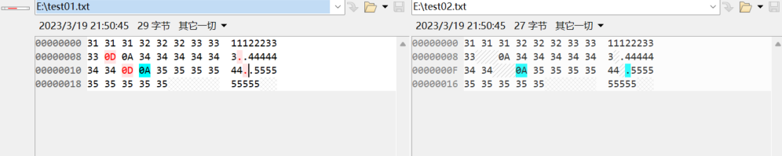

由于文件设备并不像显示器屏幕与键盘那样是标准默认设备，所以在fstream.h文件中没有像cin和cout那样预先定义的全局对象，必须自定义该类的对象。


**文件模式**

- ate   打开文件后立即定位到文件末尾
- binary  以二进制方式进行IO

读相关：

- in   以读模式打开

写相关：

- out  以写模式打开
- app 每次写操作前均定位到文件末尾
- trunc  截断文件


**对象的序列化**

```c++
void test()
{
    Person p1(10, 20), p2(30, 40);
    char *targetName = "D:\\test.bin";
    ofstream osm(targetName, ios::out | ios::binary);
    osm.write((char*)&p1, sizeof(Person));
    osm.write((char*)&p2, sizeof(Person));
    osm.close();
}
```


**文本模式与二进制模式的差别**

- 在Linux系统中，没有差别
- 在Windows系统中，写文件时，会将\n替换成\r\n写入文件，读文件时会将\r\n替换成\n，除此之外没有差别

如下，写入文件同样的内容，区别只是二进制模式和文本模式的差别：



\r的十六进制ASCII码即为0D