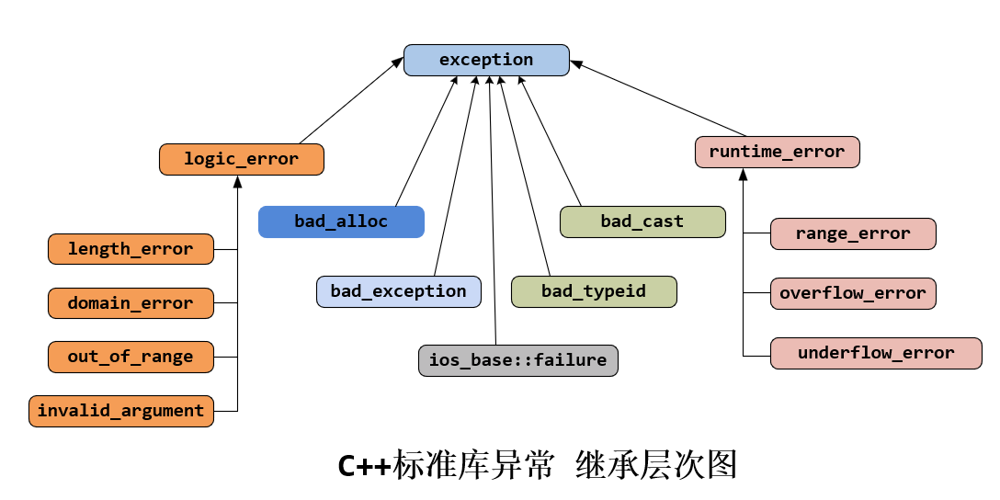

**异常处理**

异常处理指处理程序中的错误。


**异常处理的优点**

- 函数的返回值可以忽略，但是异常不可忽略。异常没有被捕获，程序就会终止
- 整型返回值没有任何语义信息，异常可包含语义信息
- 异常处理可以调用跳级


**异常处理的基本语法**

```c++
#include <iostream>
using namespace std;

int divide(int x, int y)
{
    if (y == 0) {
        throw y; //throw可跟任何类型
    }
    return x/y;
}

int main(int argc, char *argv[])
{
    try {
        divide(10, 0);
    } catch (int y) {
        cout << "除数不能为0!" << endl;
    }
    return 0;
}
```


**异常的接口声明**

- 为了加强程序的可读性，可以在函数声明列表中列出可能抛出的异常的所有类型
- 如果函数声明中没有包含异常接口声明，则此函数可抛出任何异常
- 不抛出任何异常的函数可声明为void func() throw()
- 异常的声明不影响函数内部异常的抛出（即内部抛出的异常和声明不符也不影响）

```c++
#include <iostream>
using namespace std;

int divide(int x, int y) throw(int, float, char*)
{
    if (y == 0) {
        throw y; //throw可跟任何类型
    }
    return x/y;
}

int main(int argc, char *argv[])
{
    try {
        divide(10, 0);
    } catch (int y) {
        cout << "除数不能为0!" << endl;
    } catch (float y) {    

    } catch (char *e) {
        
    }
    return 0;
}
```


**捕获所有异常**

```c++
try {
    
} catch (...) {
    
}
```


**C++标准异常类**




**自定义异常类**

- 建议自定义的异常类要继承标准异常类
- 当继承标准异常类时应重载父类的what函数和虚析构函数
- 要考虑是否提供复制构造函数