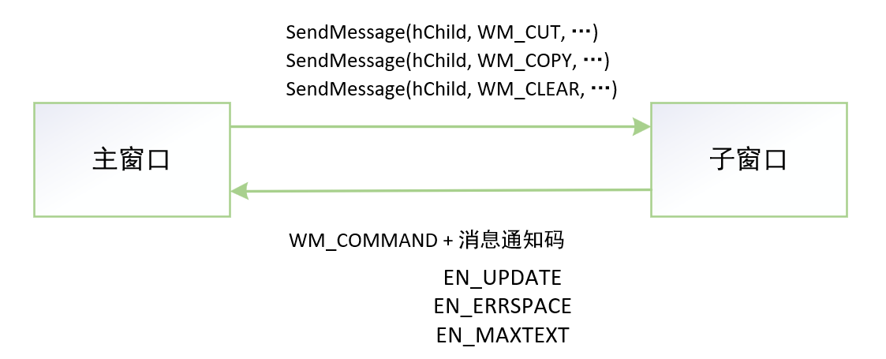

# 编辑类控件Edit

<font color=#f00>***Windows API都是C函数，没有类的概念，对应控件也没有指针的概念。操控一个窗口或控件，可以直接使用其句柄调用对应功能的Windows API函数，或通过发送消息给窗口来完成对应功能！！！***</font>

**使用编辑控件**：

- ***SetWindowText***
- ***GetWindowText***
- ***GetWindowTextLength***

**发送给编辑控件的消息**：

- ***SendMessage(hwndEdit, WM_CUT, ...)***
- ***SendMessage(hwndEdit, WM_COPY, ...)***
- ***SendMessage(hwndEdit, WM_CLEAR, ...)***
- ***SendMessage(hwndEdit, WM_PASTE, ...)***
- ***SendMessage(hwndEdit, WM_GETSEL, ...)***
- ***SendMessage(hwndEdit, WM_SETSEL, ...)***



按钮都向主窗口发送WM_COMMOND消息，按钮控件的消息通知码可以对消息进一步细分：

BN_CLICKED，BN_PAINT，BN_PUSHED，BN_DISABLE，BN_SETFOCUS，BN_KILLFOCUS

编辑类控件的消息空间码：

EN_SETFOCUS，EN_KILLFOCUS，EN_CHANGE，EN_UPDATE，EN_UPDATE，EN_ERRSPACE，EN_MAXTEXT，EN_HSCROLL，EN_VSCROLL，...


下面是一个dialog的窗口过程。dialog上有两个edit控件，以及若干个按钮。

```c++
//主窗口窗口过程
INT_PTR CALLBACK MainDlgProc(HWND hDlg, UNIT uMsg, WPARAM wParam, LPARAM lParam)
{
    BOOL ret = TRUE;
    HWND hwndEdit1 = GetDlgItem(hDlg, IDC_EDIT1);
    HWND hwndEdit2 = GetDlgItem(hDlg, IDC_EDIT2);
    TCHAR pszBuffer[1024];
    
    switch (uMsg) {
    case WM_COMMAND: //判断消息类型
         switch(LOWORD(wParam)) {  //判断消息控件ID
         case IDC_BUTTON_CLEAR:
              switch(HIWORD(wParam)) {  //判断消息通知码
              case BN_CLICKED:
                   SendMessage(hwndEdit1, WM_CLEAR, 0, 0); //清除eidt中被选中的内容，消息参数未用到，设置为0
                   break;
              case BN_SETFOCUS:
                   /*...*/
                   break;
              }
              break;
         }
         break;
            
         case IDC_EDIT1: {
            switch (HIWORD(wParam)) {
                case EN_UPDATE: {//edit控件内容有改变时发送EN_UPDATE
                    GetWindowText(hwndEdit1, pszBuffer, 1024); //获取edit1文本
                    SetWindowText(hwndEdit2, pszBuffer, 1024); //设置edit2文本
                    break;
                }
            }
         }
         break;
         
        case IDC_BUTTON_COPY: {
        	switch (HIWORD(wParam)) {
                case BN_CLICKED: {
                    SendMessage(hwndEdit1, WM_COPY, 0, 0); //发送WM_COPY消息到edit1,edit1收到消息就会将选中的文本拷贝到剪贴板
                    break;
                }
            }    
        }
        break;
            
        case IDC_BUTTON_PASTE:
            SendMessage(hwndEdit2, WM_PASTE, 0, 0); //发送paste消息给edit2，edit2会将剪贴板上文本输入自身光标处
            break;
            
        case IDC_BUTTON_GETTEXT:
            GetWindowText(hwndEdit1, pszBuffer, 1024); //获取edit1的文本
            MessageBox(hDlg, pszBuffer, TEXT("Test"), MB_OK);
            break;
        
        case IDC_BUTTON_SETTEXT:
            SetWindowText(hwndEdit2, TEXT("set window text"));
            break;          
    }
}
```

因为其他消息通知码很少用到，最常用的是BN_CLICKED，所以经常简化，不判断消息通知码