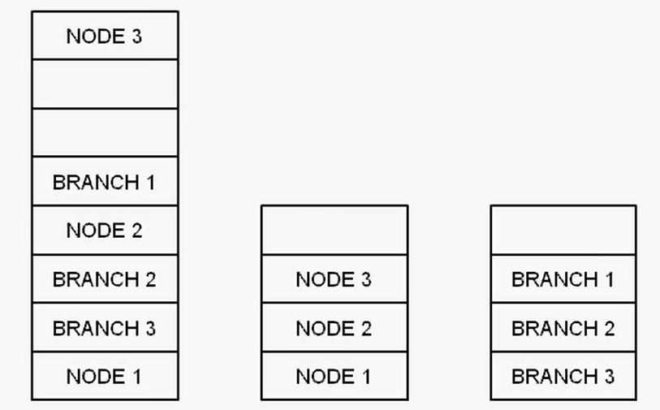

一般简单的编程中，使用进程默认的堆即可，但在复杂的编程中，创建多个堆有诸多好处：

**优点1：对组件进行保护**

一个软件内会使用多个数据结构，如一个Node节点组成的链表和Branch组成的二叉树（如图）。如果使用同一个堆，则这两种数据结构的存储是相互交叉的，所以可能产生相互影响（如操作链表节点存在bug影响了二叉树），且测试难以发现。

**优点2：更有效的内存管理**

减少内存碎片

**优点3：使内存访问局部化**

局部访问会提高内存访问效率。

例如节点组成的链表和二叉树在一个堆中相互交叉，因为同时存储两种结构堆较大，可能一部分存储在硬盘上的虚拟内存文件中。为了访问链表，就有可能需要将虚拟文件中的部分导入内存。如果堆分离，堆更小，减小内存交换的可能性，能提高访问效率。

**优点4：避免线程同步的开销**

堆同时只能供单个线程操作，则多个线程就无法实现真正的并发。如果每一个线程有独立的堆，就能避免线程同步的开销。

**优点5：快速释放**

释放一个链表要释放所有节点；如果一次性释放堆，则释放更加快速高效。