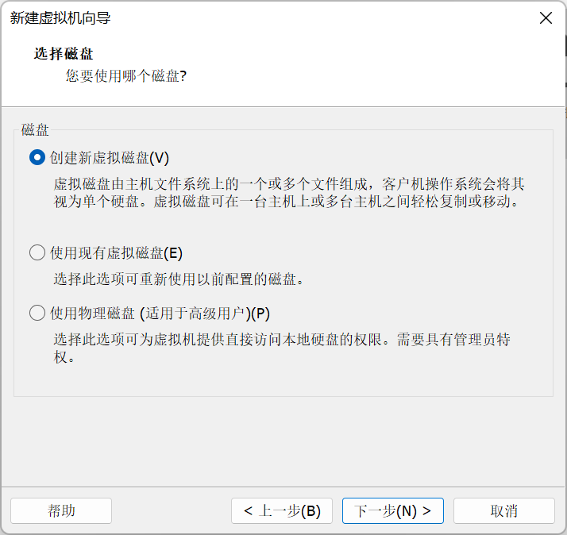

# VMware下虚拟机创建过程记录

（1）打开VMware，点击**创建新的虚拟机**

（2）选择**自定义（高级）**，点击下一步

（3）保持默认，点击下一步

（4）选择**稍后安装操作系统**，点击下一步

（5）分别选择**Linux**和**CentOS6**，点击下一步

（6）设置**名称**和**位置**

名称可以任取，位置推荐自定义，今后不需要此虚拟机可以直接删除整个文件夹即可。

**注意：**截图中的位置在VMware安装路径下，会导致最终创建失败，所以最后返回修改了路径（D:\App\VMware Data\Orchid CentOS6）

（7）设置**处理器数量**和**内核数**

实际电脑只有1个CPU，内核数写4即可。（在最后一步完成时，退回更改为了8）

（8）设置虚拟内存1024MB，即1GB即可

（9）设置网络类型，保持默认即可

（10）设置IO控制器类型，保持默认即可

（11）设置磁盘类型，保持默认即可

（12）选择硬盘，保持默认即可

（13）指定磁盘容量，默认20GB即可

（14）自定义磁盘文件名称及位置

（15）完成

**备注：以上有关硬件设置，完成后，可通过菜单栏->虚拟机->设置进行修改，但是步骤中的路径设置无法修改**