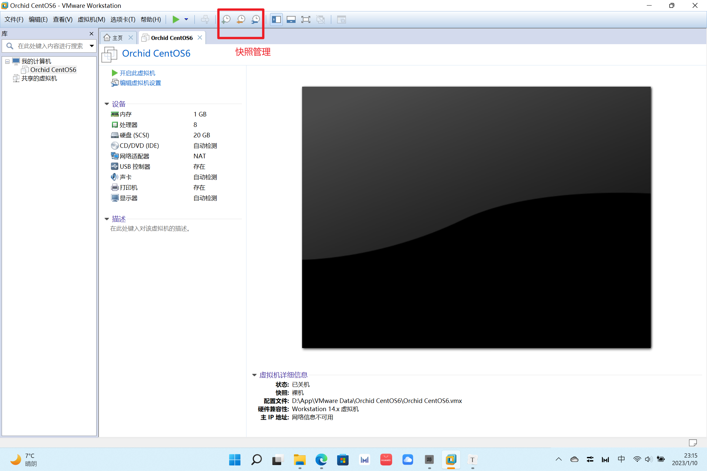
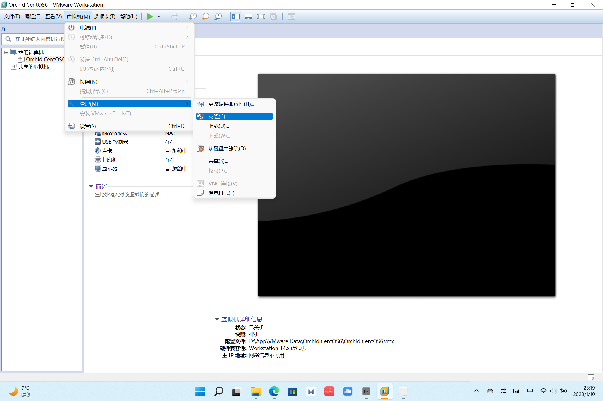

# VMware使用技巧

**快照**

快照可以保持虚拟机某一时刻的状态，有了快照，以后可以很方便、快捷的回到快照状态。

**克隆**

克隆能够直接获得一个与当前系统一模一样的虚拟机。克隆机的有点是占用的独立空间很小，但如果删掉原始机，克隆机将不能使用；删掉克隆机不影响原始机的使用。

**挂起**

挂起可以定格虚拟机的当前状态，下次可以直接回复，不用经过漫长的启动过程。

**快捷键**

Ctrl+Alt : 释放鼠标

Ctrl + Alt + Enter : 全屏