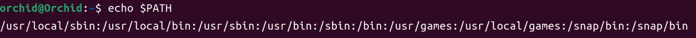

***which指令***

```
orchid@Orchid:~$ which pwd
/bin/pwd
orchid@Orchid:~$ which whoami
/usr/bin/whoami
```


***Linux是如何搜索可执行程序的***

Linux系统中有一个环境变量**PATH**，是Linux中的一个全局变量。PATH中存储了一些路径，可通过echo $PATH查看其具体内容。如下：



PATH中包含的各路径以**：**分隔。终端中输入指令并按下回车后，命令解释器依次在上面的路径中查找指令。找到则执行，找不到则提示common not found.

再例如Linux中常见的两个命令解释器bash和sh：

