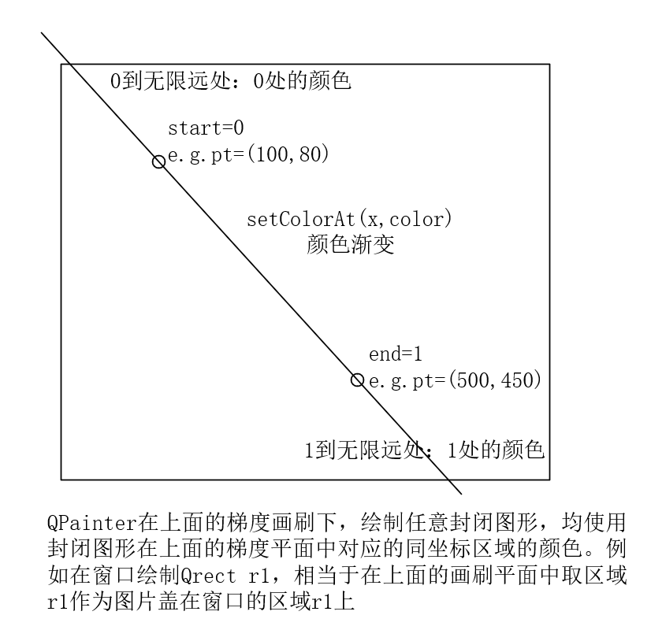

主要看一下QLinearGradient。

构造：***QLinearGradient(const QPointF &*start*, const QPointF &*finalStop*)***

设置颜色：***setColorAt(qreal position, const QColor &*color*)***

理解：QLinearGradient是一条由窗口上的点start和点stop连接的无限长的线。

