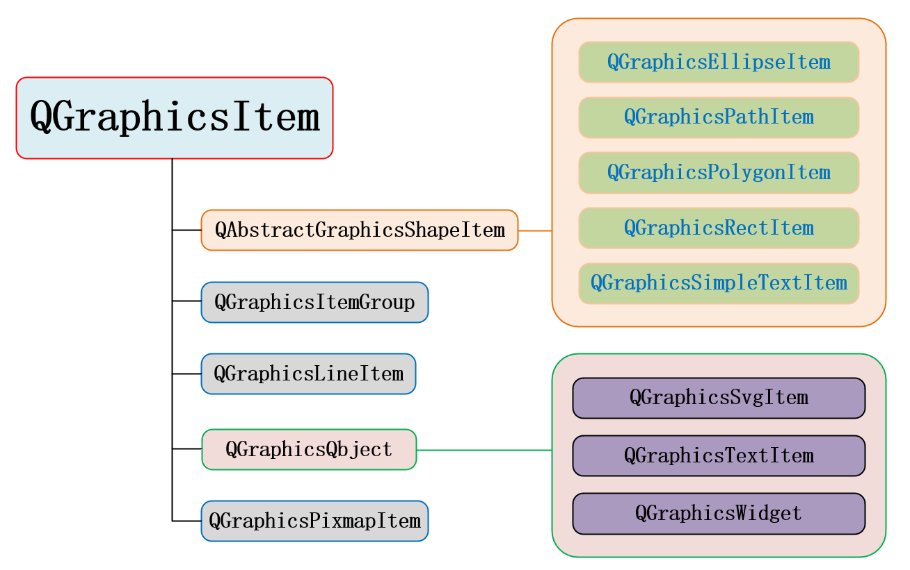

以下通过搭建一个简单的图形视图框架工程介绍部分主要接口的使用。

**1.给一个视图（view）添加一个空的场景（scene）**

```c++
#include <QApplication>

#include <QGraphicsView>
#include <QGraphicsScene>

int main(int argc, char *argv[])
{
    QApplication a(argc, argv);

    QGraphicsView view;		//创建一个view
    QGraphicsScene *p_scene = new QGraphicsScene;  //创建一个scene

    view.setScene(p_scene);   //设置view的可视化场景
    view.resize(800, 600); //view是QGraphicsView，继承自QScrollArea，是一个QWidget。设置view的大小即视口的大小。
    view.show();

    return a.exec();
}
```

上面使用了<font color=#f00 size=4>*void QGraphicsView::setScene(QGraphicsScene \*scene)*</font> 接口，**则view将可视化scene中的内容。可以有多个不同的view来可视化同一个scene，因为view和scene之间是没有所属关系的**。


**2.明确地指定视图（view）对场景（scene)的哪一块区域进行可视化**

一个场景scene无穷大（实际上受数据类型能够表示的最大值影响），而view作为视口，大小是有限的，所以需要指定view具体可视化scene的哪一块区域，这块区域用矩形表示。

使用接口<font color=red size=4>*void QGraphicsScene::setSceneRect(const QRectF &)*</font>:

```c++
    p_scene->setSceneRect(-800, -600, 1600, 1200);
```

view和scene是没有所属关系的，rect(-800,-600,1600x1200)不是view坐标系内的区域，而是scene坐标系内的一块区域。

可以对比一下第1步和第2步的运行结果的变化：第1步只有一个空窗口，第2步窗口出现了滚动条。原因是在没有设置sceneRect之前，view默认显示的场景区域大小是0，第2步设置了scene的被可视化区域（-800，-600，1600x1200)后，这块区域比第1步中设置的视口大小800x600要大，视口无法显示全部内容，所以出现了滚动条。另一个值得注意的点是滚动条初始状态是中间值，而不是在最左或最上，这是因为视图默认显示scene的可视区域中心点（可能与scene的原点重合，但并不是scene的原点）在视口的中心点。


**3.给场景（scene）准备一个图元（item）**

这里继承*QGraphicsItem*创建一个自定义图元类。

自定义图元，即根据实际需求使用QPainter进行线条绘制、区域填充等操作，所以要重载paint纯虚函数：

<font color=red size=4>*virtual void QGraphicsItem::paint(QPainter \*painter, ...) = 0*</font>

和scene类似，item也是无穷大的，也需要为view指定绘制item的具体区域，所以要重载boundingRect()纯虚函数：

<font color=red size=4>*virtual QRectF boundingRect() const = 0*</font>

*QGraphicsItem* 不继承自任何其他类，使用信号槽可以同步继承*QObject*。下面绘制一个“+”图元为例子：

```c++
//plus_item.h
#ifndef CPLUSITEM_H
#define CPLUSITEM_H

#include <QGraphicsItem>
#include <QObject>

class QPainter;

class CPlusItem : public QObject, public QGraphicsItem
{
    Q_OBJECT
public:
    CPlusItem(QObject *p_parent = nullptr, QGraphicsItem *item_parent = nullptr);
protected:
    QRectF boundingRect() const override;
    void paint(QPainter *painter,
               const QStyleOptionGraphicsItem *option,
               QWidget *widget = nullptr) override;
};

#endif // CPLUSITEM_H
```

```c++
//plus_item.cpp
#include "plus_item.h"
#include <QBrush>
#include <QPen>
#include <QPainter>

CPlusItem::CPlusItem(QObject *p_parent, QGraphicsItem *item_parent)
    : QObject(p_parent), QGraphicsItem(item_parent)
{
}

QRectF CPlusItem::boundingRect() const
{
    return QRectF(-10, -10, 20, 20);
}

void CPlusItem::paint(QPainter *painter,
                      const QStyleOptionGraphicsItem *option,
                      QWidget *widget)
{
    Q_UNUSED(option)
    Q_UNUSED(widget)

    QPen pen(QBrush(QColor(255,0,0)), 2);
    painter->setPen(pen);
    painter->drawLine(QPoint(-10, 0), QPoint(10, 0));
    painter->drawLine(QPoint(0, -10), QPoint(0, 10));
}
```


**4.将图元（item）添加到场景（view）中的指定位置**

添加图元到场景，用到的接口是<font color=red size=4>*QGraphicsScene::addItem(QGraphicsItem \*item)*</font>。

设置图元在场景中的位置，用到的接口是<font color=red size=4>*void QGraphicsItem::setPos(const QPointF  &)*</font>。

```c++
    CPlusItem *p_plus_item1 = new CPlusItem;
    p_scene->addItem(p_plus_item1);
    p_plus_item1->setPos(0, 0);
```

运行程序可以看到，在场景的原点（刚好是场景可视矩形区域的中心）处显示了一个自定义的形状为加号的红色图元。我们还可以实例化多个item，设置在场景不同的位置（分别在scene的四个顶点添加一个item）：

```c++
    CPlusItem *p_plus_item_left_top = new CPlusItem;
    p_scene->addItem(p_plus_item_left_top);
    p_plus_item_left_top->setPos(-800, -600);

    CPlusItem *p_plus_item_left_bottom = new CPlusItem;
    p_scene->addItem(p_plus_item_left_bottom);
    p_plus_item_left_bottom->setPos(-800, 600);

    CPlusItem *p_plus_item_right_top = new CPlusItem;
    p_scene->addItem(p_plus_item_right_top);
    p_plus_item_right_top->setPos(800, -600);

    CPlusItem *p_plus_item_right_bottom = new CPlusItem;
    p_scene->addItem(p_plus_item_right_bottom);
    p_plus_item_right_bottom->setPos(800, 600);
```


**5.图元（item）的常见事件处理**

（1）鼠标双击

<font color=red size=4>*void mouseDoubleClickEvent(QGraphicsSceneMouseEvent \*event) override;*</font>

（2）光标进入item、光标在item内移动、光标离开item

使用光标事件前提调用<font color=red size=4>*setAcceptHoverEvents(true)*</font>.

<font color=red size=4>*void hoverEnterEvent(QGraphicsSceneHoverEvent \*event) override;*</font>

<font color=red size=4>*void hoverMoveEvent(QGraphicsSceneHoverEvent \*event) override;*</font>

<font color=red size=4>*void hoverLeaveEvent(QGraphicsSceneHoverEvent \*event) override;*</font>

（3）Focus焦点

使用Focus焦点前提调用<font color=red size=4>*setFlag(QGraphicsItem::ItemIsFocusable)*</font>.

默认情况下，点击item，item会获得焦点，点击scene空白区域，item会失去焦点。

直接操作focus的有<font color=red size=4>*setFocus()*</font>、<font color=red size=4>*clearFocus()*</font>。

相关的事件处理器是有：

<font color=red size=4>*void focusInEvent(QFocusEvent \*event) override;*</font>

<font color=red size=4> *void focusOutEvent(QFocusEvent \*event) override;*</font>

以下对上面自定义的CPlusItem进行改进：

- 在构造函数中设置了setCursor函数，当鼠标进入item时改变鼠标的形状
- 在构造函数中设置了setFlag(QGraphicsItem::ItemIsFocusable)接收焦点事件处理
- 在paint()中，判断是否有焦点，使用不同的线条进行item的绘制
- 添加部分常用的事件处理器，打印一些log。

```c++
//plus_item.h
#ifndef CPLUSITEM_H
#define CPLUSITEM_H

#include <QGraphicsItem>
#include <QObject>

class QPainter;
class QGraphicsSceneMouseEvent;

class CPlusItem : public QObject, public QGraphicsItem
{
    Q_OBJECT
public:
    CPlusItem(QObject *p_parent = nullptr, QGraphicsItem *item_parent = nullptr);
protected:
    QRectF boundingRect() const override;
    void paint(QPainter *painter,
               const QStyleOptionGraphicsItem *option,
               QWidget *widget = nullptr) override;
    void mouseDoubleClickEvent(QGraphicsSceneMouseEvent *event) override;
    void hoverEnterEvent(QGraphicsSceneHoverEvent *event) override;
    void hoverMoveEvent(QGraphicsSceneHoverEvent *event) override;
    void hoverLeaveEvent(QGraphicsSceneHoverEvent *event) override;
    void focusInEvent(QFocusEvent *event) override;
    void focusOutEvent(QFocusEvent *event) override;
};

#endif // CPLUSITEM_H

```

```c++
//plus_item.cpp
#include "plus_item.h"
#include <QBrush>
#include <QPen>
#include <QPainter>
#include <QGraphicsSceneMouseEvent>
#include <QDebug>
#include <QCursor>

CPlusItem::CPlusItem(QObject *p_parent, QGraphicsItem *item_parent)
    : QObject(p_parent), QGraphicsItem(item_parent)
{
    setCursor(QCursor(Qt::PointingHandCursor));
    setFlag(QGraphicsItem::ItemIsFocusable);
    setAcceptHoverEvents(true);
}

QRectF CPlusItem::boundingRect() const
{
    return QRectF(-10, -10, 20, 20);
}

void CPlusItem::paint(QPainter *painter,
                      const QStyleOptionGraphicsItem *option,
                      QWidget *widget)
{
    Q_UNUSED(option)
    Q_UNUSED(widget)

    if (hasFocus()) {
        painter->setPen(QPen(QBrush(QColor(255, 0, 0)), 1, Qt::DotLine));
    } else {
        painter->setPen(QPen(QBrush(QColor(255,0,0)), 1));
    }

    painter->drawLine(QPoint(-10, 0), QPoint(10, 0));
    painter->drawLine(QPoint(0, -10), QPoint(0, 10));
}

void CPlusItem::mouseDoubleClickEvent(QGraphicsSceneMouseEvent *event)
{
    qDebug() << "mouseDoubleClickEvent:" << event->pos();
}

void CPlusItem::hoverEnterEvent(QGraphicsSceneHoverEvent *event)
{
    qDebug() << "hoverEnterEvent:" << event->pos();
}

void CPlusItem::hoverMoveEvent(QGraphicsSceneHoverEvent *event)
{
    //qDebug() << "hoverMoveEvent:" << event->pos() << hasFocus();
}

void CPlusItem::hoverLeaveEvent(QGraphicsSceneHoverEvent *event)
{
    qDebug() << "hoverLeaveEvent:" << event->pos();
}

void CPlusItem::focusInEvent(QFocusEvent *event)
{
    qDebug() << "focusInEvent:";
    QGraphicsItem::focusInEvent(event);
}

void CPlusItem::focusOutEvent(QFocusEvent *event)
{
    qDebug() << "focusOutEvent:";
    QGraphicsItem::focusOutEvent(event);
}

```


**6.添加Qt自带的item**

Qt已经写好了部分常用的item，可以直接拿来使用，它们的继承关系如下:



设置item的QGraphicsItem::ItemIsMovable可以响应鼠标的拖动：

```c++
    QGraphicsRectItem *p_rect_item1 = new QGraphicsRectItem;
    p_rect_item1->setRect(QRect(-20, -10, 40, 20));
    p_rect_item1->setPen(QPen(QColor(0,255,0)));
    p_rect_item1->setBrush(QBrush(QColor(173,241,174,100)));
    p_scene->addItem(p_rect_item1);
    p_rect_item1->setPos(-100, -100);
    p_rect_item1->setFlag(QGraphicsItem::ItemIsMovable);

    QGraphicsRectItem *p_rect_item2 = p_scene->addRect(QRect(-20,-10,40,20), \
                                      QPen(QColor("#0f0")), QBrush(QColor(255,0,0,150)));
    p_rect_item2->setPos(-100, -70);
    p_rect_item2->setFlag(QGraphicsItem::ItemIsMovable);

    QGraphicsLineItem *p_line_item = p_scene->addLine(QLineF(-20, 0, 20, 0), QPen(QColor("000"), 2));
    p_line_item->setPos(-100, -40);
    p_line_item->setFlag(QGraphicsItem::ItemIsMovable);

    QGraphicsTextItem *p_text_item = p_scene->addText("China", QFont("Times New Roman", 12));
    p_text_item->setFlag(QGraphicsItem::ItemIsMovable);

    QGraphicsPixmapItem *p_pixmap_item = p_scene->addPixmap(QPixmap("E:\\circuit.png"));
    p_pixmap_item->setScale(0.5);
    p_pixmap_item->setFlag(QGraphicsItem::ItemIsMovable);
```

