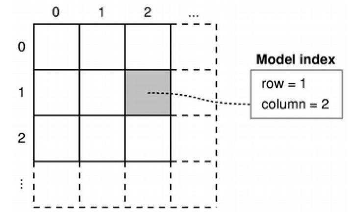

# Detailed Description

The QAbstractItemModel class defines the standard interface that item models must use to be able to interoperate with other components in the model/view architecture. It is not supposed to be instantiated directly. Instead, you should subclass it to create new models.

QAbstractItemModel类定义了项模型必须使用的标准接口，以便能够与模型/视图体系结构中的其他组件进行交互。它不应直接实例化。相反，您应该将其子类化以创建新模型。

The QAbstractItemModel class is one of the [Model/View Classes](../qtwidgets/model-view-programming.html#model-view-classes) and is part of Qt's [model/view framework](../qtwidgets/model-view-programming.html). It can be used as the underlying data model for the item view elements in QML or the item view classes in the Qt Widgets module.

QAbstractItemModel类是模型/视图类之一，是Qt的模型/视图框架的一部分。它可以用作QML中的项视图元素或Qt Widgets模块中的项视图类的底层数据模型。

If you need a model to use with an item view such as QML's List View element or the C++ widgets [QListView](../qtwidgets/qlistview.html) or [QTableView](../qtwidgets/qtableview.html), you should consider subclassing [QAbstractListModel](qabstractlistmodel.html) or [QAbstractTableModel](qabstracttablemodel.html) instead of this class.

如果您需要在项视图中使用模型，例如QML的ListView元素或C++小部件QListView或QTableView，则应考虑子类化QAbstractListModel或QAbstractTableModel而不是此类。

The underlying data model is exposed to views and delegates as a hierarchy of tables. If you do not make use of the hierarchy, then the model is a simple table of rows and columns. Each item has a unique index specified by a [QModelIndex](qmodelindex.html).

底层数据模型以表格层次结构的形式向视图和代理公开。如果您不使用层次结构，则该模型是一张简单的行列表。每个项目都有一个由QModelIndex指定的唯一索引。

Every item of data that can be accessed via a model has an associated model index. You can obtain this model index using the [index](qabstractitemmodel.html#index)() function. Each index may have a [sibling](qabstractitemmodel.html#sibling)() index; child items have a [parent](qabstractitemmodel.html#parent)() index.

每个可以通过模型访问的数据项都有一个关联的模型索引。您可以使用index()函数获取此模型索引。每个索引可能有一个兄弟索引；子项具有父级索引。

Each item has a number of data elements associated with it and they can be retrieved by specifying a role (see [Qt::ItemDataRole](qt.html#ItemDataRole-enum)) to the model's [data](qabstractitemmodel.html#data)() function. Data for all available roles can be obtained at the same time using the [itemData](qabstractitemmodel.html#itemData)() function.

每个项都有与之关联的一些数据元素，可以通过指定一个角色（参见Qt::ItemDataRole）来从模型的data()函数中检索它们。可以使用itemData()函数同时获取所有可用角色的数据。

Data for each role is set using a particular [Qt::ItemDataRole](qt.html#ItemDataRole-enum). Data for individual roles are set individually with [setData](qabstractitemmodel.html#setData)(), or they can be set for all roles with [setItemData](qabstractitemmodel.html#setItemData)().

每个角色的数据都使用特定的Qt::ItemDataRole设置。可以使用setData()单独设置每个角色的数据，或者可以使用setItemData()为所有角色设置数据。

Items can be queried with [flags](qabstractitemmodel.html#flags)() (see [Qt::ItemFlag](qt.html#ItemFlag-enum)) to see if they can be selected, dragged, or manipulated in other ways.

可以使用flags()（参见Qt::ItemFlag）查询项，以查看它们是否可以被选择、拖动或以其他方式进行操作。

If an item has child objects, [hasChildren](qabstractitemmodel.html#hasChildren)() returns true for the corresponding index.

如果一个项有子对象，则hasChildren()会对应的索引返回true。

The model has a [rowCount](qabstractitemmodel.html#rowCount)() and a [columnCount](qabstractitemmodel.html#columnCount)() for each level of the hierarchy. Rows and columns can be inserted and removed with [insertRows](qabstractitemmodel.html#insertRows)(), [insertColumns](qabstractitemmodel.html#insertColumns)(), [removeRows](qabstractitemmodel.html#removeRows)(), and [removeColumns](qabstractitemmodel.html#removeColumns)().

模型对于层次结构的每个级别都有rowCount()和columnCount()。可以使用insertRows()、insertColumns()、removeRows()和removeColumns()来插入和删除行和列。

The model emits signals to indicate changes. For example, [dataChanged](qabstractitemmodel.html#dataChanged)() is emitted whenever items of data made available by the model are changed. Changes to the headers supplied by the model cause [headerDataChanged](qabstractitemmodel.html#headerDataChanged)() to be emitted. If the structure of the underlying data changes, the model can emit [layoutChanged](qabstractitemmodel.html#layoutChanged)() to indicate to any attached views that they should redisplay any items shown, taking the new structure into account.

该模型发出信号来指示变化。例如，每当由模型提供的数据项发生更改时，会发出dataChanged()信号。对于模型提供的标题的更改将导致headerDataChanged()被发出。如果底层数据的结构发生变化，则模型可以发出layoutChanged()信号，以指示任何附加的视图应重新显示任何显示的项，并考虑新的结构。

The items available through the model can be searched for particular data using the [match](qabstractitemmodel.html#match)() function.

可以使用match()函数搜索模型中可用的特定数据项。

To sort the model, you can use [sort](qabstractitemmodel.html#sort)(). 

要对模型进行排序，可以使用sort()函数。

# Subclassing

Note: Some general guidelines for subclassing models are available in the [Model Subclassing Reference](../qtwidgets/model-view-programming.html#model-subclassing-reference).

注意：有关子类化模型的一些通用指南可在“Model Subclassing Reference”中找到。

When subclassing QAbstractItemModel, at the very least you must implement [index](qabstractitemmodel.html#index)(), [parent](qabstractitemmodel.html#parent)(), [rowCount](qabstractitemmodel.html#rowCount)(), [columnCount](qabstractitemmodel.html#columnCount)(), and [data](qabstractitemmodel.html#data)(). These functions are used in all read-only models, and form the basis of editable models.

当子类化QAbstractItemModel时，至少必须实现index()、parent()、rowCount()、columnCount()和data()这些函数。这些函数在所有只读模型中使用，并构成可编辑模型的基础。