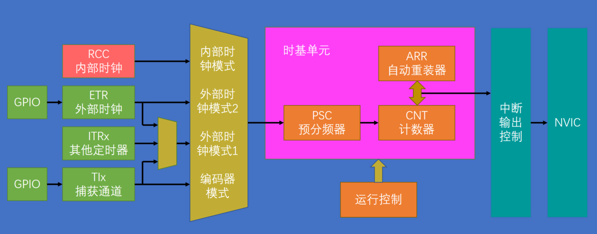

**timer_init()**初始化定时器：

如何初始化定时器？观察下图：



这是定时中断的整个框架结构，我们只需要把这里面的每个模块都打通，就可以让定时器工作。大体上的步骤是：

1. RCC开启时钟，这个基本上是每个代码的第一步。打开时钟后，定时器的基准时钟和整个外设的工作时钟都会同时打开。
2. 选择时基单元的时钟源。对于定时中断，我们选择内部时钟源。
3. 配置时基单元，包括预分频器、自动重装器、计数模式等等，这些参数用一个结构体就可以配置好。
4. 配置输出中断控制，允许更新中断输出到NVIC。
5. 配置NVIC，在NVIC中打开定时器中断的通道，并分配一个优先级。
6. 运行控制
7. 整个模块配置完成后，还需要使能一下计数器，不然计数器不会运行。当定时器使能后，计数器就会开始计数，当计数器更新时触发中断。
8. 最后我们再写一个定时器的中断函数。中断函数每隔一段时间就能自动执行一次。

以上就是初始化定时器的大体思路。


**定时器的库函数有哪些？**

找到定时器tim的库函数（文件stm32f10x_tim.c)，先打开.h文件，拖到最后，可以看到库函数的数量非常多，以下先介绍本节需要用到的函数：

```c
//恢复缺省配置
void TIM_DeInit(TIM_TypeDef* TIMx); 

//时钟单元初始化，此函数比较重要
//param TIMx选择某个定时器
//param TIM_TimeBaseInitStruct包含了配置时基单元的一些参数
void TIM_TimeBaseInit(TIM_TypeDef* TIMx, TIM_TimeBaseInitTypeDef* TIM_TimeBaseInitStruct);

//这个函数可以把结构体变量赋一个默认值
void TIM_TimeBaseStructInit(TIM_TimeBaseInitTypeDef* TIM_TimeBaseInitStruct);

//使能计数器，对应上面图中的“运行控制”
//param TIMx选择定时器
//param NewState新的状态，即使能或失能。使能则计时器可以运行；失能则计数器就不运行
void TIM_Cmd(TIM_TypeDef* TIMx, FunctionalState NewState);

//使能中断输出信号，对应上图中的“中断输出控制”
//param TIMx选择定时器
//param TIM_IT选择要配置哪个中断输出
//param NewState新的状态，使能或失能
//ITConfig函数之后还会经常用到，就是使能外设的中断输出
void TIM_ITConfig(TIM_TypeDef* TIMx, uint16_t TIM_IT, FunctionalState NewState);

//下面6个函数，对应时基单元的时钟选择部分，可以选择RCC内部时钟、ETR外部时钟、ITRx其他定时器、TIx捕获通道这些
//函数1 选择内部时钟
void TIM_InternalClockConfig(TIM_TypeDef* TIMx);
//函数2 选择TIRx其他定时器的时钟，参数TIMx选择要配置的定时器，参数TIM_InputTriggerSource选择要接入哪个其他的定时器
void TIM_ITRxExternalClockConfig(TIM_TypeDef* TIMx, uint16_t TIM_InputTriggerSource);
//函数3 选择TIx捕获通道的时钟
//参数TIM_TIxExternalCLKSource选择TIx具体的某个引脚
//参数ICPolarity和ICFilter 输入的极性和滤波器。对于外部引脚的波形，一般都会有极性选择和滤波器，这样更灵活
void TIM_TIxExternalClockConfig(TIM_TypeDef* TIMx, uint16_t TIM_TIxExternalCLKSource,
                                uint16_t TIM_ICPolarity, uint16_t ICFilter);
//函数4 选择ETR通过外部时钟模式1输入的时钟
//参数TIM_ExtTRGPrescaler 外部触发预分频器，这里可以对ETR的外部时钟再提前做一个分频
//参数ICPolarity和ICFilter 输入的极性和滤波器。
void TIM_ETRClockMode1Config(TIM_TypeDef* TIMx, uint16_t TIM_ExtTRGPrescaler, uint16_t TIM_ExtTRGPolarity, uint16_t ExtTRGFilter);
//函数5 选择ETR通过外部时钟模式2输入的时钟
//函数4和函数5 对于ETR输入的外部时钟而言，这两个函数是等效的，它们的参数也是一样的，如果不需要触发输入的功能则两个函数可以互换。
void TIM_ETRClockMode2Config(TIM_TypeDef* TIMx, uint16_t TIM_ExtTRGPrescaler, 
                             uint16_t TIM_ExtTRGPolarity, uint16_t ExtTRGFilter);
//函数6 单独用来配置ETR引脚的预分频器、极性、滤波器这些参数
void TIM_ETRConfig(TIM_TypeDef* TIMx, uint16_t TIM_ExtTRGPrescaler, uint16_t TIM_ExtTRGPolarity,
                   uint16_t ExtTRGFilter);
```

以上基本覆盖了上图中用于初始化的全部函数。接下来再看几个函数。因为在初始化结构体里有很多关键的参数，比如自动重装值和预分频值等等，这些参数可能会在初始化之后还需要更改。如果为了改某个参数还要再调用一次初始化函数太麻烦，所有有一些单独的函数，可以方便地更改这些关键参数：

```c
//单独写预分频值
//param Prescaler要写入地预分频值
//param TIM_PSCReloadMode写入的模式。预分频器有一个缓冲器，写入的值是在更新事件发生后才有效的。所以这里有一个写入的模式，可以选择是听从安排，在更新事件生效，或者是写写入后手动产生一个更新事件，让这个值立刻生效。不过这些都是细节问题，影响不大。
void TIM_PrescalerConfig(TIM_TypeDef* TIMx, uint16_t Prescaler, uint16_t TIM_PSCReloadMode);

// 用来改变计数器的计数模式
//param TIM_CounterMode选择新的计数器模式
void TIM_CounterModeConfig(TIM_TypeDef* TIMx, uint16_t TIM_CounterMode);

// 自动重装器预装功能配置 有预装还是无预装可以自行选择(调用这个函数，设置使能或失能即可)
void TIM_ARRPreloadConfig(TIM_TypeDef* TIMx, FunctionalState NewState);

// 给计数器写入一个值 如果想手动给一个计数值就可以使用此函数
void TIM_SetCounter(TIM_TypeDef* TIMx, uint16_t Counter);

// 给自动重装器写入一个值 如果想手动给一个自动重装值就可以使用此函数
void TIM_SetAutoreload(TIM_TypeDef* TIMx, uint16_t Autoreload);

// 获取当前计数器的值 如果想看当前计数器计到哪个数值，可以调用此函数，返回值就是当前计数器的值
uint16_t TIM_GetCounter(TIM_TypeDef* TIMx);

// 获取当前的预分频器的值 如果想查看预分频值，可以调用此函数
uint16_t TIM_GetPrescaler(TIM_TypeDef* TIMx);

//下面4个函数 用来获取标志位和清除标志位
FlagStatus TIM_GetFlagStatus(TIM_TypeDef* TIMx, uint16_t TIM_FLAG);
void TIM_ClearFlag(TIM_TypeDef* TIMx, uint16_t TIM_FLAG);
ITStatus TIM_GetITStatus(TIM_TypeDef* TIMx, uint16_t TIM_IT);
void TIM_ClearITPendingBit(TIM_TypeDef* TIMx, uint16_t TIM_IT);
```


# 程序1 使用内部时钟

**使用上述函数配置定时器**

```c++
//初始化TIM2通用定时器
void Timer_Init(void)
{
	//1 开启时钟 因为TIM2是APB1总线的外设，所以要使用APB1的开启时钟函数
	RCC_APB1PeriphClockCmd(RCC_APB1Periph_TIM2, ENABLE);
	
	//2 选择时基单元的时钟 此处想选择内部时钟,则TIM2的时基单元由内部时钟来驱动
	// 因为定时器上电后默认使用内部时钟，所以本函数在此处不调用也没关系
	TIM_InternalClockConfig(TIM2);
	
	//3 配置时基单元
	TIM_TimeBaseInitTypeDef TIM_TimeBaseInitStruct;
	/*
		在定时器的外部信号输入引脚，一般都会有一个滤波器。滤波器可以滤掉信号的抖动干扰，它的工作
	原理是：在一个固定的时钟频率f下进行采样，如果连续N个采样点都为相同的电平，那就代表输入信号稳
	定，就将采样值输出出去；如果这N个采样值不全都相同，则说明信号有抖动，这时就保持上一次的输出或
	输出低电平，这样能保证输出信号在一定程度上的滤波。这里的采样频率f和采样点数N都是滤波器参数，
	频率越低采样带你输越多，那滤波效果就越好，不过相应的信号延迟就越大。这就是滤波器的工作原理。
	那么采样率f从何而来？手册中写到：可以是由内部时钟直接而来，也可以是内部时钟加一个时钟分频而来。
	具体分频多少，就是由TIM_ClockDivision决定。可见此参数与时基单元关系并不大，随便配一个即可。
	*/
	TIM_TimeBaseInitStruct.TIM_ClockDivision = TIM_CKD_DIV1;
	/*
		计数模式：有向上、向下、中央对齐等模式
	*/
	TIM_TimeBaseInitStruct.TIM_CounterMode = TIM_CounterMode_Up;
	/*
	TIM_Period、TIM_Prescaler、TIM_RepetitionCounter时基单元3个关键寄存器参数
	这里并没有CNT计数器的参数，之后需要的话可以用SetCounter和GetCounter两个函数来操作计数器
	根据CK_CNT_OV = CK_CNT / （ARR + 1）= CK_PSC / (PSC + 1) / (ARR + 1), 此处定时1s
	定时1s时，预分频与自动重装值不唯一
	*/
	/*
		TIM_Period：周期，就是ARR自动重装器的值 
	*/
	TIM_TimeBaseInitStruct.TIM_Period = 10000 - 1;  //时基单元关键寄存器参数1
	/*
		TIM_Prescaler：PSC预分频器的值
	*/
	TIM_TimeBaseInitStruct.TIM_Prescaler = 7200 - 1;  //时基单元关键寄存器参数2
	/*
		TIM_RepetitionCounter：重复计数器的值，高级定时器才有的，此处用不上，写0
	*/
	TIM_TimeBaseInitStruct.TIM_RepetitionCounter = 0;  //时基单元关键寄存器参数3
	TIM_TimeBaseInit(TIM2, &TIM_TimeBaseInitStruct);
	
    //避免刚初始化完就立刻进中断
	TIM_ClearFlag(TIM2, TIM_FLAG_Update);
    
	// 4 使能中断，开启更新中断到NVIC的通路
	TIM_ITConfig(TIM2, TIM_IT_Update/*更新中断*/, ENABLE);
	
	// 5 配置NVIC 打通中断通道
	NVIC_PriorityGroupConfig(NVIC_PriorityGroup_2);
	NVIC_InitTypeDef NVIC_InitStruct;
	NVIC_InitStruct.NVIC_IRQChannel = TIM2_IRQn;
	NVIC_InitStruct.NVIC_IRQChannelCmd = ENABLE;
	NVIC_InitStruct.NVIC_IRQChannelPreemptionPriority = 2;
	NVIC_InitStruct.NVIC_IRQChannelSubPriority = 1;
	NVIC_Init(&NVIC_InitStruct);
	
	//6 最后，启动定时器，使定时器开始工作。产生更新时就会触发中断
	TIM_Cmd(TIM2, ENABLE);
	
}
```

**写中断函数**

1. 打开启动文件`startup_stm32f10x_md.s`
2. 找到`TIM2_IRQHandler`,就是定时器2的中断函数

```c++
//当定时器产生更新中断时此函数就会自动被执行
void TIM2_IRQHandler(void)
{
	//1 检查中断标志位
	if (TIM_GetITStatus(TIM2, TIM_IT_Update) == SET) {

		++g_num;
		//别忘了清除标志位
		TIM_ClearITPendingBit(TIM2, TIM_IT_Update);
	}
}
```

**main函数**

```c
uint16_t g_num;

int main(void)
{
	OLED_Init();
	
	OLED_ShowString(1, 5, "Num:");
	Timer_Init();
    
	while (1) {
		OLED_ShowNum(1, 5, g_num, 5);
		OLED_ShowNum(2, 5, TIM_GetCounter(TIM2), 5); //显示计数器的值，可以看到变化很快
	}
}
```


# 程序2 使用外部时钟

```c
//初始化TIM2通用定时器
void Timer_Init(void)
{
	//1 开启时钟 因为TIM2是APB1总线的外设，所以要使用APB1的开启时钟函数
	RCC_APB1PeriphClockCmd(RCC_APB1Periph_TIM2, ENABLE);
	
	//2 选择时基单元的时钟 
	//2.1 引脚要用到GPIO
	RCC_APB2PeriphClockCmd(RCC_APB2Periph_GPIOA, ENABLE);
	GPIO_InitTypeDef GPIO_InitStruct;
	GPIO_InitStruct.GPIO_Mode = GPIO_Mode_IPU;
	GPIO_InitStruct.GPIO_Pin = GPIO_Pin_0;
	GPIO_InitStruct.GPIO_Speed = GPIO_Speed_50MHz;
	GPIO_Init(GPIOA, &GPIO_InitStruct);
	//2.2 配置时钟
	TIM_ETRClockMode2Config(TIM2, TIM_ExtTRGPSC_OFF, TIM_ExtTRGPolarity_NonInverted, 0);
	
	//3 配置时基单元
	TIM_TimeBaseInitTypeDef TIM_TimeBaseInitStruct;
	/*
		在定时器的外部信号输入引脚，一般都会有一个滤波器。滤波器可以滤掉信号的抖动干扰，它的工作
	原理是：在一个固定的时钟频率f下进行采样，如果连续N个采样点都为相同的电平，那就代表输入信号稳
	定，就将采样值输出出去；如果这N个采样值不全都相同，则说明信号有抖动，这时就保持上一次的输出或
	输出低电平，这样能保证输出信号在一定程度上的滤波。这里的采样频率f和采样点数N都是滤波器参数，
	频率越低采样带你输越多，那滤波效果就越好，不过相应的信号延迟就越大。这就是滤波器的工作原理。
	那么采样率f从何而来？手册中写到：可以是由内部时钟直接而来，也可以是内部时钟加一个时钟分频而来。
	具体分频多少，就是由TIM_ClockDivision决定。可见此参数与时基单元关系并不大，随便配一个即可。
	*/
	TIM_TimeBaseInitStruct.TIM_ClockDivision = TIM_CKD_DIV1;
	/*
		计数模式：有向上、向下、中央对齐等模式
	*/
	TIM_TimeBaseInitStruct.TIM_CounterMode = TIM_CounterMode_Up;
	/*
	TIM_Period、TIM_Prescaler、TIM_RepetitionCounter时基单元3个关键寄存器参数
	这里并没有CNT计数器的参数，之后需要的话可以用SetCounter和GetCounter两个函数来操作计数器
	根据CK_CNT_OV = CK_CNT / （ARR + 1）= CK_PSC / (PSC + 1) / (ARR + 1), 此处定时1s
	定时1s时，预分频与自动重装值不唯一
	*/
	/*
		TIM_Period：周期，就是ARR自动重装器的值 
	*/
	TIM_TimeBaseInitStruct.TIM_Period = 10 - 1;  //时基单元关键寄存器参数1
	/*
		TIM_Prescaler：PSC预分频器的值
	*/
	TIM_TimeBaseInitStruct.TIM_Prescaler = 1 - 1;  //时基单元关键寄存器参数2
	/*
		TIM_RepetitionCounter：重复计数器的值，高级定时器才有的，此处用不上，写0
	*/
	TIM_TimeBaseInitStruct.TIM_RepetitionCounter = 0;  //时基单元关键寄存器参数3
	TIM_TimeBaseInit(TIM2, &TIM_TimeBaseInitStruct);
	
	//避免刚初始化完就立刻进中断
	TIM_ClearFlag(TIM2, TIM_FLAG_Update);
	
	// 4 使能中断，开启更新中断到NVIC的通路
	TIM_ITConfig(TIM2, TIM_IT_Update/*更新中断*/, ENABLE);
	
	// 5 配置NVIC 打通中断通道
	NVIC_PriorityGroupConfig(NVIC_PriorityGroup_2);
	NVIC_InitTypeDef NVIC_InitStruct;
	NVIC_InitStruct.NVIC_IRQChannel = TIM2_IRQn;
	NVIC_InitStruct.NVIC_IRQChannelCmd = ENABLE;
	NVIC_InitStruct.NVIC_IRQChannelPreemptionPriority = 2;
	NVIC_InitStruct.NVIC_IRQChannelSubPriority = 1;
	NVIC_Init(&NVIC_InitStruct);
	
	//6 最后，启动定时器，使定时器开始工作。产生更新时就会触发中断
	TIM_Cmd(TIM2, ENABLE);
}
```

