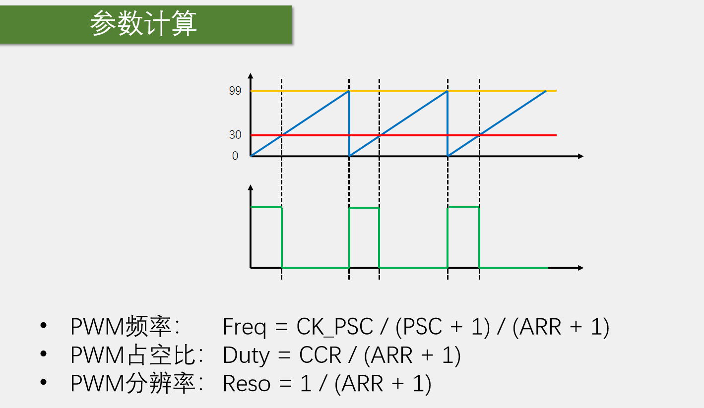

# 输出比较

**PPT**:

- OC(Output Compare)输出比较
- 输出比较可以通过比较CNT与CCR寄存器值的关系，来对输出电平进行置1、置0或翻转的操作，用于输出一定频率和占空比的PWM波形（输出比较模块最主要的功能）
- 每个高级定时器和通用定时器都拥有4个输出比较通道
- 高级定时器的前3个通道额外拥有死区生成和互补输出的功能

**解读**：

输出比较多的功能是非常重要的，它主要用来输出PWM波形。PWM波形是驱动电机的必要条件，在用STM32做一些有电机的项目中（如智能车、机器人等），输出比较功能必不可少。

- 程序1 在PA0端口上接一个LED，LED可以不断地变换亮度，实现一个呼吸灯的效果。但众所周知，GPIO口是数字输出的端口，输出电平不是高电平就是低电平，按理说LED只有完全亮和完全灭两种状态，那如何实现LED连续地调控亮度呢？答案是PWM波形。
- 程序2 PWM驱动舵机。通过按压按键，控制舵机输出轴地角度不断地变换，并且在OLED上显示当前的角度。每按一次按键，角度变量就变一次，舵机会随机跟随变化到指定的角度固定下来。这个角度可以任意设置。
- 程序3 PWM驱动直流电机。按一下按键就改变电机的转速，OLED实时显示当前的速度值。可以通过程序任意地控制电机旋转地方向和速度。

下面解释输出比较模块是如何控制这些设备的。

库函数中经常会出现英文缩写，需要了解。OC(Output Compare，输出比较)，IC(Input Capture，输入捕获)，CC(Capture Compare，表示输入捕获和输出比较的单元)。

输出比较最主要的功能就是输出PWM波形。OC以及包含的CNT寄存器和CCR寄存器如下图所示：

CCR是图中的捕获/比较寄存器，R是Register寄存器的意思。CCR是输入捕获和输出比较共用的。当使用输入捕获时，它就是捕获寄存器；当使用输出比较时，它就是比较寄存器。

在使用输出比较时，这块电路会比较CNT和CCR的值。CNT计数自增，CCR是编程时设定的值。当CNT大于CCR、小于CCR或等于CCR时，图中输出控制的输出OC1~4就会对应的置1或置0，这样就可以输出一个电平不断跳变的PWM波形。

**PPT**:

PWM简介：

PWM是一个数字输出信号，也是由高低电平组成的，用来等效获得所需的模拟参量。所以对于呼吸灯，按理说LED只能有完全亮和完全灭两种状态，但通过PWM就可以实现呼吸的效果。让LED不断地点亮、熄灭、点亮、熄灭，当点亮、熄灭地频率足够大时，LED就不会闪烁而是呈现一个中等亮度。当调控点亮和熄灭的时间比例时，就能让LED呈现不同的亮度级别。

对于电机调速，以一个很快的频率给电机通电、断电、通电、断电，则电机的速度就维持在一个中等速度，这就是PWM的基本思想。PWM的秘诀就是天下武功唯快不破。

PWM的应用场景必须是一个惯性系统，LED在熄灭的时候，由于余晖和人眼视觉暂留现象，LED不会立马熄灭，而是具有一定的惯性过一小段时间才会熄灭。电机断电时，电机的转动不会立马停止，而是具有一定的惯性过一会才停止。这样具有惯性的系统，才能使用PWM。

从PPT图左中可以看出，PWM波可以等效为中间虚线所表示的模拟量，PWM的占空比越高，等效的模拟量数值就越大。占空比就是高电平时间相对于整个周期时间的比例，如百分比为50%，则是高低电平时间相等的方波。占空比决定了等效出来的模拟电压的大小，占空比越大，等效的模拟电压就越趋近于高电平。这个等效关系一般来说是线性的。比如高电平5V低电平0V，则50%占空比就等效2.5V。

从PPT图右看，可以计算频率、占空比。PWM的频率越快，则等效模拟的信号就越平稳，但同时性能开销就越大。一般来说PWM的频率都在几K到几十KHz，这些频率已经很快了。

总的来说：使用PWM波形就可以在数字系统中等效地输出模拟量，就能实现LED控制亮度、电机控速等功能。

**PPT**

上图红色框出部分，左边是CNT与CCR比较的结果，右边是输出比较电路，最后通过TIM_CH1输出到GPIO引脚上。下面还有三个同样的单元，分别输出到CH2、CH3、CH4。将这部分图单独拎出来，如下图：

在这个图中，左边是CNT计数器和CCR1第一路的捕获/比较寄存器。两者进行比较，当CNT>CCR1或者CNT=CCR1时，就会给输出模式控制器传一个信号，然后输出模式控制器就会改变它输出到OC1REF的高低电平。REF信号实际上是指这里的信号的高低电平，REF就是reference的缩写。

上面的ETRF输入是定时器的一个小功能，一般不用，可不用了解。

REF信号可以前往主模式控制器，可以把这个REF映射到主模式的TRGO输出上去，不过REF的主要去向还是下面的一路，进入极性选择。给CC1O这个寄存器写0，信号就会往上走，信号电平不翻转；写1则信号往下走，信号通过一个非门取反，输出的信号就是输入信号高低电平反转的信号。

接着就是使能电路，选择要不要输出。最后是OC1引脚，这个引脚就是CH1通道的引脚。在引脚定义表里就可以知道具体是哪一个GPIO。

再看一下上图中输出模式控制器是如何工作的，即何时给REF高电平，何时给REF低电平。下面的表格列出了输出比较的8种模式。

这8种模式就是输出模式控制器内执行的逻辑。输出模式控制器的输入是CNT和CCR的大小关系，输出是REF的高低电平，模式可以通过图中的OC1M寄存器来配置。

- 冻结模式：比如正在输出PWM波，突然想暂停一会儿输出，就可以设置成这个模式。一旦切换为冻结模式后，输出就暂停了，并且高低电平也维持为暂停时刻的状态，保持不变，这就是冻结模式的作用。
- 匹配时置有效电平、匹配时置无效电平、匹配时电平翻转。有效电平与无效电平一般是高级定时器里面的一个说法，是和关断、刹车这些功能配合表述的。此处说法比较严谨，所以称有效电平和无效电平。为了理解方便，可以直接认为有效电平就是高电平，无效电平就是低电平。这三种模式都是当CNT和CCR值相等时执行操作。
  - 匹配时置有效电平：当CNT=CCR时REF置有效电平，即高电平
  - 匹配时置无效电平：当CNT=CCR时REF置无效电平，即低电平
  - 匹配时电平翻转：当CNT=CCR时电平翻转。此模式可以方便地输出一个频率可调、占空比时钟为50%的PWM波形。比如，设置CCR为0，则CNT每次更新清0时，就会产生一次CNT=CCR的事件，导致输出电平翻转一次，每更新两次输出为一个周期，并且高电平和低电平的时间始终相等，则占空比始终为50%。当改变定时器的更新频率时，输出波形的频率也会随之改变，关系是输出波形的频率=更新频率/2。
- 强制为无效电平、强制为有效电平。这两种模式与冻结模式相似，可以用来暂停输出，区别是这两种模式与CNT和CCR的值无关，强制为无效电平即此模式下REF为低电平，强制有效电平即此模式下REF为高电平
- PWM模式1、PWM模式2：很重要，用于输出频率和占空比都可调的PWM波形，是主要使用的模式。情况较多，一般使用向上计数即可。可以看出模式1和模式2互反。模式控制器可以控制REF极性，而最终输出之前也可以设置极性（上图中的CC1P寄存器）。

以PWM模式1向上计数为例：

首先左上角是时基单元和运行控制部分，输出PWM波时不需要此处更新事件的中断申请。配置好时基单元，CNT就开始不断地自增运行。下面是输出比较单元，最开始是CCR捕获/比较寄存器。CCR由我们在程序中设定，CNT不断自增运行，同时二者在不断地进行比较。接下来是输出模式控制器。观察右上图，蓝色线是CNT地值，黄色线是ARR的值，蓝色线从0开始自增，一直增到ARR，也就是99，之后清0继续自增。红色线是CCR，比如设置为30，下面的绿色线就是输出。可以看出CNT<CCR时，输出高电平，CNT>=CCR时输出低电平。占空比是受CCR值调控的，如果CCR设置高一些，输出的占空比就变大。图中REF就是一个频率可调、占空比也可调的PWM波形。最终再通过极性选择、输出使能，通向GPIO口，这样就完成了PWM波形的输出。

看一下相关计算：

占空比变化的越细腻越好。比如，要求输出一个频率为1KHz、占空比任意调节且分辨率为1%的PWM波形。。。

**PWM外围设备**

- 舵机 PWM信号输入到舵机内的控制板，给控制板一个指定的目标角度，实现输出轴固定在指定角度。在舵机中，PWM波形实际是作为通信协议来使用的，与PWM等效模拟输出不一样。

  

- 电机

  

AIN1和AIN2控制正转还是翻转，PWMA控制转速。