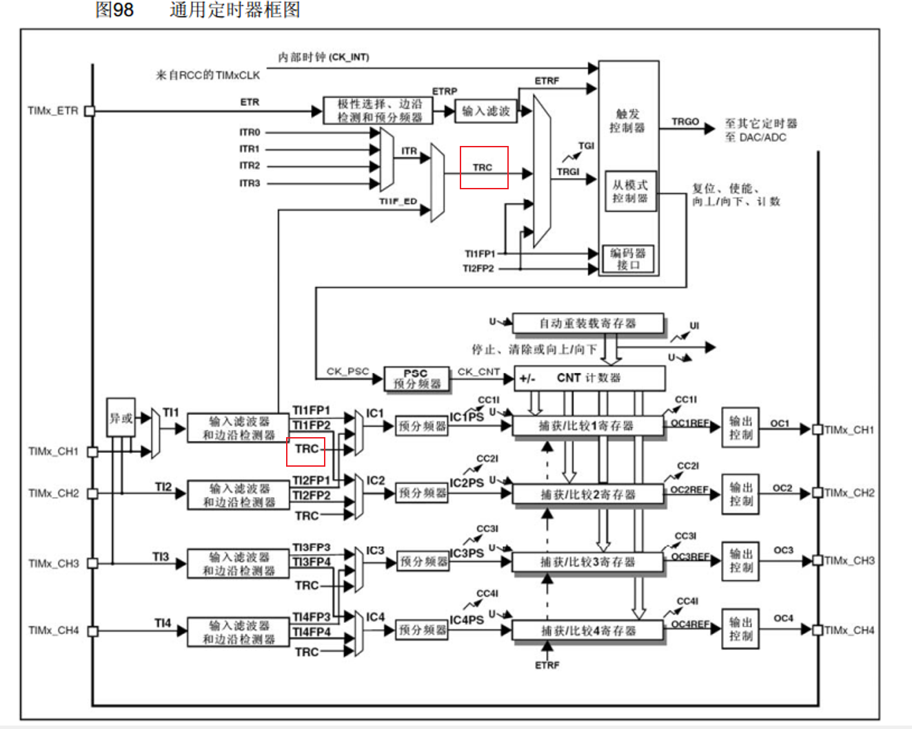

输入捕获对应下图框选的部分：

4个输入捕获和输出比较通道，共用4个CCR寄存器，并且它们的CH1~CH4这4个通道的引脚，也是共用的。所以对于同一个定时器，输入捕获和输出比较不能同时使用。

输出比较是根据CNT和CCR的大小关系来执行输出动作；输入捕获是接收到输入信号（即边沿信号）执行CNT锁存到CCR的动作。

脉冲间隔实际上和频率类似，电平持续时间和占空比类似。

PWMI模式和主从触发模式设计得非常巧妙，将这两个功能结合起来测量频率和占空比就是硬件全自动执行，软件不需要进行任何干预，也不需要进中断，需要测量时直接读取CCR寄存器即可。使用非常方便，极大减轻软件压力。

ppt中有一个频率逐渐降低的方波波形。stm32测量频率时只能测量数字信号的频率。测量频率有两种方法可选择：测频法和测周法。

测频法流程：可设定T为1s，每来一个上升沿其实就是来了一个周期的信号，所以1s时间内来了多少个周期那它的频率就是多少Hz。

测周法原理：周期的倒数就是频率。fx = 1 / （N * (1 / fc)）。测出一个周期的时间（图中两个上升沿的时间间隔）取倒数就是频率。测量时间的方法实际上也是定时器计数。我们使用一个已知的标准频率fc的计次时钟来驱动计数器，上升沿时计数器清零并开始计数，下一个上升沿计数停止。计一个数的时间是1 / fc，计N个数就是N / fc，取倒数就得到公式fx = fc / N。

两种方法比较分析：

测频法适合测量高频信号，测周法适合测量低频信号。测频法，在闸门时间内最好多出现一些上升沿，计数数量多一些这样有助于减小误差。测周法适合测量低频信号，低频信号周期比较长，计次会比较多，有助于减小误差。

测频法测量的是在闸门时间内的多个周期，实际得到的闸门时间内的平均频率，所以自带均值滤波。测频法的单个结果需要耗时一个闸门时间，如果闸门时间为1s，那么每隔1s才能得到一次结果，所以测频法结果更新慢，测量结果是一段时间的平均值，值比较平滑。

测周法只测量一个周期就能出一次结果，所以出结果的速度取决于待测信号的频率。一般而言待测信号都是几百几千Hz，所以一般情况下测周法结果更新更快。由于它只测量一个周期，所以结果值会受噪声的影响，波动比较大。

如何选择测量方法？使用中界频率。

中界频率是测频法与测周法误差相等的频率点。在两种方法中，计次N可能会存在正负1的误差，比如测频法闸门时间内并不是每个周期信号都是完整的（最后的时间里一个周期只出现一半就到达闸门时间，只能舍弃掉或当作一整个周期来看待，这种多计1个和少计1个就是正负1误差）。测周法类似。

要减少正负1误差的影响就要尽可能多计数，当N越大，误差影响就越小。当有一个频率在两种方法下误差相同，称该频率为中界频率。将两种方法的N提出来使之相等，就得到中界频率。

**STM32实现测频法和测周法**

测频法：使用普通外设即可实现。对射式红外传感器计次，每来一个上升沿计次+1，再用一个定时器定1个1s的定时中断，在中断中每隔1s取计数值，同时清零计次，为下一次做准备。这样每一次读取的计次值就直接是频率。对应定时器外部时钟的代码，也是如此，每隔1s取计次值，就能实现测频法测量频率的功能。

测周法：输入捕获测频率使用的是测周法，就是测量两个上升沿之间的时间来进行频率测量。观察下图：

从左往右看，最左边是四个通道的引脚，参考引脚定义表就能知道引脚复用在了哪个位置。引脚进来，有一个三输入的异或门，该异或门的输入接在了通道1、2、3端口，异或门的执行逻辑是：当单个输入引脚的任何一个电平有翻转时，输出引脚就产生一次电平翻转，之后输出通过数据选择器，到达输入捕获通道1，数据选择器如果选择上面的输入，那输入捕获通道1的输入就是3个引脚的异或值，如果选择下面的，则异或门就没有用，4个通道各用各的引脚。该异或门是为三相无刷电机服务的。无刷电机有3个霍尔传感器检测转子的位置，可以根据转子的位置进行换相，有了这个异或门就可以在前三个通道接上无刷电机的霍尔传感器，这个定时器就作为无刷电机的接口定时器，去驱动换相电路工作。了解即可。

继续往下看。输入信号进入输入滤波器和边沿检测器，输入滤波器可以对输入信号进行滤波避免一些高频的毛刺信号误触发。边沿检测器可以选择高电平触发或低电平触发。当出现指定的边沿电路时，边沿检测电路就会触发后续电路执行动作。此处实际设计了两套滤波和边沿检测电路，第一套电路经过滤波和极性选择，得到TI1FP1(TI1 Filter Polarity 1)，输入给通道1的后续电路，第二套电路经过另一套滤波和极性选择，得到TI1FP2(TI1 Filter Polarity 2)，输入给下面通道2的后续电路。同理下面的TI2信号进来也经过两套滤波和极性选择，得到TI2FP1和TI2FP2，其中TI2FP1输入给上面的通道1。所以此处两个信号TI1和TI2进来，可以选择各走各的，也可以选择进行一个交叉，让CH2引脚输入到通道1，或者CH1引脚输入到通道2。进行交叉连接的目的有2个：第一个目的可以灵活切换后续捕获电路的输入，比如你一会儿相以CH1作为输入，一会儿想以CH2作为输入，此时可以通过数据选择器灵活地进行选择。第二个目的也是交叉的主要目的，可以把一个引脚的输入同时映射到两个捕获单元，这也是PWMI模式的经典结构。第一个捕获通道使用上升沿触发用来捕获周期，第二个通道使用下降沿触发，用来捕获占空比。两个通道同时对一个引脚进行捕获就可以同时测量频率和占空比，这就是PWMI模式。

一个通道灵活切换两个引脚和两个通道同时捕获一个引脚，就是此处交叉的作用和目的。同样下面的通道3和通道4也是一样的结构。注意图中还有一个TRC信号也可以作为捕获部分的输入，如下图：

TRC的设计也是为了无刷电机的驱动。

继续往后看，输入信号进行滤波和极性选择后，就来到了预分频器。每个通道各有一个预分频器，可以对信号进行分频，分频后的信号就可以触发捕获电路进行工作。每来一个触发信号，CNT的值就会向CCR转运一次，转运的同时会发生一个捕获事件，该事件会在状态寄存器置标志位，同时也可以产生中断。如果需要在捕获的瞬间处理一些事情，就可以开启这个捕获中断。这就是整个电路的工作流程。比如我们可以配置上升沿触发捕获，每来一个上升沿，CNT转运到CCR一次，又因为这个CNT计数器是由内部的标准时钟驱动的，所以CNT的数值就可以用来记录两个上升沿之间的时间间隔。有个细节问题，每次捕获后都需要将CNT清零，这个清零的动作可以使用主从触发模式自动完成。

下面研究输入捕获的细节，下图是输入捕获通道1更详细的框图：

引脚进来先经过一个滤波器，滤波器的输入是TI1，就是CH1的引脚，输出的TI1F就是滤波后的信号。fDTS是滤波器的采样时钟来源，下面CCMR1寄存器里的ICF位可以控制滤波器的参数。这个滤波器具体的工作，可以参考手册14.4.7CCMR1寄存器章节。ICF位定义了TI1输入的采样频率及数字滤波长度，数字滤波器由一个事件计数器组成，它记录到N个事件后会产生一个输入的跳变。简单理解这个滤波器的工作原理就是：以采样频率对输入信号进行采样，当连续N个值都为高电平，输出才为高电平，连续N个值都为低电平，输出才为低电平，如果信号出现高频抖动，导致连续采样N个值不全都一样，那输出就不会变化，这样就可以达到滤波的效果。采样频率越低，采样个数N越大，滤波效果就越好。

滤波之后的电路通过边沿检测器捕获上升沿或者下降沿，使用CCER寄存器里的CC1P位就可以选择极性了。最终得到TI1FP1触发信号，通过数据选择器，进入通道1后续的捕获电路。CC1S位可以对数据选择器进行选择，ICPS位可以配置分频器，CC1E位控制输出使能或失能。输入使能电路，输入端产生指定边沿信号经过层层电路，就可以让CNT的值转运到CCR里面，并且硬件电路可以在捕获之后自动完成CNT的清零工作。如何自动清零？看图中TI1FP1和TI1的边沿信号，都可以通向从模式控制器，比如TI1FP1的上升沿触发捕获，在此处TI1FP1还可以同时触发从模式，从模式中就有电路可以自动完成CNT的清零。所以从模式就是完成自动化操作的利器。

接下来研究主从触发模式，看一下主从触发模式有什么用，如何完成硬件自动化的操作。

**主从触发模式**

主从触发模式是主模式、从模式和触发源选择三个功能的检测。其中主模式可以将定时器内部的信号映射到TRGO引脚，用于触发别的外设，所以这部分叫做主模式。从模式就是接收其他外设或自身外设的一些信号，用于控制自身定时器的运行，也就是被别的信号控制，所以这部分叫从模式。触发源选择，就是选择从模式的触发信号源，可以认为它是从模式的一部分。触发源选择，选择指定的一个信号得到TRGI，TRGI去触发从模式。从模式可以选择上图中的列表里一项操作来自动执行。如果想让TI1FP1信号自动触发CNT清零，则触发源选择中，就可以选择TI1FP1(如上图)，从模式执行的操作就可以选择执行Reset操作，这样TI1FP1的信号就可以自动触发从模式，从模式自动清零CNT，实现硬件全自动测量，这就是主从触发模式的用途。

有关信号的具体解释，可以查看手册，比如主模式的触发源都是什么意思，可以翻阅手册14.4.2，可以查看各种主模式的解释。比如想实现定时器的级联，就可以选择一个定时器主模式输出更新信号到TRGO，另一个定时器选择上一个定时器触发从模式，从模式选择执行外部时钟模式1的操作，这样就能实现定时器的级联了。

主模式还可以选择复位、使能、比较脉冲和4个OCREF信号作为TRGO的输出。

操作手册14.4.3节：有从模式配置介绍。

库函数中，上图中三部分对应三个函数，调用函数即可。

**输入捕获测频率**

上图只使用了一个通道，所以只能测量频率。右上角是时基单元，把时基单元配置好，启动定时器，CNT就会在预分频之后的这个时钟驱动下不断自增，CNT就是测周法用来计数计时的东西。经过预分频之后的时钟频率，就是驱动CNT的标准频率fc。所以标准频率fc= 72M/预分频系数。下面输入捕获通道1的GPIO口，输入左上的方波信号，经过滤波器和边沿检测，选择TP1FP1为上升沿触发。之后输入选择直连的通道，分频器选择不分频。当TI1FP1出现上升沿之后，CNT的当前计数值转运到CCR1，同时触发源选择，选中TI1FP1为触发信号，从模式选择复位操作，这样TI1FP1也会通过上面一条路，去触发CNT清零。顺序是先捕获再清零。CCR1时钟保持最新一个计数周期的值。CCR1的值就是N，fc/N就是频率。所以当读取信号的频率时，只需要读取CCR1得到N，再计算fc/N就可以。

注意事项：CNT的值是有上限的，ARR一般设置为最大65535，则CNT最大也只能计65535个数。如果信号频率太低，CNT计数值可能会溢出。从模式的触发源选择，只有TI1FP1ge TI2FP2，没有TI3和TI4的信号，所以使用从模式自动清零CNT，就只能用通道1和通道2。对于通道3和通道4就只能开启捕获中断，在中断内手动清零，此时程序就会处于频繁终端的状态，比较消耗软件资源。

**PWMI基本结构**

PWMI模式使用了两个通道同时捕获一个引脚。可以同时测量周期和占空比。首先TI1FP1配置上升沿触发，触发捕获和清零CNT，正常的捕获周期，这时再来一个TI1FP2配置为下降沿触发，通过交叉通道去触发通道2的捕获单元。观察左上角波形，最开始上升沿CCR1捕获，同时清零CNT，之后CNT一直++，然后再下降沿的时刻，触发CCR2捕获（并不触发CNT清零），这是CCR2的值就是高电平时间段内的计数值。所以CCR1就是一整个周期的计数值，CCR2就是高电平期间的计数值，使用CCR2/CCR1就是占空比。这就是PWMI模式，使用两个通道来捕获频率和占空比的思路。