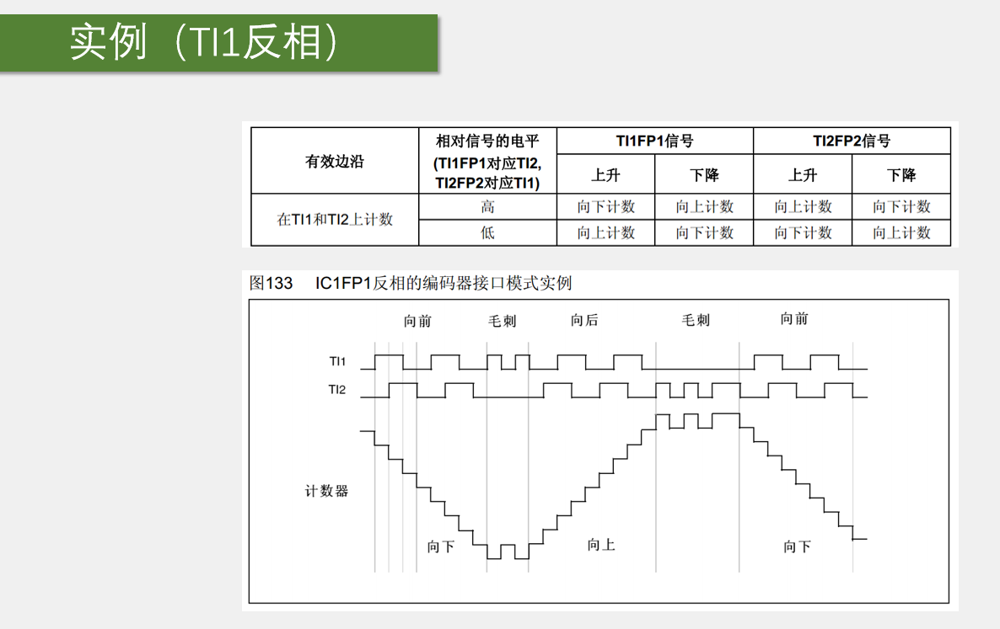

使用TIM定时器的编码器接口，再配合编码器，就可以测量旋转速度和旋转方向。编码器测速一般应用在电机控制的项目上。使用PWM驱动电机，再使用编码器测量电机的速度，然后再用PID算法进行闭环控制，是一个比较常见的场景。一般电机旋转速度比较高，会使用无接触式的霍尔传感器或者光栅进行测速。

下面的实验实验触点式的旋钮编码器进行演示。电机旋转通过人工旋转来进行模拟，实际使用中旋钮编码器和电机的霍尔、光栅编码器都是一样的效果。

正交编码器输出两个相位差90°的方波信号，超前90°或者滞后90°分别代表正转和反转。

编码器接口其实相当于是一个带有方向控制的外部时钟，它同时控制着CNT的计数时钟和计数方向。CNT的值就表示了编码器的位置，如果每隔一段时间取一次CNT的值并清零，每次取出来的值就表示了编码器的速度。借鉴测频法和测周法测频率，编码器测速实际上就是测频法测正交脉冲的频率。

正交编码器一般可以测量位置或者带有方向的速度值。它一般有两个信号输出引脚，分别是A相和B相，编码器转的越快，输出的A相和B相的频率就越高，所以方波的频率就代表了速度。取任意一相的信号来测频率就能知道旋转速度。但是只有一相的信号无法测量旋转方向，无论正转还是反转，方波都是一样的。想要测量方向，还必须要有另一根线的辅助，比如这里的B相。正传时A相提前B相90°，反转时A相滞后B相90°。对于正转，A相提前还是滞后，并不是绝对的，还涉及到极性的问题（如果此时A提前B90°，A取反后，A就滞后90°了）。

使用正交信号相比较单独定义一个方向引脚，有什么好处呢？首先，正交信号精度更高。因为A、B相都可以计次，相当于计次频率提高了一倍；其次，正交信号可以抗噪声，因为正交信号的两个信号是交替跳变的，所以可以涉及一个抗噪声电路，如果一个信号不变，另一个信号连续跳变，也就是产生了噪声，这时计次值是不会变化的。

上图中右侧表格解释了正交信号如何计次和区分旋转方向。

编码器接口的设计逻辑就是：首先把A相和B相的所有边沿作为计数器的计数时钟，出现边沿信号时就计数自增或自减。是增还是减，计数的方向由令一相的状态来确定。当出现某个边沿时判断另一相的高低电平。如果对应另一相的状态出现在右侧上面的表格，就是正转，计数自增；反之另一相的状态出现在下面的表里，那就是反转，计数自减。如此，就能实现编码器接口的功能，这也是stm32定时器编码器接口的执行逻辑。

**编码器接口电路是如何设计的？**

每个定时器都只有一个编码器接口，基本定时器没有编码器接口。如上图，编码器接口有两个输入端，分别接到编码器的A相和B相。TI1FP1和TI2FP2分别是两个网络标号，可以看出编码器接口的两个引脚借用了输入捕获单元的前两个通道。所以最终编码器的输入引脚就是CH1和CH2这两个引脚。其中，CH1和CH2的输入捕获滤波器和边沿检测，编码器接口也有使用，但输入捕获中的是否交叉、预分频器和CCR寄存器，与编码器接口无关。

编码器接口的输出部分，相当于从模式控制器控制CNT的计数时钟和计数方向。简单来说，输出执行流程是：如果出现了边沿信号，并且对应另一相的状态为正转，则控制CNT自增，否则控制CNT自减。注意，72M内部时钟和在时基单元初始化时设置的计数方向并不会使用。因为此时计数器时钟和计数方向都处于编码器接口托管的状态。计数器的自增和自减受编码器控制。

如上图，输入捕获的前两个通道，通过GPIO口接入编码器的A相和B相。然后通过滤波器和边沿检测极性选择，产生TI1FP1和TI2FP2，通向编码器接口。编码器的接口通过预分频器控制CNT计数器的时钟，同时编码器接口还根据编码器的旋转方向控制CNT的计数方向。编码器正传时CNT自增，编码器反转时CNT自减。ARR也是有效的，一般会设置ARR为65535最大量程，利用补码的特性很容易得到负数，将16位的无符号数转换为16位的有符号数即可。根据补码的定义，65535就对应-1。

编码器接口有三种工作模式，分别是仅在TI1计数，仅在TI2计数，和在TI1和TI2上都进行计数。以第三个模式为例，总结就是正转的状态下，A和B的边沿都进行向上计数；反转状态下，A和B的边沿都进行向下计数。一般都是以第三个模式，因为该模式计数精度最高。

