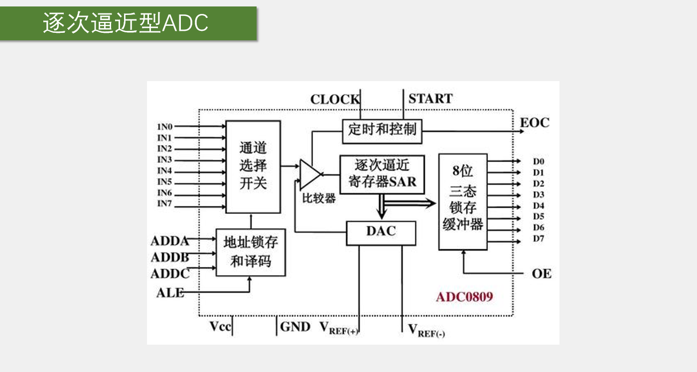
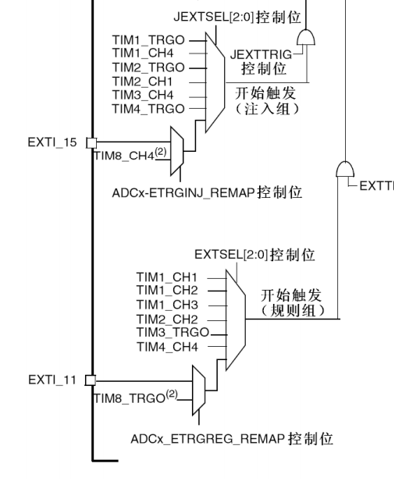

STM32的ADC是12位的，所以AD结果的最大值是2^12-1,即4095，对应的电压是3.3V。GPIO只能读取引脚的高低电平，要么是高电平，要么是低电平，只有两个值，使用了ADC之后，我们就可以对高电平和低电平之间的任意电压进行量化，最终用一个变量来表示，读取这个变量，就可以知道引脚的具体电压值。所以ADC其实就是一个电压表，把引脚的电压值测出来放在一个变量中，这就是ADC的作用。

ADC读取引脚上的模拟电压，转换为一个数据，存在寄存器中，我们再将这个数据读取出来，就可以进行显示、判断、记录等操作。ADC可以将模拟信号转换为数字信号，是模拟电路到数字电路的桥梁。ADC是模拟到数字的桥梁，反过来也有数字到模拟的桥梁，即DAC数字模拟转换器，使用DAC就可以将数字变量转换为模拟电压。PWM波也是数字到模拟的桥梁，如使用PWM控制LED的亮度、电机的速度，这就是DAC的功能，同时PWM只有导通和完全断开两种状态，在这两种状态上都没有功率损耗，所以在直流电机调速这种大功率的应用场景，使用PWM来等效模拟量，是比DAC更好的选择，并且PWM电路更加简单，更加常用，所以可以看出PWM还是挤占了DAC的很多应用空间。目前DAC的应用主要是在波形生成领域，比如信号发生器、音频解码芯片等，这些领域PWM还是无法替代的。

逐次逼近型是ADC的工作模式。12位和1us的转换时间涉及到ADC的两个关键参数，第一个是分辨率，一般用多少位来表示，12位AD值，它的表示范围就是0~2^12-1，量化结果的范围是0-4095，位数越高，量化结果就越精细，对应的分辨率就越高。第二个就是转换时间，即转换频率，AD转换需要花一小段时间，这里1us表示从AD转换开始到产生结果，需要花1us的时间，对应AD转换的频率就是1MHz。这就是stm32 ADC的最快转换频率。如果需要转换一个频率非常到的信号，就要考虑这个转换频率是否够用。如果信号频率比较低，则最大1MHz的转换频率就完全够用了。

ADC的输入电压，一般要求在芯片供电的负极和正极之间变化。负极0V对应转换结果最小值0，正极3.3V对应转换结果最大值4095，中间都是线性关系。计算简单，直接乘除一个系数即可。

外部信号源就是16个GPIO口，在引脚上直接接模拟信号即可，不需要任何额外的电路，引脚就直接能测电压，非常方便。2个内部信号源是内部温度传感器和内部参考电压，温度传感器可以测量CPU的温度，比如电脑可以显示CPU的温度，就可以使用ADC读取这个温度传感器来进行测量；内部参考电压是一个1.2V左右的基准电压，该基准电压不随外部供电电压变化而变化，所以芯片的供电不是标准的3.3V，那测量外部引脚的电压可能就不对，这时就可以读取这个基准电压进行校准，就能得到正确的电压值。

规则组和注入组是stm32 ADC的增强功能。普通的AD转换流程是启动一次转换、读一次值，然后再启动、再读值，但stm32的ADC比较高级，可以列一个组，一次性启动一个组，连续转换多个值。并且有两个组，一个是用于常规使用的规则组，一个用于突发事件的注入组。

模拟看门狗自动监测输入电压范围：这个ADC一般可以用于测量光线强度、温度等值，并且经常会有需求是如果光线高于某个阈值、低于某个阈值，或者温度高于或低于某个阈值时，执行一些操作，这个高于或低于某个阈值的判断，就可以用模拟看门狗来自动执行。模拟看门狗可以监测指定的某些通道，当AD值高于它设定的上阈值或低于下阈值时，它就会申请中断，所以可以在中断函数里执行相应的操作，这样可以避免不断地手动读值再用if进行判断。

stm32f103c8t6的ADC资源最多只能测量10个外部引脚的模拟信号。前面提到的16个外部信号源是指这个系列最多有16个外部信号源。但stm32f103z8t6芯片引脚较少，有很多引脚没有引出来，所以只有10个外部信号源，如果需要更多的外部通道，可以选择引脚更多的型号。

**逐次逼近型ADC是如何测电压的？**

上图是逐次逼近型ADC的内部结构。stm32的ADC和该结构原理一致，了解这个结构对学习stm32的ADC大有帮助。stm32只画了一个框表示ADC，并没有描述内部结构。

上图是ADC0809的内部结构图。这是一个独立的8位逐次逼近型ADC芯片。首先左侧IN0-IN7是8路输入通道。通过通道选择开关选中一路，输入到比较器进行转换。下面的地址锁存和译码，用于设置选中的通道号，然后给一个ALE锁存信号，上面对应的通路开关就会自动拨好。因此这一部分就相当于可以通过模拟信号的数据选择器。因为ADC转换是一个很快的过程，给个开始信号，过几个us就转换完成了，所以如果想要转换多路信号，就不必设计多个AD转换器，只需要一个AD转换器再加一个多路选择开关，需要转换哪一路就先拨开关选中对应通道，然后再开始转换即可。此处的输入只有8个通道，在stm32中此处对应的是18个通道，所以地址锁存和译码对应的是一个18路的多路开关。

如何知道电压对应的编码数据是多少？这就需要用逐次逼近的方法一一比较。图中的电压比较器可以判断两个输入信号的大小关系，它输出一个高低电平指示大小。它的两个输入端一个是待测的电压，另一个是图中DAC的电压输出端。DAC是数模转换器，给它一个数据，它就可以输出数据对应的电压。DAC内部是使用加权电阻网络来实现的转换。此时比较器有了一个外部通道输入的未知编码的电压，和一个DAC输出的已知编码的电压，这两个电压同时输入到电压比较器进行大小判断。如果DAC输出的电压比较大，就调小DAC数据，反之增大DAC数据，直到两个电压近似相等，此时DAC 输入的数据就是外部电压的编码数据了。这就是DAC的实现原理。电压调节的过程就是图中逐次逼近SAR完成的。为了最快找到未知电压的编码，通常会使用二分法进行寻找。

图中EOC是转换结束信号，START是开始转换。给一个输入脉冲，开始转换。因ADC内部是一步一步进行判断的，所以需要CLOCK时钟。VREF+和VREF-是DAC的参考电压。DAC的参考电压决定了ADC的输入范围，所以它也是ADC的参考电压。图左下部分的Vcc和GND是整个ADC芯片电路的供电。通常参考电压的正极和Vcc一样，会接在一起，参考电压的负极和GND也是一样的，也接在一起。所以一般情况下，ADC输入电压的范围就和ADC的供电是一样的。

**stm32 ADC**

一般在手册中，每个外设的最前面都有一个整体的结构图。

图左侧是ADC的输入通道，包括16个GPIO口，IN0-IN15，还有两个内部通道，分别是温度传感器和VREFINT(V Reference Internal，内部参考电压)。18个通道到达一个模拟多路开关，可以指定需要选择的通道。多路开关的输出进入到模数转换器，模数转换器执行的就是逐次比较的过程，转换结果会放置在图中的注入通道寄存器和规则通道寄存器，读取寄存器即可知道ADC转换的结果。

对于普通的ADC，多路开关一般都只能选中一个，即选中某一个通道、开始转换、等待转换完成、取出结果。但此处stm32的ADC比较高级，它可以同时选中多个，并且转换时还分成了规则通道组和注入通道组。其中规则通道组可以一次性最多选择16个通道，注入组最多可以选择4个通道。规则通道组可以一次性获取16个转换结果，但比较尴尬的地方是规则组只有一个数据寄存器，前15个转换结果会被冲掉。所以规则组转换最好配合DMA来实现，DMA是一个数据转运小帮手，可以进行数据转运放置被覆盖。

规则组虽然可以同时转换16个通道，但是数据寄存器只能存一个结果，如果不想之前的结果被覆盖，那在转换完成之后就要尽快把结果拿走。

注入组的数据寄存器有4个，并且同时可以转换4个通道，不需要担心数据覆盖的问题。

一般情况下使用规则组即可，如果使用规则组，再配合DMA转运数据，就可解决数据覆盖的问题。下面只介绍规则组。

图中左下角是触发转换的部分，即对应START信号开始转换。对于stm32的ADC，触发ADC开始转换的信号有两种，一种是软件触发，程序中手动调用代码启动转换；另一种就是硬件触发，就是如下图中的触发源：

上图中上面的部分是注入组的触发源，下面的部分是规则组的触发源。这些触发源主要是来自于定时器，有定时器的各个通道，还有TRGO定时器主模式的输出。定时器可以通向ADC、DAC这些外设，用于触发转换。因ADC经常需要经过一个固定的时间转换一次，比如每隔1ms转换一次，正常的思路就是用定时器每隔1ms申请一次中断，在中断中手动开启一次转换也是可以的。但频繁进中断对程序是有一定影响的。对于需要频繁进中断，并且在中断里只完成了简单工作的情况，一般都会有硬件的支持，如此处可以给TIM3定个1ms的时间，并且把TIM3的更新事件选择为TRGO输出，然后在ADC中选择触发信号为TIM3的TRGO，这样TIM3的更新事件就能通过硬件自动触发ADC转换了。

左上角标注了VREF+、VREF-、VDDA和VSSA，VREF+和VREF-是ADC的参考电压，决定了ADC输入电压的范围；VDDA和VSSA是ADC的供电引脚。一般情况下，VREF+要接VDDA，VREF-要接VSSA，但在stm32芯片上，没有VREF+和VREF-的引脚，在内部已经和VDDA和VSSA接在一起。VDDA和VSSA在引脚定义表中可以查到，它们是内部模拟部分的电源，比如ADC、RC振荡器、锁相环等。在这里VDDA接3.3V，VSSA接GND，所以ADC的输入电压范围是0-3.3V。

ADCCLK是ADC的时钟，用于驱动内部逐次比较。它来自于ADC预分频器，而ADC预分频器来源于RCC。

DMA请求触发数据转运。

模拟看门狗可以设定阈值高限和低限，如果启动了模拟看门狗并且指定了看门的通道，则一旦超出阈值范围，就会申请一个模拟看门狗的中断，最后通向NVIC.

对于规则组，转换完成后，会有一个EOC转换完成的信号（如图）；对于注入组，转换完成后，会有一个JEOC信号（如图）。这两个信号会在状态寄存器里置一个标志位，读取标志位即可知道是否转换结束，同时这两个标志位可以去到NVIC申请中断。

总结：左边是输入通道，16个GPIO口外加两个内部通道。然后进入AD转换器，AD转换器分规则组和注入组。规则组最多选择16个通道，注入组最多选择4个通道。转换的结果可以存放在AD数据寄存器中，其中规则组只有1个数据寄存器，注入组有4个。下面的触发控制提供了开始转换的START信号。触发控制可以选择软件触发和硬件触发，硬件触发主要来自于定时器，也可以选择外部中断的引脚。下面还有来自于RCC的ADC时钟CLOCK，ADC逐次比较的过程由该时钟推动。可以布置一个模拟看门狗用于监测转换结果的范围，超出设定阈值范围就可以通过中断输出控制相NVIC申请中断。另外，规则组和注入组转换完成后会有一个EOC信号，会置标志位，还可以通向NVIC。右下角开关控制对于库函数中ADC_Cmd函数，用于给ADC上电。

上图是ADC通道和引脚复用的关系，也可以查看引脚定义表。可以看出ADC1和ADC2引脚完全一致。既然引脚完全一致，为什么还要ADC2？因为stm32 ADC还有一个高级功能，就是双ADC模式，这个模式比较复杂，此处简要介绍。双ADC模式就是ADC1和ADC2一起工作，可以配合组成同步模式、交叉模式等模式。比如交叉模式，ADC1和ADC2交叉地对一个通道进行采样，这样可以进一步提高采样率。

**规则组的4种转换模式**

- 单次转换，非扫描模式
- 连续转换，非扫描模式
- 单次转换，扫描模式
- 连续转换，扫描模式

ADC初始化的结构体中有两个参数，分别选择单次转换还是连续转换，和非扫描模式还是扫描模式。

单次转换非扫描模式：图中的表就是规则组中的菜单，有16给空位分别是序列1到序列16。可以在其中写入要转换的通道，在非扫描的模式下，就只有第一个序列1的位置有效。这时菜单同时选中一组的方式就退化为简单地选中一个的方式。我们可以在序列1的位置指定我们想要转换的通道。比如图中的序列1位置写了通道2，然后既可以触发转换，ADC就会对这个通道2进行模数转换。过一小段时间后转换完成，转换结果放在数据寄存器里，同时给EOC标志位置1，整个转换过程就结束了。我们判断这个EOC标志位，如果转换完成，我们就可以在数据寄存器中读取结果。如果我们想再启动一次转换，那就需要再触发一次，然后转换结束，置EOC标志位，读结果。如果想换一个通道，则在转换之前，把第一个位置的通道2改成其他通道，然后再启动转换即可。这就是单次转换非扫描的转换模式。

连续转换非扫描模式：首先这还是非扫描模式，所以菜单列表就只用第一个。它与前一种单次转换不同的是，它在一次转换结束后不会停止，而是立刻开始下一轮的转换，然后一直持续下去。这样就只需要最开始触发一次，之后就可以一直转换了。这个模式的优点是开始转换之后不需要等待一段时间，因为它一直在转换，所i就不需要手动触发转换了。也不要判断是否结束，想要读AD值时，直接从数据寄存器读取即可。这就是连续转换非扫描模式。

单次转换扫描模式：这个模式也是单次转换，所以每次触发转换结束之后，就会停下来，下次转换需要再触发才能开始。它是扫描模式，就要用到菜单列表了。你可以在这个菜单里点菜，比如第一个是通道2，第二个是通道5等。这里的每个位置是通道几可以任意指定，并且也是可以重复的。初始化结构体里还会有个参数就是通道数目，因为这16个位置可以不用完，只用前几个，所以就需要再给一个通道数目的参数，告知程序有几个通道。比如这里指定通道数目为7，那它就只看前7个位置，每次触发之后，就依次对这前7个位置进行AD转换。转换结果都放在数据寄存器中。为了防止数据被覆盖，就需要用DMA及时将数据挪走。7个通道转换完成之后产生EOC信号，转换结束。然后手动触发下一次，就又开始新一轮的转换。这就是单次转换扫描模式的工作流程。

连续转换扫描模式：本模式下，一次转换完成后立刻开始下一次的转换。

在扫描模式下还有一种模式叫间断模式，作用是：在扫描的过程中，每隔几个转换，就暂停一次，需要再次触发才能继续。了解即可。

上表就是规则组的触发源。这些触发信号的选择是通道设置表中最后一列的寄存器来完成。使用库函数时设定一个参数即可。

ADC是12位的，它的转换结果就是一个12位的数据。但数据寄存器是16位的，所以存在一个数据对齐的问题。第一种是数据右对齐，就是12位的数据向右靠，高位多出来的补零。第二种是数据左对齐，12位的数据向左靠，低位多出来的几位补0。一般使用的是第一种右对齐，这样读取16位的寄存器直接就是转换的结果。在不需要12位这么高精度时，如只需要8位精度，就可以使用左对齐，将D11到D4读出来舍弃掉D3-D1，这个12位的ADC就退化成了8位的ADC。

转换时间我们一般不太敏感，因为AD转换一般都很快。如果不需要非常高速的转换频率，那转换时间就可以忽略。

AD转换是需要时间的。AD转换的步骤采样、保持、量化、编码就需要时间。采样和保持可放在一次，量化和编码可放在一起，总体分为两大部。量化编码就是ADC逐次比较的过程，一般位数越多，花的时间就越长。为什么需要采样保持？是因为后面的量化编码是需要一小段时间的，如果在这一小段时间内，输入的电压还在不断的变换，就无法定位输入电压的具体值。所以在量化编码之前需要设置一个采样开关。先打开采样开关，收集一下外部的电压，比如可以用一个小容量的电容存储一下这个电压，存储好之后断开采样开关，再进行后面的AD转换。这样在量化编码的期间电压始终保持不变。采样保持的过程需要闭合采样开关，过一段时间再断开，这就会产生一个采样时间。采样时间可以在程序中配置，采样时间越大，越能避免一些毛刺信号的干扰，不过转换时间也会相应地延长。12.5个ADC周期是量化编码花费的时间，因为是12位的ADC，所以要花费12个ADC周期。此处多的0.5个周期，可能是做其他一些东西花费的时间。ADC周期就是从RCC分频过来的ADCCLK，ADCCLK最大是14MHz，所以上图中最后的例子，就是最快的转换时间。也可以将ADCCLK的时钟设置超过14MHz，这样ADC就是在超频，转换时间可以比1us还短，但稳定性就无法保证了。

校准过程是固定的，我们只需要在ADC初始化的最后，加几条代码即可。具体原理了解即可。

ADC的外围电路如何设计？如上图，第一个是电位器产生一个可调的电压。这里电位器的两个固定端，一端接3.3V，另一端接GND，这样中间的滑动端就可以输出一个0-3.3V可调的电压输出。此处接PA0口，当滑动端往上滑时电压增大，反之电压减小。注意电位器电阻的阻值不要给太小，因为这个电阻两端也是直接跨接在电源正负极的。如果阻值太小，这个电阻就会比较费电，再小就有可能发热冒烟。一般至少要接千欧的电阻，比如图中接的是10K的电阻。

中间是传感器输出电压的电路。一般来说，像光敏电阻、热敏电阻、红外接收管、麦克风等，都可以等效为一个可变电阻，电阻阻值没法直接测量，所以这里就可以通过和一个固定电阻串联分压，得到一个反应电阻值电压的电路。在此处，传感器阻值变小，下拉作用变强，输出端电压就下降；传感器阻值变大时，下拉作用变弱，输出端受上拉电阻的作用，电压就会升高。这个固定电阻一般可以选择和传感器阻值相近的电阻，这样可以得到一个位于中间电压区域比较好的输出。当然这里的传感器和固定电阻的位置也可以换过来，输出电压的极性就反转了。

最右边是一个简单的电压转换电路，比如你需要测一个0-5V的VIN电压，但ADC只能接收0-3.3V的电压，此时可以搭建一个这样的简易转换电路。此处还是使用电阻进行分压，上面阻值17k，下面阻值33k，加在一起是50k，所以中间电压就是VIN/50k * 33K，最后得到的范围就是0-3.3V，就可以进入ADC转换。如果电压比较大，如超过10V，不建议使用这个电路，可能会比较危险。高电压采集最好使用一些专用的采集芯片，比如隔离放大器，做好高低电压的隔离，保证电路的安全。

