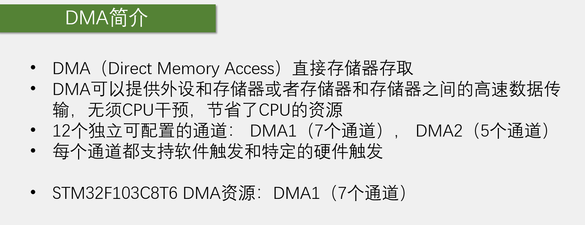
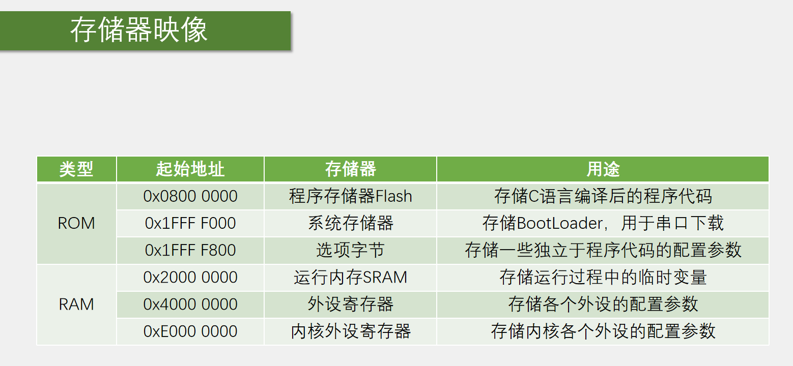
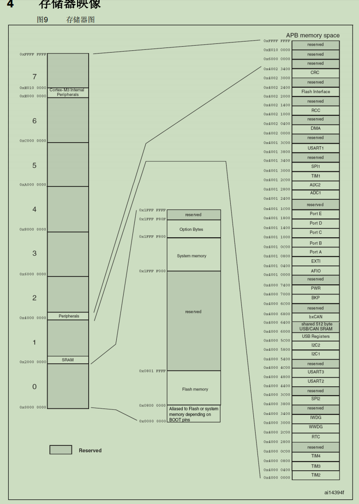
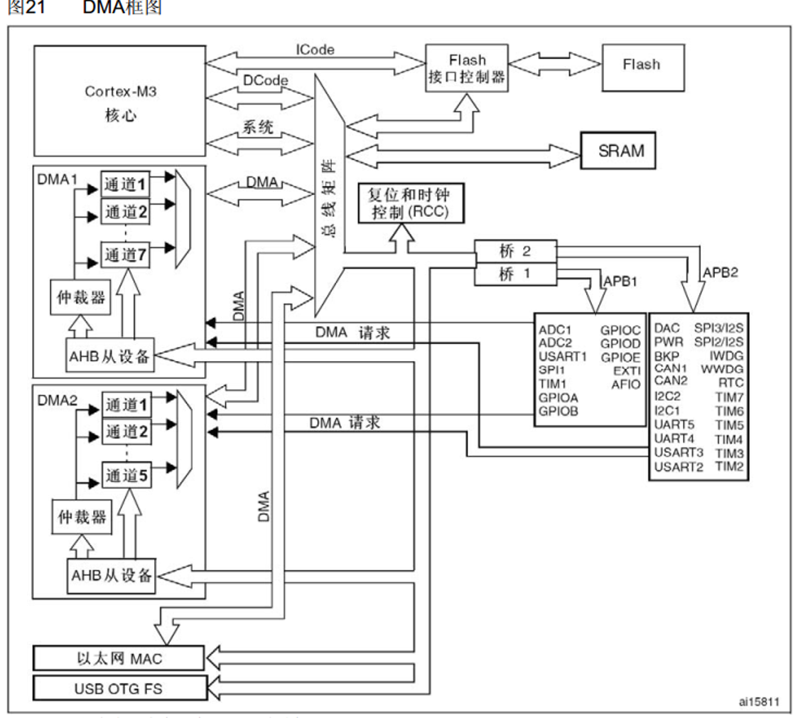
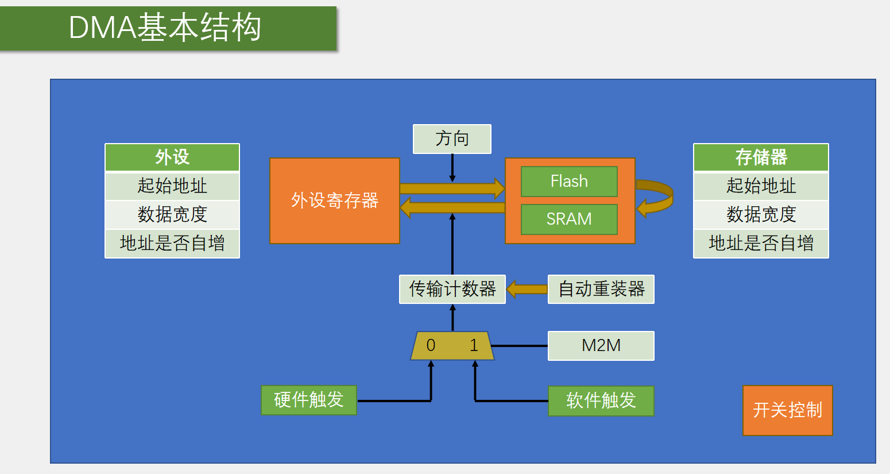
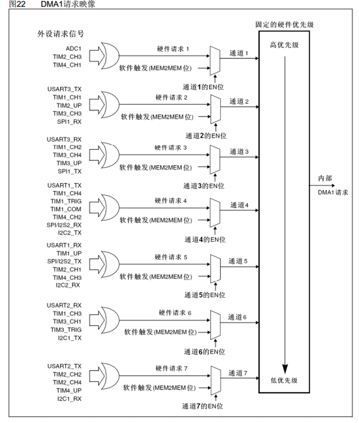
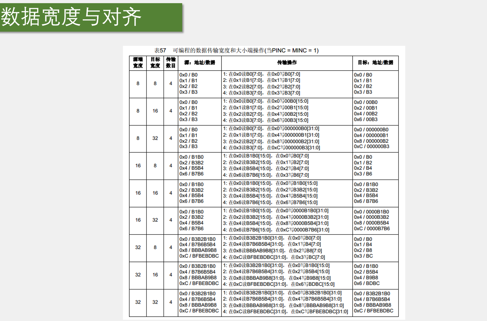

DMA是一个数据转换小助手，它主要是用来协助CPU，完成数据转运的工作。

DMA，直接存储器存取，或者叫直接存储器访问。DMA这个外设可以直接访问STM32内部的存储器，包括运行内存SRAM、程序存储器Flash和寄存器等等。DMA都有权限访问它们，所以DMA才能完成数据转运的功能。

第二点：这里外设指的就是外设的寄存器，一般是外设的数据寄存器DR（Data Register)，比如ADC的数据寄存器、串口的数据寄存器等等。这里存储器指定是运行内存SRAM和程序存储器Flash， 是存储变量数组和程序代码的地方。

第三点：通道是数据转运的路径，从一个地方移动到另一个地方，需要占用一个通道。如果有多个通道进行转运，它们之间互不干扰。

第四点：如果DMA进行的是存储器到存储器的数据转运，比如我们想把Flash里的一批数据转运到SRAM里去，就需要软件触发。使用软件触发之后，DMA会以最快的速度将数据全部转运完成。如果DMA进行的是外设到存储器的数据转运，无法无脑地进行转运，原因是外设的数据是有一定时机的。此时需要用硬件触发，比如转运ADC数据，需要ADC每个通道AD转换完成之后，硬件触发一次DMA，之后DMA再转运。触发一次转运一次，数据才是正确的，才是我们想要的效果。特定的硬件触发，意思是每个DMA通道的硬件触发源是不一样的，想要使用某个外设的硬件触发源，就必须使用它连接的那个通道，而不能任意选用通道。

DMA进行存储器间数据转运，下面了解stm32中有哪些存储器以及这些存储器被安排到哪些地址上，即存储器映像的内容。计算机五大组成部分是运算器、控制器、存储器、输入设备和输出设备。运算器和控制器合在一起叫做CPU，因此计算机的核心关键部分就是CPU和存储器。存储器有两个重要知识点，即存储器的内容和存储器的地址。stm32也不例外。上图中的表就是stm32中所有类型的存储器，和它们所被安排的地址（详情见数据手册中的存储器映像）。

上表中，无论是Flash，还是SRAM，还是外设寄存器，都是存储器的一种。ROM是只读存储器，是一种非易失性、掉电不丢失的存储器。RAM是随机存储器，是一种易失性、掉电丢失的存储器。

ROM分成了三块。第一块是程序存储器Flash，也就是主闪存，用途是存储C语言编译后的程序代码，所以Flash就是我们下载程序的位置。运行程序一般也是从主闪存里面开始运行的。第二块和第三块的系统存储器和选项字节，实际上它们的存储介质也是Flash，只不过一般说的Flash指的是主闪存的Flash，而不指这两块区域。用途见上表，BootLoader程序是芯片出厂自动写入的，一般不允许我们修改。下载程序可以不刷新选项字节的内容，这样选项字节的配置就可以保持不变。选项字节中，存储的主要是Flash的读保护、写保护，还有看门狗等等的配置。

RAM。运行内存SRAM，类比电脑的内存条。外设寄存器的存储介质实际上也是SRAM，只不过我们一般习惯把运行内存叫SRAM。外设寄存器一般习惯性直接叫寄存器。内核外设计就是NVIC和Systick。因内核外设和其他外设不是一个厂家设计的，所以两者的地址被分开。

在stm32中，所有的存储器都被安排到了0x0到0xffff ffff的地址范围内。因为CPU是32位的，所以寻址范围是32位的范围。32位的寻址范围很大，可以支持最大4GB存储容量的存储器，但是stm32的存储器都是KB级别，所以如上图中，4GB的寻址空间会有大量的地址是空的（图中的Reserved），地址的使用率不到1%。0x0地址实际上也是没有存储器的，这里写的是别名到Flash或者系统存储器，取决于BOOT引脚。因为程序是从0地址开始执行的，所以此处需要把我们想要执行的程序映射到0地址上。如果映射在Flash区，就是从Flash执行；如果映射在系统存储器区，就是从系统存储器运行BootLoader；如果映射到SRAM，就是从SRAM启动。具体如何选择由BOOT0和BOOT1两个引脚来决定。这就是0地址里的别名区。

0x4000 0000开始的是外设寄存器区，里面展开就是图最右边的寄存器。具体到每个外设，它们又有自己的起始地址。外设地址又可以具体细分到每个寄存器的地址、寄存器里每个字节的地址。最终所有字节的地址都可以计算出来。

左上角是Cortex-M3内核，里面包含了CPU和内核外设。图中剩下的所有东西，都可以看作是存储器。所以总共就是CPU和存储器两个东西。Flash是主闪存，SRAM是运行内存，各个外设都可以看成是寄存器，也是一种SRAM存储器。寄存器是一种特殊的存储器，一方面CPU可以对寄存器进行读写，就像读写运行内存一样。另一方面，寄存器的每一位背后都连接了一根导线，这些导线可以用于控制外设电路的状态，比如置引脚的高低电平、导通和断开开关、切换数据选择器，或者多位组合起来当作计数器、数据存储器等等。所以寄存器是连接软件和硬件的桥梁，软件读写寄存器就相当于控制硬件电路的执行。既然外设就是寄存器，寄存器就是存储器，因此使用DMA进行数据转运都可以归为一类问题，就是从某个地址取内容再放到另一个地址去。

如图，为了高效有条理地访问存储器，设计了一个总线矩阵（如图），总线矩阵的左端是主动单元，即拥有存储器的访问权。右边是被动单元，它们的存储器只能被左边的主动单元读写。主动单元中，内核有DCode和系统总线（如图），可以访问右边的存储器。DCode总线是专门访问Flash的，系统总线是访问其他东西的。此外由于DMA要转运数据，所以DMA也必须要有访问的主动权。主动单元处了内核CPU，剩下的就是DMA总线（如图）。可以看到DMA1和DMA2各有一条DMA总线，以太网外设有私有的DMA，不用管。可以看到，DMA1有7个通道，DMA2有5个通道，各个通道可以分别设置它们转运数据的源地址和数据地址，因此各自可独立工作。

仲裁器（如图）：虽然多个通道可以独立转运数据，但是DMA总线只有一条，所以所有的通道都只能分时复用这一条DMA总线。如果产生了冲突，就会由仲裁器根据通道的优先级决定哪个通道先用。另外，在总线矩阵处也有一个仲裁器（图中未画出），如果DMA和CPU都要访问同一个目标，那么DMA就会暂停CPU的访问以防止冲突，不过总线仲裁器仍然会保证CPU得到一半的总线带宽，使CPU也能正常的工作。

AHB从设备（如图）：是DMA自身的寄存器，用于配置DMA参数。DMA作为一个外设，它自己也会有相应的配置寄存器。它连接在了总线矩阵右边的AHB总线上。所以DMA既是总线矩阵的主动单元，可以读写各种寄存器，也是AHB总线上的被动单元，所以CPU才可以通过该线路对DMA进行配置。

DMA请求（如图）：请求即触发，请求的右边是触发源（即各个外设），因此DMA请求就是DMA的硬件触发源。比如ADC转换完成、串口接收到数据，需要触发DMA转运数据的时候，就会向DMA发出硬件触发信号。

注意：Flash只读，DMA目的地址写了Flash会导致出错。Flash不是绝对的不可写入，可以配置Flash接口控制器对Flash进行写入。流程比较复杂，要先对Flash按页进行擦除，再写入数据。

编写代码参照上图即可。stm32手册中，存储器一般特指Flash和SRAM，不包含外设寄存器。外设寄存器一般直接称为外设。虽然寄存器也是存储器的一种，但stm32还是使用外设和存储器来作为区分。

可以看到，DMA的数据转运可以是外设到存储器，也是可以从存储器到外设，有一个参数方向进行控制。林格哎还有一种转运方式是存储器到存储器。由于Flash是只读的，所以DMA不可以进行SRAM到Flash或Flash到Flash的转运操作。

要进行数据转运，就要指定从哪个位置转到哪个位置，以及如何转，所以外设和存储器两个站点，都有3个参数。第一个是起始地址，有外设端的起始地址和存储器端的起始地址，决定了数据从哪里来到哪里去。第二个参数是数据宽度，该参数的作用是指定一次要按多大的数据宽度来进行，可以选择字节Byte、半字HalfWord和字Word。比如转运ADC的数据，ADC的结果是uint16_t的大小，所以数据宽度要选择半字。第三个参数是地址是否自增，该参数的作用是指定一次转运完成后，下一次转运是否将地址移动到下一个位置去，相当于指针p++，如ADC扫描模式，用DMA进行数据转运，外设地址是ADC_DR寄存器，地址不用自增，而存储器的地址需要自增，否则会被覆盖。如果要进行存储器到存储器的转运，就需要把其中一个存储器的地址放在外设站点。站点虽然叫外设寄存器，但只是个名字而已，并不是说只能写外设寄存器的地址。

传输计数器：指定总共需要转运的次数。这是一个自减计数器，每转运一次，计数器值减一，值为0之后DMA就不再进行数据转运。并且减到0之后，之前自增的地址也会恢复到起始地址的位置，以方便DMA开始新一轮的转换。计数器旁有一个自动重装器，作用是传输计数器减到0之后， 是否要恢复到最初的值。不使用自动重装器时，计数器减到0之后，DMA转运结束，对应单次模式；使用自动重装器，则计数器减到0之后会立即重装初始值，对应循环模式，如ADC扫描模式加连续转换。简而言之，自动重装决定了DMA结束一轮转运后是否继续进行下一轮的工作。

DMA触发控制：触发决定了DMA需要在什么时机进行转运，触发源有硬件触发和软件触发，由M2M（Memory to Memory）参数控制选择哪一个触发源。M2M为1时，DMA选择软件触发，软件触发不是调用某个函数触发一次，执行逻辑是以最快的速度连续不断地触发DMA，争取尽快把传输计数器清零完成一轮的转换。因此DMA的软件触发和外部中断、ADC的软件触发有区别。DMA的软件触发和循环模式不能同时用，因为软件触发就是想将传输计数器清零，循环模式是清零后自动重装，同时使用的话DMA就停不下来。软件触发一般适用于存储器到存储器的转运。当M2M位给0，就是使用硬件触发。硬件触发源可以选择ADC、串口、定时器等等。使用硬件触发的转运一般都是与外设有关的转运，这些转运需要一定的时机，比如ADC转换完成、串口接收到数据、定时时间到等等。硬件会传一个信号来触发DMA转运。

开关控制：即DMA_Cmd函数。当DMA使能后，DMA就准备就绪，就可以进行转运了。DMA进行转换有几个条件，第一是开关控制，DMA_Cmd必须使能；第二是传输计数器必须大于0；第三是触发源，必须有触发信号，触发一次。转运一次，传输计数器自减一次，自减为0后且没有重装，无论是否触发都不会进行转运，此时需要DMA_Cmd给DISABLE，关闭DMA，再为传输计数器写入一个大于0的数。再DMA_Cmd给ENABLE，开启DMA。需要注意写传输计数器时必须先关闭DMA再进行。

可以看到，每个通道的硬件触发源都是不同的，例如，如果使用ADC1来触发就必须选择通道1。所以如果想使用某个硬件触发源就必须使用它所在的通道。使用软件触发时通道可以任意选择。

通道1有ADC1、TIM3_CH3、TIM4_CH1，具体选择哪一个触发源，由对应的外设是否开启了DMA传输决定。如使用ADC1，有个库函数ADC_DMACmd可以开启。同理也有TIM_DMACmd函数进行DMA输出控制。一般不会都同时开启，同时开启也没关系，都触发。

如果DMA转运时，起点和终点的数据宽度不一致，如何处理？上表说明此问题。把小的数据转运到大的数据，高位补零；把大的数据转运到小的数据，高位会舍弃。和uint8_t、uint16_t、uint32_t变量之间相互赋值是一致的，不够补零，超了舍弃高位。

ADC与DMA和结合使用最常见。