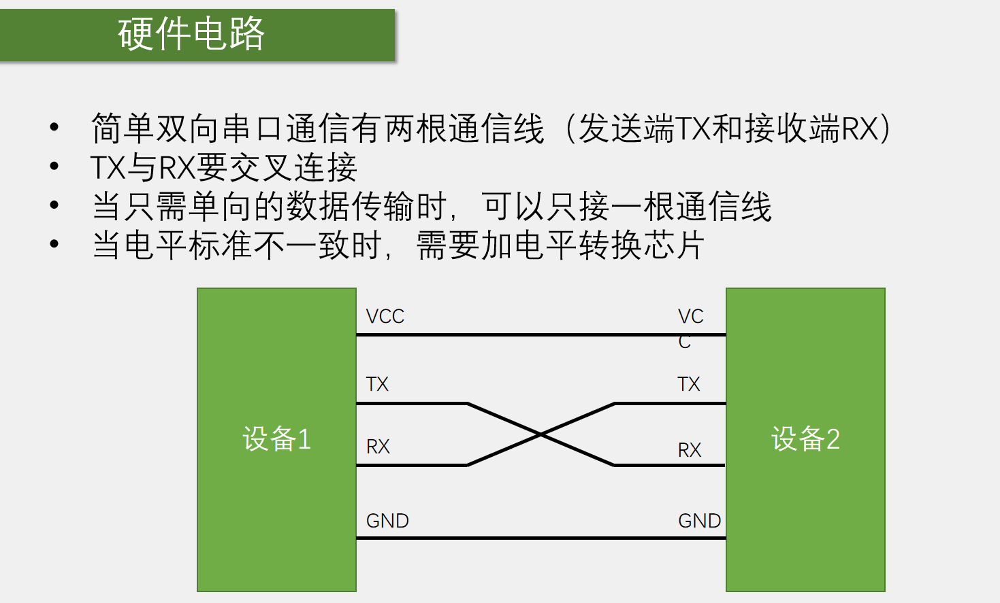

在stm32中集成了很多用于通信的外设模块，如上表中的USART、I2C、SPI、CAN和USB，c8t6均支持。USART，即串口。

第一点：stm32芯片集成了很多功能模块，如定时器计数、PWM输出、AD采集等，这些都是芯片内部的电路。这些电路的配置寄存器、数据寄存器都在芯片里面，操作这些寄存器非常简单、直接读写即可。但是有一些功能是stm32内部没有的，比如蓝牙无线遥控的功能，陀螺仪加速度计测量姿态的功能，dtm32没有这些功能，所以只能外挂芯片。外挂的芯片的数据都在stm32外面，stm32如何才能获取这些数据呢？这就需要我们在这两个设备之间，连接上一根或多根通信线，通过通信线路发送或者接收数据，完成数据交换，从而实现控制外挂模块和读取外挂模块数据的目的。单片机有了通信的功能，就能与众多别的设备实现互联，极大地扩展了硬件系统。

第二点：通信的目的是进行信息传递，双方约定的规则就是通信协议。上表就是stm32里包含的通信协议。改表格只是列出了部分典型的参数，因各种通信协议应用都很宽泛，参数也很多，所以上表只列出最常用、最简单的配置。第一个USART串口，它的引脚是TX和RX，也称TXD和RXD，两种名称意思相同。TX(Transmit Exchange)是数据发送脚，RX(Receive Exchange)是数据接收脚。第二个I2C通信，引脚是SCL和SDA，SCL(Serial Clock)是时钟，SDA(Serial Data)是数据。SPI通信，引脚是SCLK、MOSI、MISO、CS，SCLK(Serial Clock)是时钟，MOSI(Master Output Slave Input)是主机输出数据脚，MISO(Master Input Slave Output)是主机输入数据脚，CS(Chip Select)是片选，用于指定通信的对象。CAN通信，引脚是CAN_H和CAN_L，这两个是差分数据脚，用两个引脚表示一个差分数据。USB通信，引脚是DP(Data Positive)和DM(Data Minus)，或者叫D+h和D-，也是一对差分数据脚。

数据按照协议的规定在引脚上进行输入和输出，从而实现通信。

全双工，指通信双方能够同时进行双向通信，一般来说，全双工的通信都有两根数据线，如串口USART，一根TX发送，一个RX接收；SPI，一根MOSI发送，一根MISO接收。发送线路和接收线路互不影响，全双工。

I2C、CAN、USB都只有一根数据线（CAN和USB两根差分线组合成一根数据线），所以都是半双工。

单工是指数据只能从一个设备到另一个设别，不能反着来。比如把串口USART的RX引脚去掉，串口就退化成单工了。

时钟特性：发送一个波形，接收方如何知道是1、0还是1、1、0、0呢？这就需要有一个时钟信号告诉接收方何时需要采集数据。时钟特性分为同步和异步。I2C和SPI有单独的时钟线，所以是同步的，接收方可以在时钟信号的指引下进行采样。串口USART、CAN和USB没有时钟线，所以需要双方约定一个采样频率，这就是异步通信。异步通信需要加一些帧头帧尾等进行采样位置的对齐。

电平特性：单端信号，指它们的引脚的高电平都是对GND的电压差。所以单端通信的双方必须要共地，即把GND接在一起。所以USART、I2C、SPI通信的引脚还需要加一个GND引脚，不接GND是没法通信的。CAN和USB是差分信号，它们是靠两个差分引脚的电压差来传输信号，在通信时可以不需要GND，但USB协议里面也有一些地方需要单端信号，所以USB还是需要共地的。使用差分信号可以极大地提高抗干扰特性 ，所以差分信号一般传输速度和距离都会非常高。

设备特性：串口和USB属于点对点的通信，而I2C、SPI、CAN可以在总线上挂载多个设备。多设备通信需要有一个寻址的过程，以确定通信的对象。

串口的通信协议：是软硬件的规则，与某个具体的硬件无关。

USART是stm32中的外设，作用就是按照串口协议来产生和接收高低电平信号，实现串口通信。

第一点：在单片机领域，串口是一种最简单的通信接口，它的协议相较于I2C 、SPI等非常简单。一般单片机里面都会有串口的硬件外设。一般串口是都是点到点的通信，所以是两个设备之间的互相通信。

第二点：单片机与电脑通信是串口的一大优势，可以接电脑屏幕，非常适合调试程序、打印信息。I2C和SPI一般是芯片之间的通信，不会接在电脑上。图1，USB转串口模块。上面有芯片，型号为CH340，该芯片可以把串口协议转换为USB协议。它一边是USB口，可以插在电脑上，另一边是串口的引脚，可以和支持串口的芯片接在一起，这样就是实现串口和电脑的通信。图2，是一个陀螺仪传感器模块，可以测量角速度、加速度等姿态参数。它左右各有4个引脚，一边是串口的引脚，一边是I2C的引脚。图3，是蓝牙串口模块。下面的4个引脚是串口通信的引脚，上面的芯片可以和手机互联，实现手机遥控单片机的功能。

以上就是串口通信和使用串口通信的模块。

上图是串口的接线图，一般串口通信的模块都有4个引脚，VCC、TX、RX、GND。VCC和GND是供电，TX和RX是通信的引脚。TX和RX是单端信号，它们的高低电平都是相对于GND的，所以严格上GND也算是通信线。因此串口的TX、RX、GND是必须要接的。如果两个设备都有独立供电，VCC可以不接，如果其中一个设备没有供电，假如设备1是stm32有独立供电，设备2是蓝牙串口模块没有独立供电，那就需要将蓝牙串口的VCC和STM32的VCC接在一起。STM32通过VCC向右边的子模块供电。需要注意，供电的电压要按照子模块的要求来。

第一点：上图是简单的串口通信，实际上复杂一点的串口通信还有其他引脚，比如时钟引脚、硬件流控制的引脚，这些引脚stm32的串口也具备，但最常用的还是简单的串口通信，也就是VCC、TX、RX、GND四个引脚。

第四点：串口也是有很多电平标准的，像这种直接从控制器里出来的信号，一般都是TTL电平。不同的电平信号，需要加装电平转换芯片转接。

单片机最常用的电平是TTL电平。

上图中底部的两个时序图，是串口发送一个字节的格式。该格式由串口协议规定。串口中，每一个字节都装载在一个数据帧里面，每个数据帧都由起始位、数据位和停止位组成。左图中，数据位有8个，代表一个字节的8位。右图中的数据帧，在数据位的最后加一个奇偶校验位，即数据位总共是9位。其中有效载荷是前8位，代表一个字节，校验位跟在有效载荷后面，占1位。

波特率：规定串口通信的速率。串口一般是使用异步通信，所以需要双方约定一个通信速率，比如发送方每隔1s发送一位，接收方也必须每隔1s接收一位。如果接收方接收快了，会导致重复接收某些位；如果接收慢了，就会漏掉某些位。因此发送和接收必须约定好速率。速率参数就是波特率。波特率本意是每秒传输码元的个数，单位是码元/s，或者直接叫波特（Baud)。另外，还有一个速率表示，叫比特率，意思是每秒传输的比特数，单位是bit/s，或叫bps。在二进制调制的情况下，一个码元就是一个bit，此时波特率就等于比特率。单片机的串口通信，基本都是二进制调制，也就是高电平表示1，低电平表示0，一位就是1bit。因此串口的比特率经常会和比特率混用。但如果是多进制调制，则波特率和比特率就不一样。在波形上，比如双方规定波特率位1000bps，就表示1s要发1000位。每一位的时间就是1ms。发送方每隔1ms发送一位，接收方每隔1ms接收一位。这就是波特率，它决定了每隔多久发送一位。

起始位：标志数据帧的开始，固定位低电平。串口的空闲状态是高电平，即没有数据传输的时候，引脚必须要置高电平作为空闲状态。需要传输时必须先发送一个起始位，该起始位必须是低电平，来打破空闲状态的高电平，产生一个下降沿。下降沿告诉接收设备，一帧数据要开始了。如果没有起始位，当发送8个1时，数据线就一直为高电平没有任何波动，接收方无法知道要接收数据，因此必须要一个下降沿的起始位。

停止位：与起始位同理，在一个字节数据发送完成后，必须要有一个停止位。停止位的作用是用于数据帧间隔，固定为高电平。同时该停止位也是为下一个起始位做准备。如果没有停止位，当数据最后一位是0的时候，下次再发送新的一帧，就没法产生下降沿。

数据位：低位先行，比如发送0x0f，顺序是11110000依次发送在引脚上。所以发送数据时，根据波特率要求定时反转引脚电平，产生一个波形即可。

校验位：串口使用的是奇偶校验。奇偶校验可以判断数据传输是不是出错了，如果出错，可以选择丢弃或者要求重传。校验可以选择3中方式，无校验、奇校验、偶校验。无校验即不需要校验位，波形是左图，包括起始位、数据位、停止位总共3部分。奇校验和偶校验的波形如右图，包括起始位、数据位、校验位、停止位总共4部分。如果使用奇校验，那么包括校验位在内的9位数据会出现奇数个1。发送方在发送数据后会补一个校验位保证1的个数位奇数。接收方接收数据后，会验证数据位和校验位。偶校验与奇校验同理，保证1的个数是偶数。奇偶校验的检出率并不是很高，比如如果两位数据同时出错，奇偶特性不变就校验不出来。所以奇偶校验只能保证一定程度上的数据校验。如果想要更高的检出率，可以了解一下CRC校验。stm32也有CRC的外设。

9位数据位和8位数据位+1位校验位是同一个意思。

