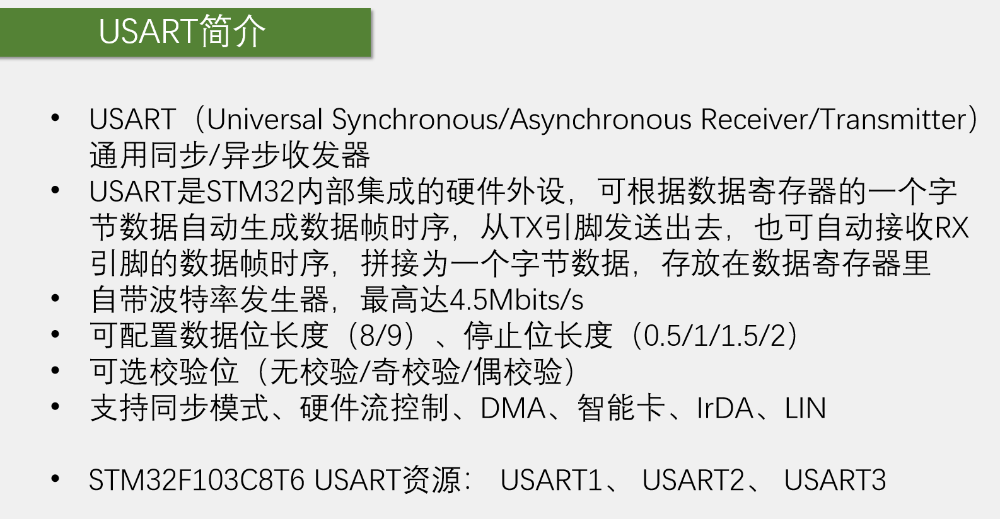
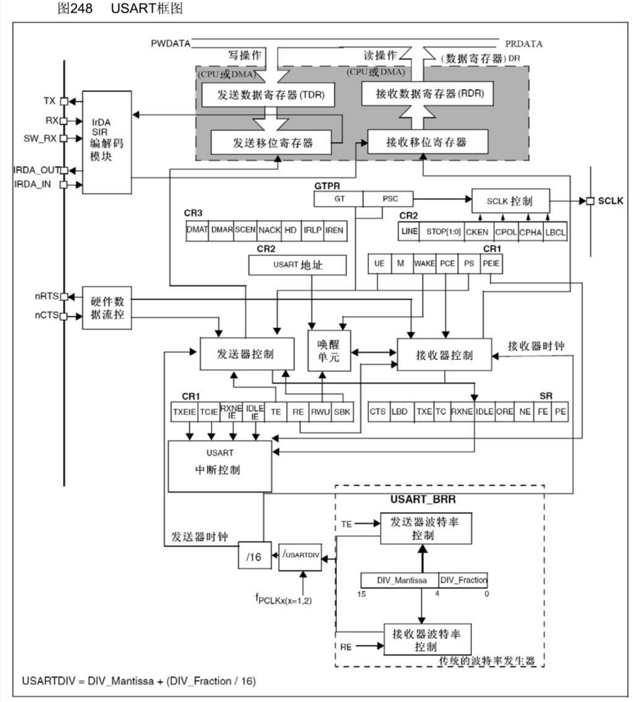
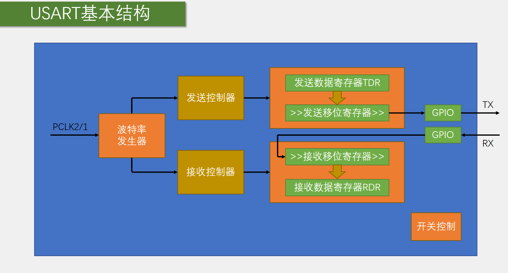
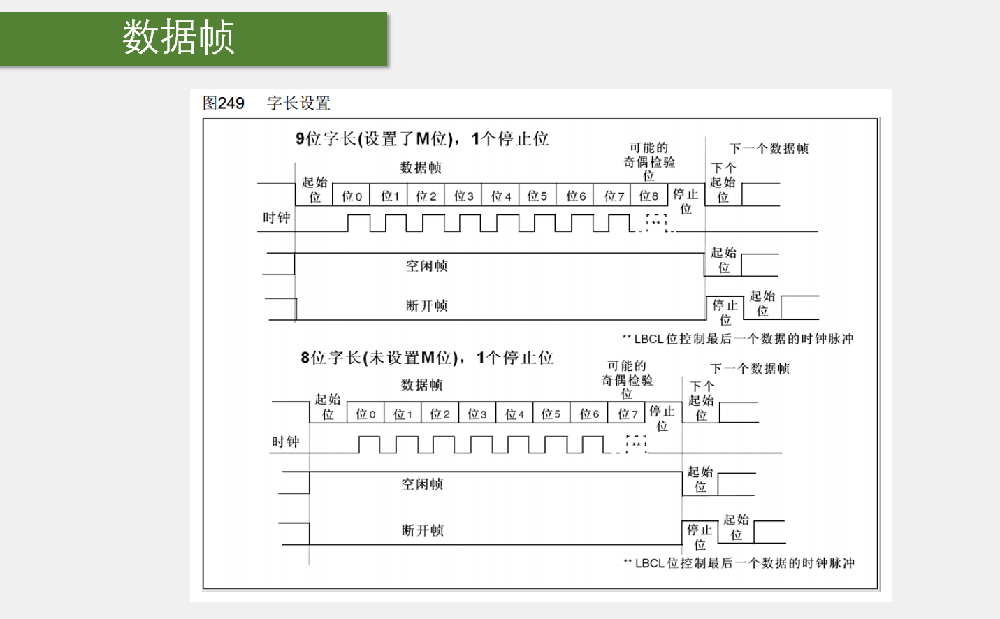
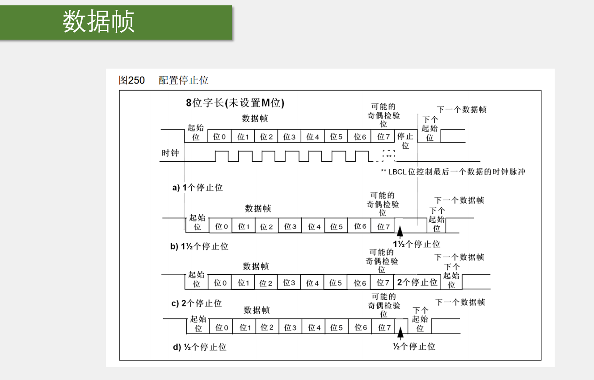
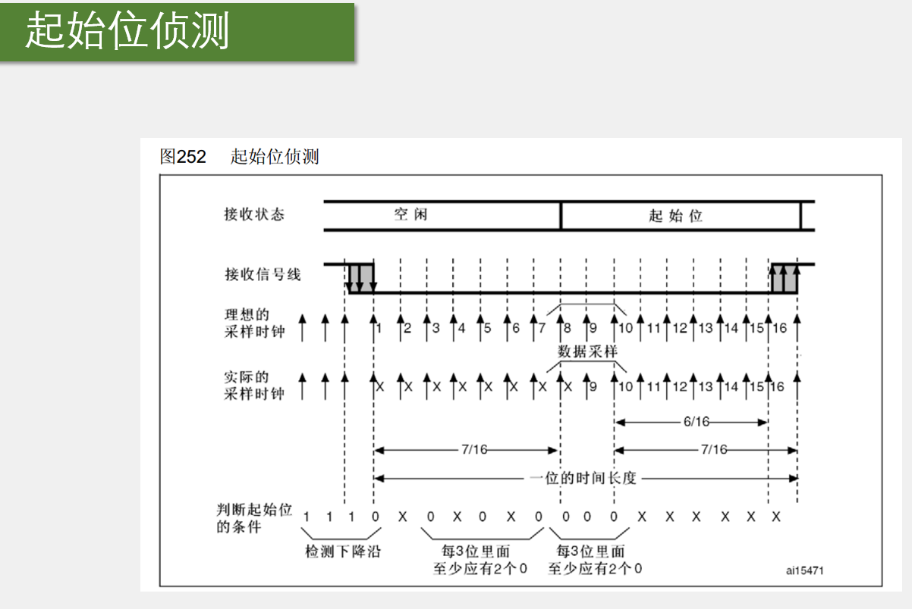
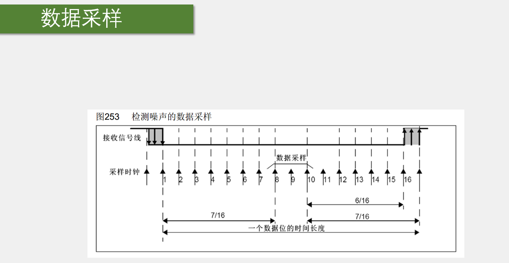
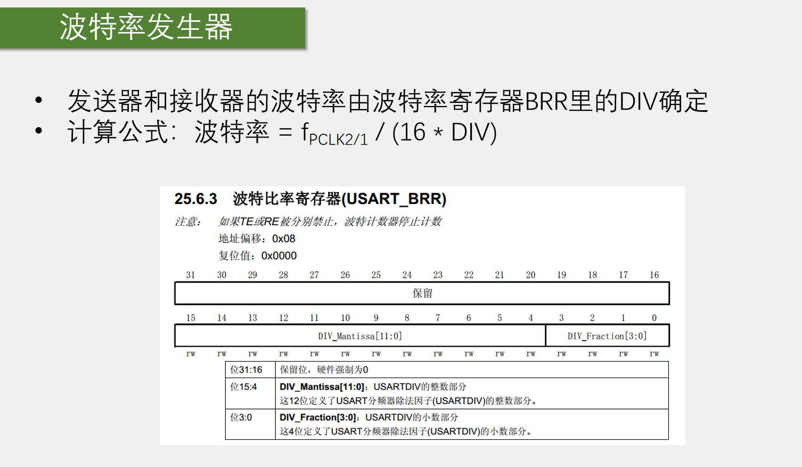
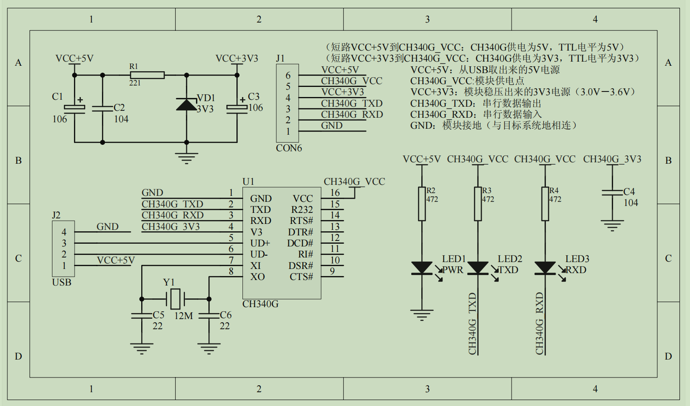

第一点：除USART，还会遇到UART（异步收发器）。一般串口很少使用同步功能，所以USART和UART使用起来没什么区别。stm32的USART模式只是多了一个时钟输出，并且只支持时钟输出，不支持时钟输入。所以同步模式更多的是为了兼容别的协议或特殊用途而设计的，并不支持两个USART之间进行同步通信。学习串口，主要是异步通信。

第二点：USART外设是串口通信的硬件支持电路。USART大体可分为发送和接收两部分。当配置好USART电路，直接读写数据寄存器，就能自动发送和接收数据。

第三点：波特率发生器，用来配置波特率。本质是一个分频器，比如APB2总线给一个72MHz的频率，波特率发生器进行分频，得到我们想要的波特率时钟。最后在该时钟下进行收发，就是指定的通信波特率。

第四点：这些参数是stm32 USART支持配置的参数，

第三、四、五点都是通过配置寄存器来完成，使用库函数直接给结构体赋值即可。串口常用参数：波特率9600或者115200，数据位8位，停止位1位，无校验。

第六点：同步模式就是多了个时钟CLK的输出。硬件流控制：比如A设备TX向B设备的RX发送数据，A设备一直发，发太快，B无法及时处理，如果没有硬件流控制，B就只能抛弃新数据或者覆盖原数据；如果有硬件流控制，在硬件电路上，会多出一根线，如果B没准备好接收就置高电平，如果准备好就置低电平，A接收到了B反馈的准备信号，就只会在B准备好的时候才发数据。这就是硬件流控制，可以防止因为B处理慢而导致数据丢失的问题。硬件流控制stm32也具备，不过一般不用。DMA：USART串口支持DMA进行数据转运，如果有大量的数据收发，可以使用DMA转运数据，减轻CPU的负担。

最后一点：USART1是APB2上的设备，剩下的都是APB1总线的设备，开启时钟时需要注意。

左上角引脚部分：此处有TX和RX，分别是发送和接收引脚。下面的SW_RX、IRDA_OUT、IRDA_IN是智能卡和LrDA通信的引脚。TX发送脚从图中发送移位寄存器接出，RX接收脚通向图中接收移位寄存器。

上部：这部分是串口的数据寄存器，存储发送和接收的字节数据。上面有发送数据寄存器TDR(Transmit DR)，接收数据寄存器RDR(Receive DR)，这两个寄存器占用同一个地址，在程序上只表现为一个寄存器，就是数据寄存器DR(Data Register)，但实际硬件中分成了两个寄存器，一个用于发送TDR，一个用于接收RDR。TDR只写，RDR只读。当进行写操作时数据会被写入TDR，当进行读操作时，数据从RDR读出来。发送移位寄存器的作用是把一个字节的数据一位一位地移出去，正好对应串口协议波形的数据位。比如在某时刻给TDR写入0x55数据，TDR=01010101，此时硬件检测到有数据写入，就会检查当前移位寄存器是不是有数据正在移位，如果没有，TDR内的数据就会立刻全部移动到发送移位寄存器，准备发送。当数据从TDR移动到移位寄存器时，会置一个TXE(TX Empty)标志位，表示发送寄存器为空。检查TXE标志位置1时就可以在TDR写入下一个数据。注意，当TXE标志位置1时，数据其实还没有发送出去，因为只要数据从TDR转移到发送移位寄存器，TXE就会置1，就可以写入新的数据。然后，发送移位寄存器就会在下面的发生器控制的驱动下，向右移位，然后一位一位地把数据输出到TX引脚。此处向右移位，正好和串口协议规定的低位先行一致。当数据发送完成后，新的数据就会再次自动地从TDR转移到发送移位寄存器里。如果当前移位寄存器移位尚未完成，TDR的数据就会进行等待，一但移位完成，TDR的数据就会立刻转移过来。有了TDR和移位寄存器的双重缓存，可以保证连续发送数据的时候，数据帧之间不会有空闲，提高了工作效率。

接收端类似，数据从RX引脚通向接收移位寄存器，在接收器控制的驱动下，一位一位地读取RX电平，先放在最高位，然后右移。移位8次之后，就能接收一个字节。同样因为串口通信是低位先行，所以接收移位寄存器是从高位往低位这个方向移动的。当一个字节移位完成之后，这一个字节的数据就会整体地一下子转移到接收数据寄存器RDR里。在转移的过程中，也会置一个标志位RXNE(RX Not Empty)，接收数据寄存器非空。当检测到RXEN置1后就可以把数据读走。同样也是两个寄存器进行缓存，当数据从移位寄存器转移到RDR时，就可以直接移位接收下一帧数据。

发送添加帧头帧尾以及接收去除帧头帧尾，内部电路会自动执行。

唤醒单元：实现串口挂载多设备。串口一般是点对点通信，只支持两个设备互相通信。而多设备，在一条总线上，可以接多个从设备，每个设备分配一个地址，想和某个设备通信就先进行寻址确定通信对象，再进行数据收发。因此，可以给USART串口分配一个地址，当发送指定地址时此设备唤醒开始工作。设备没收到地址时就会保持沉默。

中断控制：中断申请位，就是状态寄存器SR中的各种标志位。TXE和RXNE很重要，TXE是发送寄存器为空，RXNE是接收寄存器非空。这两个是判断发送状态和接收状态的必要标志位。中断控制即配置中断是不是通向NVIC。

最下面，波特率发生器：波特率发生器其实就是分频器。APB时钟进行分频，得到发送和接收移位的时钟。此处时钟输入是fPCLKx(x=1或x=2)，USART1挂载在APB2，所以就是PCLK2的时钟，一般是72M，其他的USART都挂载在APB1，所以是PCLK1的时钟，一般是36M。之后时钟进行分频，除以USARTDIV的分频系数。USARTDIV是一个数值，分为了整数部分和小数部分。因为有些波特率，用72M除一个整数可能除不尽，导致误差，所以分频系数支持小数点后4位，分频更加精准。之后再除以16，得到发送器时钟和接收器时钟，通向控制部分。如图，如果TE为1，即发送器使能了，发送部分的波特率就有效；如果RE为1，即接收器使能了，接收部分的波特率就有效。

查看引脚定义表：

USART2的TX在PA2口，RX在PA3口；USART3的TX在PB10口，RX在PB11口；USART1的TX在PA9口，RX在PA10口.

上图usart的基本结构。

最左边的波特率发生器：用于产生约定的通信速率，时钟来源是PCLK2或1，经过波特率发生器分频后，产生的时钟通向发送控制器和接收控制器。发送控制器和接收控制器用来控制发送移位和接收移位。之后，由发送数据寄存器和发送移位寄存器这两个寄存器的配合，将数据一位一位地移出去，通过GPIO的复用输出，输出到TX引脚，产生串口协议规定的波形。当数据由数据寄存器转到移位寄存器时，会置TXE的标志位，通过判断这个标志位就可以知道是否可以写下一个数据。接收部分类似，RX引脚的波形通过GPIO的输入，在接收控制器的控制下，一位一位地移入接收移位寄存器。移完一帧后，数据就会统一转运到接收数据寄存器。在转移的同时会置RXNE标志位，通过检查该标志位，就知道是否受到数据了，同时该标志位可以申请中断，这样就可以在收到数据时直接进入中断函数，然后快速地读取和保存数据。如图，硬件层面实际有4个寄存器，但在软件层面，只有一个DR寄存器可供读写。

右下角：开关控制，即配置完成后，用Cmd开启一下外设。

下面看几个细节的问题：

上图是在程序中配置8位字长和9位字长的波形对比。此处的字长指的是数据位的长度（包含校验位）。

第一条时序是TX发送或者RX接收的数据帧格式，空闲高电平，起始位0，然后根据写入的数据置1或0，依次发送位0到位8，加起来就是9位。最后停止位1数据帧结束。可以配置成8位数据+1位校验位，或选择9位全是有效载荷。一般选择9位字长，都是要加上校验位的。下面的时钟对应同步时钟输出的功能。可以看到，在每个数据位的中间都有一个时钟上升沿。时钟的频率和数据速率是一致的，接收端可以在时钟上升沿进行采样，因此可以精准定位每一位数据，时钟的最后一位可以通过LBCL位控制要不要输出。另外时钟的极性、相位等，也可以通过配置寄存器配置。下面的两个波形，一个是空闲帧，从头到尾都是1，另一个是断开帧，从头到尾都是0，这两个数据帧是局域网使用的，串口用不上，了解即可。

第二条时序是9位字长的波形。可以看到，这里的数据是从位0到位7，总共是8位，比9位字长少了位8。同样最后一位位7，也可能是一个奇偶校验位。既然选择了8位字长，此处推荐选择无校验，否则有效载荷7位，不是一个字节。

总的来说，9位字长和8位字长，都具有有校验和无校验两种选择，但推荐选择9位字长有校验或8位字长无校验。

下面看一下不同停止位的波形变化：

stm32的串口可以配置停止位长度为0.5、1、1.5、2这4种，这4种参数的区别就是停止位的时长不一样。

第一个是1个停止位，此时停止位的时长和数据位的一位时长一致。

第二个是1.5个停止位，此时停止位是数据位一位时长的1.5倍。

其他同理，一般选择1位停止位即可。

下面的两张图展示的是USART电路输入数据的一些策略。可以想象得到，串口的输出TX应该比输入RX简单很多。输出只需要定时翻转TX引脚高低电平即可。但输入比较复杂，不仅要保证输入的采样频率和波特率一致，还要保证每次输入采样的位置要正好处于每一位的正中间，只有在每一位的正中间采样，这样高低电平读进来才是最可靠的。如果采样点过于靠前或靠后，那有可能高低电平还正在翻转，电平还不稳定，或者稍有误差数据就会采样错误。另外输入最好还要对噪声有一定的判断能力。如果是噪声，最好能置一个标志位进行提醒。以上就是输入数据所面临的问题。下面讲解STM32是如何设计输入电路的。

上图展示的是USART起始位的侦测。当输入电路侦测到一个数据帧的起始位后，就会以波特率的频率连续采样一帧的数据。同时，从起始位开始，采样位置就要对齐到位的正中间，只要第一位对齐，后面的会自动对齐。为了实现这个功能，首先输入的这一部分电路会对采样时钟进行了细分，它会以波特率的16倍频率进行采样，也就是在一位的时间里，可以进行16次采样。它的策略是：最开始，空闲状态高电平，那采样就一直是1，在某个位置突然采到一个0，就说明两次采样之间出现了下降沿。如果没有任何噪声，那之后就应该是起始位了。在起始位会连续进行16次采样，没有噪声的话，16次采样肯定都是0，但是实际电路还是会存在噪声的，所以如图所示，即使出现下降沿了，后续也要再采样几次以防万一。根据手册描述，这个接收电路，还会在下降沿之后的第3次、5次、7次进行一批采样，第8次、9次、10次再进行一批采样，且这两批采样都要要求每3位里面至少有2个0。如果没有噪声，那肯定全是0，如果有轻微噪声，导致3位中，只有两个0和1个1，也算是检测到起始位，但是在状态寄存器里会置一个NE（Noise Error)噪声标志位，就是提醒一下数据已收到，但是有噪声，可能需要注意。如果3位中只有1个0，就不算检测到起始位，即前面的下降沿是噪声导致的，这是电路就会忽略前面的数据重新开始捕捉下降沿。这就是stm32的串口在接收过程中对噪声的处理。

如果通过了起始位检测，则接收状态就由空闲变为接受起始位，同时第8、9、10次采样的位置就正好对应起始位的正中间，之后接收数据位时就都在第8、9、10次进行采样，这样就能保证采样位置在位的正中间。这就是采样位置对齐的策略。

上图是数据采样的流程。这里从1到16是一个数据位的时间长度，在一个数据位有16个采样时钟，由于起始位侦测已经对齐了采样时钟，所以这里就直接在第8、9、10次采样数据位，为了保证数据的可靠性，这里连续采样3次。没有噪声的理想情况下，这3次全为1或者全为0。全为1则认为收到1，全为0则认为收到了0。如果有噪声，导致3次采样不是全为1或者全为0，则按照2：1的规则，2次为1则认为收到1，2次为0则认为收到0，此时在噪声标志位NE也会置1。这就是检测噪声的数据采样。

波特率发生器就是分频器。DIV分为整数部分和小数部分，可以实现更细腻的分频。如配置9600的波特率，USART1的时钟是72M，可以解得DIV=72M/9600/16=467.85,带小数的分频系数最终写到寄存器还需要转换成二进制，然后写入BRR寄存器。用库函数配置时更方便，需要多少波特率直接写即可，二进制转换由库函数完成。

上图为USB转串口模块的的内部电路图。有几次注意事项。最左边是USB的端口（图中J2），USB有4根线，GND、D+、D-、VCC。USB标准供电是5V，中间D+和D-是通信线，走的是USB协议，所以此处需要一个CH340的芯片进行转换，转换之后输出的是TXD和RXD，是串口协议。最后通过排针（图中J1）引出。需要注意此处的供电策略。首先所有的电都是从USB的VCC+5V来，然后VCC+5V通过左上图的稳压管电路进行降压得到VCC+3.3V，之后VCC+5V和VCC+3.3V都通过排针（J1的6脚和4脚）引出来了。所以第6脚和第4脚分别有5V和3.3V的输出。排针的第5脚通向了CH340芯片的VCC上，所以第5脚实际上是CH340的电压输入脚，一般这个模块的排针会有一个跳线帽，这个跳线帽插在4、5脚或5、6脚上，图右上也有说明，根据说明，这个跳线帽是用来选择通信电平的，也是给CH340供电的。stm32通信需要3.3V，所以要把跳线帽插在4、5脚上。

图右下部分是指示灯和电源滤波：这里有PWR电源指示灯，以及TXD、RXD的指示灯，如果引脚上有数据传输，这两个指示灯会对应闪烁，方便观察。