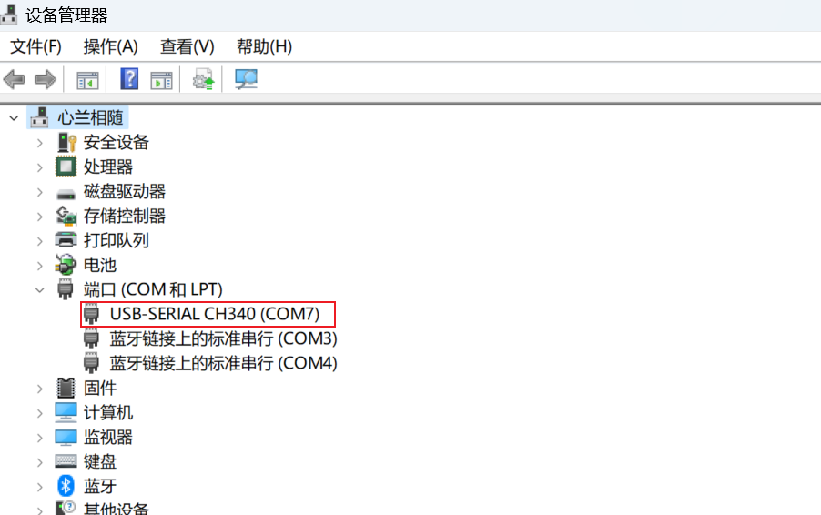

注意TX和RX交叉连接。




```c
void USART_DeInit(USART_TypeDef* USARTx);
void USART_Init(USART_TypeDef* USARTx, USART_InitTypeDef* USART_InitStruct);
void USART_StructInit(USART_InitTypeDef* USART_InitStruct);

//配置同步时钟输出，包括时钟是否输出，时钟的极性相位等参数
void USART_ClockInit(USART_TypeDef* USARTx, USART_ClockInitTypeDef* USART_ClockInitStruct);
void USART_ClockStructInit(USART_ClockInitTypeDef* USART_ClockInitStruct);

void USART_Cmd(USART_TypeDef* USARTx, FunctionalState NewState);
void USART_ITConfig(USART_TypeDef* USARTx, uint16_t USART_IT, FunctionalState NewState);

//开启USART到DMA的触发通道
void USART_DMACmd(USART_TypeDef* USARTx, uint16_t USART_DMAReq, FunctionalState NewState);

//重要的两个函数 发送和接收数据
void USART_SendData(USART_TypeDef* USARTx, uint16_t Data); //写DR寄存器
uint16_t USART_ReceiveData(USART_TypeDef* USARTx); //读DR寄存器

//标志位相关
FlagStatus USART_GetFlagStatus(USART_TypeDef* USARTx, uint16_t USART_FLAG);
void USART_ClearFlag(USART_TypeDef* USARTx, uint16_t USART_FLAG);
ITStatus USART_GetITStatus(USART_TypeDef* USARTx, uint16_t USART_IT);
void USART_ClearITPendingBit(USART_TypeDef* USARTx, uint16_t USART_IT);
```


```c
void Serial_Init(void)
{
	/*
	1.开启时钟，把需要用到的USART和GPIO的时钟打开
	2.GPIO初始化，把TX配置成复用输出，RX配置成输入
	3.配置USART，直接使用一个结构体，把所有参数配置好
	4.如果只需要发送功能，就直接开启USART，初始化结束
	5.如果需要接收的功能，可能还需要配置中断，需要在开启USART之前，再加上ITCOnfig和NVIC的代码
	初始化完成之后，如果要发送数据，调用一个发送函数即可。如果要接收数据，就调用接收的函数。如
	过要获取发送和接收的状态，就调用获取标志位的函数。这就是USART外设的使用思路。
	*/
	
	RCC_APB2PeriphClockCmd(RCC_APB2Periph_USART1, ENABLE);
	RCC_APB2PeriphClockCmd(RCC_APB2Periph_GPIOA, ENABLE);
	
	//TX引脚是USART外设控制的输出脚，所以要选复用推挽输出
	//RX引脚是USART外设数据输入脚，所以要选择输入模式。一般RX配置浮空输入或上拉输入，
	//因为串口波形空闲状态是高电平，所以不使用下拉输入
	GPIO_InitTypeDef GPIO_InitStruct;
	GPIO_InitStruct.GPIO_Mode = GPIO_Mode_AF_PP;
	GPIO_InitStruct.GPIO_Pin = GPIO_Pin_9;
	GPIO_InitStruct.GPIO_Speed = GPIO_Speed_50MHz;
	GPIO_Init(GPIOA, &GPIO_InitStruct);
	
	GPIO_InitStruct.GPIO_Mode = GPIO_Mode_IPU;
	GPIO_InitStruct.GPIO_Pin = GPIO_Pin_10;
	GPIO_InitStruct.GPIO_Speed = GPIO_Speed_50MHz;
	GPIO_Init(GPIOA, &GPIO_InitStruct);
	
	//9600波特率、8为字长、无校验、1位停止位、无流控、只有发送模式
	USART_InitTypeDef USART_InitStruct;
	USART_InitStruct.USART_BaudRate = 9600;
	USART_InitStruct.USART_HardwareFlowControl = USART_HardwareFlowControl_None;
	USART_InitStruct.USART_Mode = USART_Mode_Tx | USART_Mode_Rx; //发送+接收模式
	USART_InitStruct.USART_Parity = USART_Parity_No;
	USART_InitStruct.USART_StopBits = USART_StopBits_1;
	USART_InitStruct.USART_WordLength = USART_WordLength_8b;
	USART_Init(USART1, &USART_InitStruct);
	
	USART_Cmd(USART1, ENABLE);
}

void Serial_SendByte(uint8_t Byte)
{
	USART_SendData(USART1, Byte);
	while(USART_GetFlagStatus(USART1, USART_FLAG_TXE) == RESET);
}
```

对于串口接收，可以使用查询和中断两种方法。

如果使用查询，完成初始化即可。如果使用中断，还需要开启中断，配置NVIC。

查询的流程是在主函数里不断判断RXNE标志位，如果置1了就说明收到数据，再调用ReceiveData读取DR寄存器即可。

```c

```

