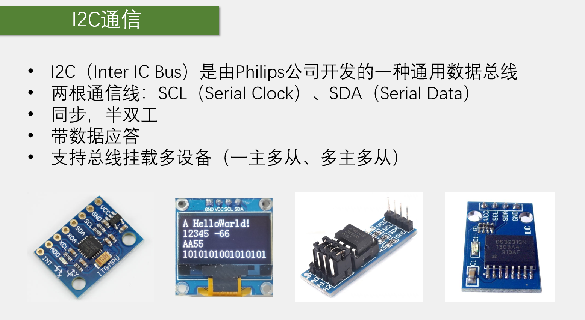

两部分内容：

- 介绍协议规则，通过软件模拟的形式实现协议
- 通过stm32的I2C外设，用硬件实现协议

I2C是同步时序，软件模拟协议也非常方便，目前也存在很多软件模拟I2C的代码，所以可以学习软件I2C和硬件I2C。哪个更方便，更有优势，可以进行对比。

先看一下串口通信。串口通信是从TX引脚向RX引脚发送数据流，数据流以字节为单位，可以组合多个字节，变成多字节的数据包传输。另外，串口通信的设计是一条发送线、一条接收线，没有时钟线的异步全双工的协议。

现在有以下需求场景，一个公司要设计一个通信协议。该公司开发出了一款芯片，可以进行AD转换、温湿度测量、姿态测量等等。在单片机中，芯片里的众多外设都是通过读写寄存器来控制运行的。寄存器本身也是存储器的一种，该芯片所有的寄存器都被分配到了一个线性的存储空间，如果想通过读写寄存器来控制硬件电路，就至少需要定义两个字节数据，一个字节是我们要读写哪个寄存器，即指定寄存器的地址，另一个字节就是这个地址下存储器存的内容。写入内容就是控制电路，读出内容就是获取电路状态，整个流程和单片机CPU操作外设的原理是一样的。问题来了，单片机读写自己的寄存器，可以直接通过内部的数据总线来实现，直接用指针即可操作。但现在一个额外的芯片模块的寄存器在单片机的外面，直接把单片机内部的数据总线拽出来把两个芯片合为一体不太现实。所以该公司需要设计这样一款通信协议，在单片机和外部模块连接少量的几根线，实现单片机读写外部模块寄存器的功能，并且具体要求：

（1）如果使用串口协议是否可行？不可以。串口的设计是一个需要两根通信线的全双工协议，但是可以发现，读写外部模块寄存器的操作流程是一种基于对话的形式进行的，在整个过程中并不需要同时进行发送或接收，这样就会导致始终存在一条信号线处于空闲状态。这就是资源的浪费。所以要求1就是**删掉一根通信线，只能在同一根线上进行发送和接收，将全双工改为半双工。**

（2）串口协议并没有一个应答机制，也就是单片机发送了一个数据，对方有没有收到，单片机是完全不了解的。所以为了安全起见，要求**增加应答机制，每发送或者接收一个字节对方都要给一个应答**。

（3）串口传输线一根线只能接一个模块，要求**一根线上能同时接多个模块，单片机可以指定和任意一个模块通信，同时单片机在跟某个模块进行通信时，其他模块不能对正常的通信产生干扰**。

（4）串口是异步的时序，也就是发送方和接收方约定的传输速率非常严格，时钟不能有过大的偏差，也不能在传输过程中单片机进中断。对于异步时钟来说，时序无法暂停。单片机一个字节发一半暂停了，接收方无法知道，依旧会按照原来约定的速率读取，这就会导致传输出错。所以异步时序的缺点就是非常依赖硬件外设的支持，必须要有USART电路才能方便的使用。如果没有USART电路的支持，串口是很难用软件来模拟的。所以**要求采样同步协议，外加一条时钟线指导对方读写**。由于存在时钟线，对传输的时间要求就不高，单片机也可以随时暂停传输去处理其他事情。因为暂停传输的同时，时钟线也暂停了，所以传输双方都能定格在暂停的时刻，过一段时间再继续不会对传输造成影响。这就是同步时序的好处。使用同步时序可以极大地降低单片机对硬件电路的依赖，即使没有硬件电路的支持，也可以很方便地用软件手动翻转电平来实现通信。异步时钟的好处是省一根时钟线节省资源，缺点是对时间要求严格，对硬件电路的依赖比较严重。同步时序反过来，优点是对时间要求不严格，对硬件电路不怎么依赖，在一些低端单片机没有硬件资源的情况下，也很容易使用软件来模拟时序，缺点是多一根时钟线。这就是同步和异步的区别。

其实通信协议是一个很灵活的设计方案，只要设计能实现项目要求、符合电路原理、性能和稳定性好，那设计就是好设计。

以上就是i2c通信协议的设计背景。

进入正题，看一下i2c通信。目标是通过通信线，实现单片机读写外挂模块寄存器的功能，其中至少要实现在指定的位置写寄存器以及在指定的位置读寄存器这两个功能。实现了读写寄存器就实现了对外挂模块的完全控制。

I2C，也可写为IIC。上图中第一个模块是MPU6050模块，可以进行姿态测量，使用了I2C通信协议。第二个模式是OLED模块，可以显示字符、图片等信息，也是I2C协议。第三个模块是AT24C02，存储器模块。第四个模块是DS3231模块，实时时钟模块，也是使用I2C协议。使用通用的协议对于开发者来说非常方便，通用的协议在不同的硬件上操作方法都极为相似。

第二点：I2C的标志性引脚，是两根通信线，SCL串行时钟线，SDA串行数据线。下面的四个模块图中都有SCL和SDA这两个引脚。

第五点：I2C支持挂载多设备，有两种模型，分别是一主多从（单片机作为主机，主导I2C总线的运行，挂载在I2C总线的所有外部模块都是从机，从机只有在被主机点名之后才能控制I2C总线，不能在未经允许的情况下去碰I2C总线，防止冲突。）和多主多从（比较复杂，了解即可）。

下面详细分析I2C是如何实现这些功能的。作为一个通信协议，它必须在硬件和软件上都做出规定。硬件上的规定就是电路应该如何连接，端口的输入输出模式是什么样的等。软件上的规定就是，时序是怎么定义的，字节如何传输，高位先行还是低位先行，一个完整的时序由哪些部分构成等。硬件和规定和软件的规定配合起来就是一个完整的通信协议。

上面ppt中左边的图是i2c的一个典型电路模型，这是一个一主多从的模型，左边CPU是单片机作为总线的主机。主机的权力很大，包括对SCL线的完全控制，任何时候都是主机完全掌控SCL线，另外在空闲状态下，主机可以主动发起对SDA的控制，只有从机发送数据和从机应答的时候，主机才会转交SDA的控制权给从机。下方是众多从机，这些从机可以是姿态传感器、OLED、存储器、时钟模块等。从机的权利小，对于SCL时钟线，在任何时刻都只能被动的读取，从机不允许控制SCL线。对于SDA数据线，从机不允许主动发起对SDA的控制，只有在主机发送读取从机的命令或从机应答时，从机才能短暂地取得SDA的控制权。这些是一主多从模型中协议的规定。

首先忽略上部的两个电阻R，那如何规定每个设备SCL和SDA的输出输出模式？SCL好规定，因为现在是一主多从，主机拥有SCL的绝对控制权，所以主机的SCL可以配置成推挽输出，所有从机的SCL都配置成浮空输入或者上拉输入，数据流向是主机发送、所有从机接收。而SDA线比较麻烦，因为是半双工的协议，所以主机的SDA在发送的时候是输出，在接收的时候是输入。通用从机的SDA也会在输入和输出之间反复切换。如果能协调好输入输出的切换时机，其实也没问题，但这样做，如果总线时序没协调好，极有可能发生两个引脚同时处于输出的状态。如果此时正好一个输出高电平一个输出低电平，则该状态就是电源短路。这种状态是要极力避免的。所以为了避免总线没协调好导致电源短路的问题，I2C的设计是禁止所有设备输出强上拉的高电平，采用外置弱上拉电阻加开漏输出的电路结构，所以有了ppt中第2条的规定。所有的设备，包括CPU和被控IC，它们引脚的内部结构都是上面ppt右图所示，左边是SCL的结构（图中SCLK就是SCL），右边是SDA的结构（图中DATA就是SDA）。首先引脚的信号进来，都可以通过数据缓冲器或这施密特触发器进行输入，因为输入多设备没有任何影响，所以任何设备在任何时刻都是可以输入的。但是在输出的部分采用的是开漏输出的配置。正常的推挽输出是（图略）：上面一个开关管接到正极，下面一个开关管接到负极，上面导通输出高电平，下面导通输出低电平，因为是通过开关管直接接到正极和负极的，所以是强上拉和强下拉的模式。而开漏输出，是去掉强上拉的开关管，输出低电平时下管导通，是强下拉，输出高电平时下管断开，但是没有上管，此时引脚处于浮空的状态，这就是开漏输出。右图就是开漏输出，SCLK输出低电平时开关管导通，引脚直接接地，是强下拉，输出高电平开关管断开，SCLK引脚什么都不接，处于浮空状态，这样所有的设备都只能输出低电平而不能输出高电平。为了避免高电平造成的引脚浮空，这时就需要在SCL和SDA各外置一个上拉电阻，通过电阻拉到高电平，所以是一个弱上拉。用弹簧和杆子的模型解释就是：SCL和SDA就是一根杆子，为了防止有人向上推杆子以及有人向下拉杆子造成冲突，所以规定所有的人不允许向上推杆子，只能选择向下拉或者放手，然后再外置一根弹簧向上拉，想要输出低电平就往下拽，弹簧被拉升，杆子处于低电平；要输出高电平就放手，杆子在弹簧拉力下回到高电平。这就是弱上拉的高电平，但是完全不影响数据传输。这样做的好处是完全杜绝了电源短路的现象，保证电路的安全，并且避免了引脚模式频繁地切换，开漏加弱上拉的模式同时键入了输入和输出的功能。并且，还会有一个“线与”的现象，就是只要有任意一个或多个设备输出了低电平，总线就处于低电平，只有所有设备都输出高电平，总线才处于高电平，I2C可以利用这个电路特性执行多主机模式下的时钟同步和总线仲裁。所以SCL虽然在一主多从模式下可以用推挽输出，但它仍然采用了开漏加上拉输出的模式。

