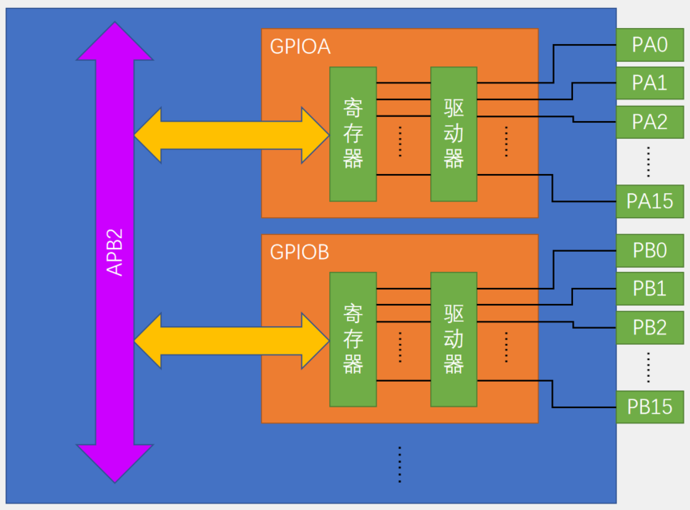
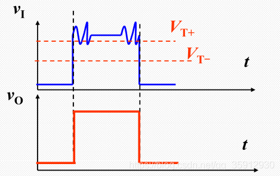
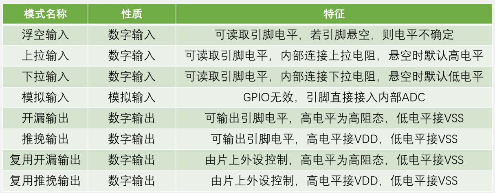

# GPIO简介

- GPIO（General Purpose Input Output）通用输入输出口
- 可配置8种输入输出模式
- 引脚电平：0V ~ 3.3V，部分引脚可容忍5V（可以在这个端口输入5V的电压，也认为是高电平，但是对于输出而言，最大就只能输出3.3V，因为供电就只有3.3V）
- 输出模式下可控制端口输出高低电平，用以驱动LED、控制蜂鸣器、模拟通信协议输出时序等
- 输入模式下可读取端口的高低电平或电压，用于读取按键输入、外接模块电平信号输入、ADC电压采集、模拟通信协议接收数据等

**GPIO基本结构**

左边是APB2外设总线，GPIO外设的名字是按照GPIOA、GPIOB、GPIOC等进行命名。每个GPIO外设总共有16个引脚。GPIOA的编号是PA0-PA15，GPIOB类似。GPIO内包含寄存器和驱动器。内核可通过APB2总线对寄存器进行读写，即可完成对电平的输入和输出。寄存器每一位对应一个引脚，输出寄存器写1，对应的引脚就会输出高电平，写0就会输出低电平；输入寄存器读取为1，则对应的端口目前是高电平，读取为0则是低电平。

STM32是32位单片机，内部的寄存器都是32位的，寄存器只有低16位有对应的端口，高16位是没有被用到的。

驱动器是用来增加信号的驱动能力，寄存器只负责存储数据。

**GPIO的位结构**

- I/O引脚旁的保护二极管，VDD接3.3V，VSS接0V，这样避免过高的电流流入对内部电路产生伤害（比3.3V高，上二极管导通；如果是比0V还小的负电压，则下二极管导通）

**输入部分**：

- 输入线路中，有一个上拉电阻和下拉电阻；上拉电阻至VDD，下拉电阻至VSS。两个开关可通过程序进行配置。如果上面导通、下面断开，就是*上拉输入模式* （也称默认为高电平的输入方式）；如果上面断开，下面导通、就是*下拉输入模式* （也称默认为低电平的输入方式）；如果两个都断开，就是*浮空输入模式*。上拉和下拉的作用是为数字输入提供一个默认的输入电平（即I/O引脚浮空的时候的输入电平。浮空输入模式下，如果输入什么都不接，输入就会处于一种浮空的状态，引脚的输入电平极易受到外界干扰而改变。上拉电阻和下拉电阻是阻值比较大的电阻，属于弱上拉和弱下拉，目的是尽量不影响正常的输入操作）

- 施密特触发器（图中错误标识为肖特基触发器）的作用是对输入电压进行整形。工作逻辑是：如果输入电压大于某一阈值，输出就会瞬间升为高电平；如果输入电压小于某一阈值，输出就会瞬间降为低电平。由于引脚的波形是外界输入的，虽然是数字信号，实际情况下可能会产生各种失真（这种失真指高电平和低电平都会有各种扰动，直接输入电路可能使电路产生误判）。通过施密特触发器的电平就可以直接写入输入寄存器了。

  

- 模拟输入连接至作为片上外设的ADC，因为ADC需要接收模拟量，所以模拟输入是接到施密特触发器之前的。

- 复用功能输入是连接到其他需要读取端口的外设上的，比如串口的输入引脚。这根线接收的是数字量，所以在施密特触发器的后面。

**输出部分**：

- 输出的电压可由输出寄存器或片上外设控制。两种方式的数据通过数据选择器接到了输出控制部分。如果选择通过数据寄存器进行控制，就是普通的I/O口输出，写数据寄存器的某一位就可以操作对应的端口。位设置/清除寄存器用来单独操作输出寄存器的某一位，而不影响其他位。因为输出数据寄存器同时控制16个端口，并且这个寄存器只能整体读写，所以想单独控制其中某一个端口而不影响其他端口的话，就需要一些特殊的操作方式。第一种方式：先读出这个寄存器，然后按位与和按位或的方式更改某一位，最后再将更改后的数据写回去，这种方式比较麻烦，效率不高，对于I/O口的操作不太合适。第二种方式：设置位设置和位清除寄存器。对某一位进行置1操作，在位设置寄存器的对应位写1即可，剩下不需要操作的位写0，内部的电路会自动将输出数据寄存器中的对应位置为1，而剩下写0的位则保持不变。位清零寄存器同理。库函数使用的就是读写位设置和位清除寄存器的方法。第三种方式：读写STM32中的“位带”区域。在STM32中，专门分配有一段地址区域，这段地址映射了ARM和外设寄存器所有的位，读写这段地址中的数据，就相当于读写所映射位置的某一位。
- 输出控制后接到了两个MOS管，上面是P-MOS，下面是N-MOS。MOS管就是电子开关，信号通过控制开关的导通和关闭，开关负责将I/O口接到VDD或者VSS。这里可以选择推挽、开漏或关闭三种输出方式。
  - 推挽：P-MOS和N-MOS均有效。数据寄存器为1时，上管导通，下管断开，输出直接接到VDD，就是输出高电平；数据寄存器为0时，上管断开，下管导通，输出直接接到VSS，就是输出低电平。这种模式下高低电平均有较强的驱动能力，所以推挽模式也叫强推输出模式。在推挽模式下，STM32对I/O口具有绝对的控制权，高低电平都由STM32决定。
  - 开漏：P-MOS是无效的，只有N-MOS工作。数据寄存器为1时，下管断开，这是输出相当于断开，也就是高阻模式。数据寄存器为0时，下管导通，输出直接接到VSS，也就是输出低电平。这种模式下只有低电平有驱动能力，高电平没有驱动能力。开漏模式可以作为通信协议的驱动方式，比如I2C通信的引脚，就是使用的开漏模式。在多机通信的情况下，开漏模式可以避免各个设备的相互干扰。开漏模式还可用于输出5V的电平信号，如在I/O口外接欸一个上拉电阻到5V的电源，当输出低电平时，由内部的N-MOS直接接到VSS，I/O输出低电平；当输出高电平时，由外部的上拉电阻拉高至5V，这样就可以输出5V的电平信号，用于兼容一些5V电平的设备。这就是开漏输出的主要用途。
  - 关闭：当引脚配置为输入模式时，两个MOS管都无效，也就是输出关闭，端口的电平由外部信号来控制。

**GPIO模式**

