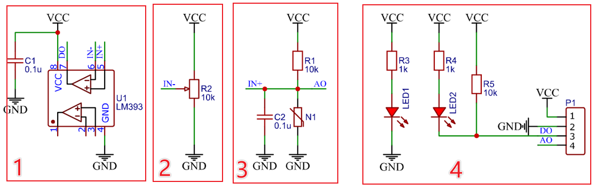
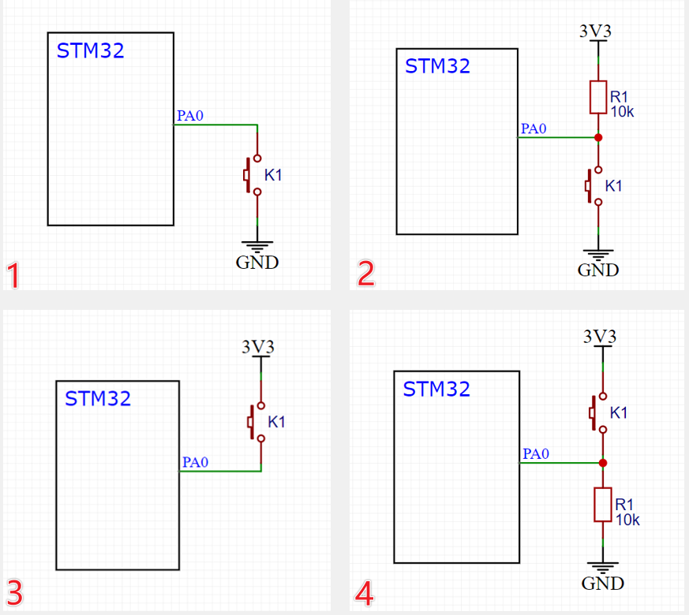
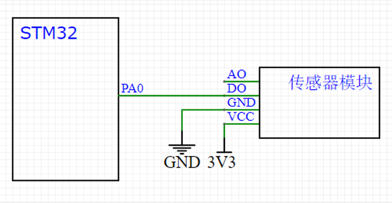

# 传感器模块

**原理**

传感器元件（光敏电阻/热敏电阻/红外接收管等）的电阻会随外界模拟量的变化而变化，通过与定值电阻分压即可得到模拟电压输出，再通过电压比较器进行二值化即可得到数字电压输出。

如图3：

N1就是传感器元件所代表的可变电阻，它的阻值可以根据换进的光光线、温度等模拟量进行变化。上面的R1是和N1进行分压的定值电阻，R1和N1串联构成基本的分压电路。

C2是一个滤波电容，目的是给中间的电压输出AO进行滤波（滤除一些干扰，保证输出波形的平滑。一般在电路中遇到这种一端接在电路中，另一端接地的电容，都可以考虑是否是滤波电容，如果是滤波电容的电路，那该电容就是用来保证电路稳定的，并不是电路的主要框架，在分析电路时，可以抹掉该电容，简化电路分析）。

根据分压定理，可以分析传感器电阻的阻值变化对输出电压的影响，或使用上下拉电阻的思维分析。当N1阻值变小时，下拉作用就会增强，中间的AO端的电压就会拉低（极端情况下，N1阻值为0，AO输出被完全下拉，输出0V；当N1阻值变大，下拉作用就会减弱，中间的引脚由于R1的上拉作用，电压就会升高。极端阻值情况下，N1阻值无穷大，相当于断路，输出电压被R1拉高至VCC。）（AO输出端可以想象成一个放在屋里的水平杆子，R1上拉电阻相当于拴在屋顶的弹簧，将杆子往上拉；N1下拉电阻相当于拴在地面上的弹簧，将杆子往下拉。电阻的阻值越小，弹簧的拉力就越强；杆子的高度就相当于电路中的电压）AO端的输出同时受到上拉和下拉的作用，哪个电阻小，对应的作用就强，AO就更靠近那一边，如果阻值一样大，AO就是VCC/2；如果阻值都是0，电路呈现电源短路的状态，应该避免。上拉电阻和下拉电阻在单片机电路中经常出现，比如弱上拉、弱下拉、强上拉、强下拉，强和弱就是指电阻阻值的大小，也就是弹簧弹力的大小。

在R1和和N1的分压下，AO就是我们需要的模拟电压输出，通过图4的AO排针输出。

如图1：

数字输出就是对AO进行二值化输出。二值化是通过芯片LM393来完成，LM393是一个电压比较器芯片。IN+接到了图3的AO，即模拟电压端；IN-接到了图2中的电位器，电位器的接法也是分压电阻的原理，调节电位器就能得到一个对应的输出电压。DO就是数字输出，通过图4的DO输出。

如图4：

左边是电源指示灯，只要通电就会亮；右边的是DO输出指示灯，用于指示DO的输出电平，低电平点亮，高电平熄灭。右边DO这里多了一个R5的上拉电阻，是为了保证默认输出为高电平。

4个排针对应的就是传感器模块的4个引脚。

# 硬件电路

按键有以下4中接法。图1和图2是下接按键的方式；图3和图4是上接按键的方式。一般按键都采用图1和图2所示的下接按键的方式，这种接法同LED电路的接法类似，是电路设计的习惯和规范。

如图1：

这是最常见的按键接法，在这里随便选取一个GPIO口，比如PA0，然后通过K1接地。当按键按下时，PA0被直接下拉到GND，此时读取PA0的电压就是低电平，当按键松手时，PA0被悬空。悬空情况下，引脚的电压不确定，所以要求PA0是上拉输入的模式，提供默认的高电平，否则会出现引脚电压不确定的错误现象。PA0上拉输入模式下，引脚悬空，PA0就是高电平。

如图2：

相较于图1，这里外部接了一个上拉电阻，所以PA0不会出现悬空状态，此时PA0可以配置为浮空输入或上拉输入。如果是上拉输入，内外两个上拉电阻共同作用，这时高电平就会更强一些，对应的高电平就会更加稳定，但引脚被拉到低电平时，损耗就会更大。

# 传感器电路

