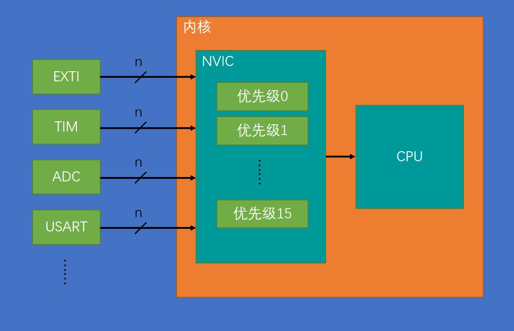
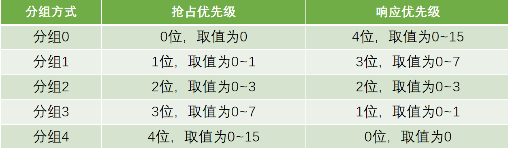

中断系统是管理和执行中断的逻辑结构，外部中断是众多能产生中断的外设之一。

**中断**：正常主程序执行的某个时刻，发生了中断触发条件，比如外部中断来说，可以是引脚发生了电平跳变，对于定时器来说，可以是定时的时间到了，对于串口通信来说可以是接收到了数据。当这些事件发生时，情况会比较紧急，比如外部中断来了，如果不处理，下一个跳变信号就紧跟着过来了（如串口接收中断来了，如果不读取接收到的数据，新的数据过来就会覆盖原来的数据）。所以我们希望当中断条件满足时，CPU能够立即停下当前执行的程序，转而去处理这些中断事件的程序（比如外部中断来了，需要记次，则变量加1；串口中断来了，则把接收到的数据转存起来）。当这些紧急事件处理完成之后，CPU还能回到原来停下的地方继续运行，这就是中断的流程和用途。

使用中断系统，能够极大地提高程序地效率。比如，没有中断系统，为了防止外部中断被忽略或者串口数据被覆盖，那主程序就只能不断地查询是否有这些事件发生，不能执行其他任务；如果没有定时器中断，那主程序只有靠Delay函数，才能实现定时地功能。有了中断系统后，主程序就可以安心执行其他事情，有中断地时候再去处理，效率就会大大提升。

**中断优先级**：中断地紧急程度就是中断的优先级。中断优先级是根据程序设计的需求，程序员自定义设置的。当多个中断源同时申请中断时，CPU会根据中断源的轻重缓急进行裁决，优先响应更加紧急的中断源。

**中断嵌套**：中断程序执行时再次出现中断的现象。

# STM32中断

- 68个可屏蔽中断通道，包含EXIT、TIM、ADC、USART、SPI、I2C、RTC
- 使用NVIC统一管理中断，每个中断通道都可拥有16个可编程的优先等级，可对优先级进行分组，进一步设置抢占优先级和响应优先级（NVIC用于STM32中用来管理中断、分配优先级）

**内核中断**：

- Reset，复位中断。当产生复位事件时，程序就会自动执行复位中断函数，即复位后程序开始执行的位置。
- NMI（不可屏蔽中断）、硬件失效、存储管理、总线错误、错误应用等等，都是内核中断

**外设中断**：

- WWDG，窗口看门狗，即窗口定时器中断。用于监测程序运行状态的中断，如程序卡死了，没有及时喂狗，窗口看门狗就会申请中断，让程序调到窗口看门狗的中断程序中，因此可以在中断程序中进行一些错误检查。
- PVD，电源电压监测。如果供电电压不足，PVD电路就会申请中断，因此在中断程序中，就可以获知，供电不足，可能电池没电，要赶紧保存一下重要数据。
- 其他等等外设中断。外设电路检测到有什么异常或事件，需要提示一下CPU的时候，就可以申请中断，让程序调到对应的中断函数里运行一次，用来处理异常或事件。

每一种中断都有对应的中断地址，如0x0000_0058为EXTI1中断的地址。因为程序中的中断函数的地址是由编译器分配的，不固定。中断跳转由于硬件的限制，只能跳转到固定的地址执行程序。为了让硬件跳转到一个不固定的中断函数中，需要在内存中定义一个地址列表，地址列表中的地址是固定的，中断发生后，就跳转到这个固定位置。这个固定位置，由编译器加上一条跳转到中断函数的代码，这样中断就可以跳转到任意位置。这个中断地址的列表，就叫***中断向量表***，相当于中断跳转的跳板。

但C编程不需要管理这个中断向量表，由编译器自动管理。

**NVIC的基本结构**

NVIC，即***嵌套中断向量控制器***，在STM32中，用来统一分配中断优先级和管理中断。NVIC是一个内核外设，是CPU小助手。NVIC有很多输入口，有多少个中断都可以接过来，如可以接到EXTI、TIM、ADC、USART等等。如下图：

上图中的n表示一个外设可能会同时占用多个中断通道，所以有n条线。NVIC只有一个输出口，NVIC根据每个中断的优先级分配中断的先后顺序，通过右边的一个输出口通知CPU该处理具体哪一个中断。对于中断先后顺序分配的任务，CPU不需要知道。

**NVIC优先级分组**

为了处理不同形式的优先级，STM32的NVIC可以对优先级进行分组，分为抢占优先级和响应优先级。

- NVIC的中断优先级由优先级寄存器的4位（0-15，对应16个优先级，值越小，优先级越高，0是最高优先级）决定，这4位可以进行切分，分为高n位的抢占优先级和低4-n位的响应优先级
- 抢占优先级高的可以中断嵌套，响应优先级高的可以优先排队，抢占优先级和响应优先级均相同的按中断号排队（每一个中断都有固定的中断号，可通过手册查询）。

分组方式如下：

分组方式在程序中由程序员自定义选择。选好分组方式之后，在配置优先级时，就需要注意抢占优先级和响应优先级的取值范围，不能超出规定的取值范围。