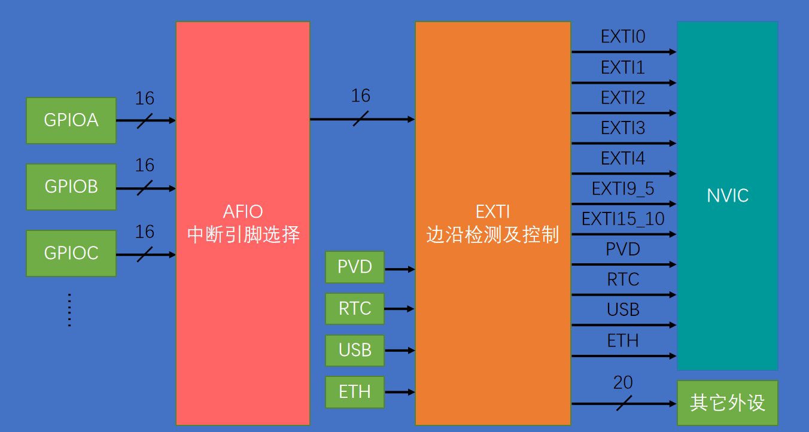
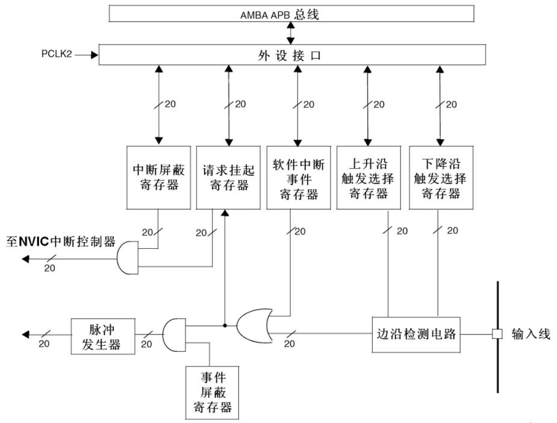

# EXIT

- EXIT（Extern Interrupt），外部中断
- EXIT可以监测指定GPIOA口的电平信号，当其指定的GPIO口产生电平变化时，EXIT将立即向NVIC发出中断申请，经过NVIC裁决后即可中断CPU主程序，使CPU执行EXIT对应的中断程序
- 支持的触发方式：上升沿/下降沿/双边沿（同时监测上升沿、下降沿）/软件触发（软件触发即程序员在程序内主动触发）
- 支持的GPIO口：所有的GPIO口，但相同的Pin不能同时触发中断（比如PA0和PB0、PC0不能同时用，端口GPIO_Pin一样的不同同时用，只能选一个作为中断引脚）
- 通道数：16个GPIO_Pin（对应GPIO_Pin_0到GPIO_Pin15），外加PVD输出、RTC闹钟、USB唤醒、以太网唤醒，总共20个中断线路。16个GPIO_Pin是外部中断的主要功能，后四个是蹭外部中断的，因为外部中断有个功能，就是低功耗模式的停止模式下唤醒STM32，对于PVD电源电压监测，当电源从电压过低恢复时，就需要PVD借助一下外部中断退出停止模式；对于RTC闹钟来说，有时候为了省电，RTC定一个闹钟之后，STM32会进入停止模式，等到闹钟响的时候再唤醒，这也需要借助外部中断；USB唤醒、以太网唤醒都是类似的作用。
- 触发响应方式：中断响应/事件响应。中断响应就是申请中断，让CPU执行中断函数；事件响应是STM32对外部中断增加的一种额外的功能。当外部中断检测到引脚电平变化时，正常的流程是选择触发中断，但在STM32中也可以选择触发一个事件，如果选择触发事件，那外部中断的信号就不会通向CPU了，而是通向其它外设，用来触发其他外设的操作，比如触发ADC转换、触发DMA等。总结一下就是：中断响应是正常的流程，引脚电平变化触发中断，事件响应不会触发中断函数，而是触发别的外设操作，属于外设之间的联合工作。

**EXIT基本结构**

如上图：最左边是GPIO口的外设，比如GPIOA、GPIOB、GPIOC等等，每个GPIO外设有16根引脚。EXIT模块只有16个GPIO通道，但每个GPIO外设都有16个引脚，如果每个引脚占用一个通道，那EXIT的16个通道显然不够用。所以存在一个AFIO中断引脚选择电路模块。AFIO就是一个数据选择器，它可以在前面3个GPIO外设的16个引脚里选择其中一个连接到后面的EXIT的通道里，所以相同的Pin不同同时触发中断（PA0,PB0,PC0其中选一个，PA1,PB1,PC1选一个，以此类推，总共选择16个）。

通过AFIO选择之后的16个通道，就接到了EXIT边沿检测及控制电路上，同时4个蹭网的外设（PVD/RTC/USB/ETH）并列接进来，全部加起来就组成了EXIT的20个输入信号。经过EXIT电路之后，分为了两种输出：上面的一部分接到了NVIC，是用来触发中断的。需要注意，本来20路输入，应该有20路中断的输出，但20个输出太多了，比较占用NVIC的通道资源，所以就把其中外部中断的9-5和15-10给分到一个通道了，也就是说，外部中断的9-5会触发同一个中断函数，15-10也会触发同一个中断函数。在编程时，我们在这两个中断函数中，需要再根据标志位来区分到底是哪个中断进来的。下面的一部分有20根输出接到其他外设，这是用来触发其他外设操作的，也就是事件响应。

**EXTI框图**

如上图：输入线首先进入边沿检测电路，在上面的上升沿寄存器和下降沿寄存器可以选择是上升沿触发，还是下降沿触发，或者两个都触发。接着触发信号就进入到或门的输入端了。硬件触发和软件中断寄存器的值接到或门上（任意一个为1，或门就可以输出1），所以支持的触发方式是上升沿、下降沿、双边沿和软件触发。触发信号通过或门之后，兵分两路，上一路是触发中断的，下一路是触发事件的。

上一路：触发中断首先会置一个挂起寄存器，这相当于是一个中断标志位，我们可以通过读取这个寄存器判断是哪个通道触发的中断。如果中断挂起寄存器（图中的请求挂起寄存器）置1，信号继续向左走，和中断屏蔽寄存器共同进入一个与门，然后是至NVIC中断控制器。这里的与门实际就是开关的作用。

下一路：首先也是一个事件屏蔽寄存器进行开关控制，最后通过一个脉冲发生器到其他外设。这个脉冲发生器就是给一个电平脉冲，用来触发其他外设的动作。

图中，画一个斜线写着20，表示的是20根线，代表20个通道。最上面的部分就是外设接口和APB总线，我们可以通过总线访问这些寄存器。