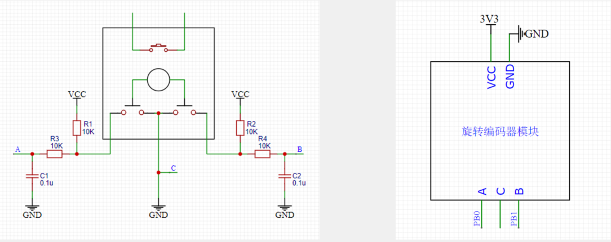

# 旋转编码器

**旋转编码器**：用来测量位置、速度或旋转方向的装置，当其旋转轴旋转时，其输出端可以输出与旋转速度和方向相对应的方波信号，读取方波信号的频率和相位信息即可得知旋转轴的速度和方向。

旋转 编码器的类型包括：机械触点式/霍尔传感器式/光栅式

**硬件电路**

如上右图：上面按键的两根线，模块并没有使用，悬空。下面是编码器内部的两个触点，旋转轴旋转时，这两个触点以相位相差90°的方式交替导通。由于输出的是机械式的开关信号，所以要配合外围电路才能输出高低电平。

左半部分：首先接了一个10k的上拉电阻R1，默认没旋转的情况下，这个点（假设为P点，R1与R3之间的点）被上拉为高电平，通过R3这个电阻输出到A端口的就也是高电平；当旋转时，内部触点导通，P点直接被拉低到GND了，再通过R3输出，A口就是低电平。R3是一个输出限流电阻，是为了防止模块引脚电流过大的；C1是输出滤波电容，可以防止一些信号输出抖动。

中间部分：C端口直接接到GND。

右半部分：同左半部分，只是输出接到B端口。

如上右图：使用时，上面的VCC、GND接电源，下面的A相输出和B相输出接到STM32的两个引脚上，比如PB0和PB1，注意引脚的GPIO_Pin的编号不要一样。中间C引脚接GND.