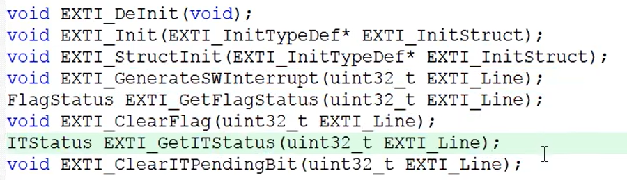

**电路图**


OLED用于显示程序的运行现象。左下角，接了一个对射式红外传感器模块，VCC和GND分别接电源的正负极，DO数字输出端，随意选择一个GPIO口接上就行，此处选择的是B14的端口。当挡光片或编码盘在这个对射式红外传感器中间经过时，DO就会输出电平变化的信号，然后电平跳变的信号触发STM32 PB14号口的中断。我们可以在中断函数里，执行变量++的程序，然后主循环里调用OLED显示这个变量，这样红外计次的实验就完成了。


**程序编写**

创建模块文件CountSensor.h和CountSensor.c文件

```c
//CountSensor.h
#ifndef __COUNT_SENSOR_H__
#define __COUNT_SENSOR_H__

#endif
```

```c
//CountSensor.c 右键添加头文件
#include "stm32f10x.h"

```

- 初始化函数的编写

  一般写的第一个函数都是模块的初始化函数，把这个模块要用的资源配置好。在.h文件写void CountSensor_Init(void)。在此函数中要进行外部中断的配置。如何进行外部中断的配置。观察如下外部中断整体结构图：

  

  观察此图，可以很清晰地知道外部中断要配置的东西。简单来说，我们只需要把外部中断，从GPIO到NVIC这一路中出现的外设模块都配置好，把这条信号链路打通即可。具体步骤是：

  **第一步**：配置RCC，把涉及的外设的时钟都打开。不打开时钟外设是无法工作的。

  ```c
  //CountSensor.c 右键添加头文件
  #include "stm32f10x.h"
  
  void CountSensor_Init(void)
  {
      //第一步 
      RCC_APB2PeriphClockCmd(RCC_APB2Periph_GPIOB, ENABLE);  //1.1开启gpio时钟
      RCC_APB2PeriphClockCmd(RCC_APB2Periph_AFIO, ENABLE); //1.2 开启AFIO的时钟
  }
  ```

  主要就是三个开启时钟的函数。针对PB14引脚，这里使用RCC_APB2PeriphClockCmd。需要注意，GPIOB是APB2的外设，参数是RCC_APB2Periph_GPIOB，函数也要用APB2的时钟开启函数。这里如果使用了APB1或者AHB的函数，然后填上APB2_GPIOB的参数，程序也不会报错，因为语法上并没有错误，后面的参数只是宏定义，只是数的替换，所以编译器并不知道程序的这个错误。

  ```c
  //stm32f10x_rcc.h
  #define RCC_APB2Periph_GPIOB ((uint32_t)0x00000008)
  ```

  所以此处需要细心：注意函数和参数的这个APB2、APB1和AHB要对应起来。

  紧接着开启AFIO的时钟。AFIO也是APB2的外设。如果不确定哪个外设是接到哪个总线上，可以转到这个函数的定义，看一下参数列表。

  

  最后是外设EXTI和NVIC的时钟。这两个外设的时钟一直都是打开着的，不需要再开启时钟了。EXTI作为一个独立外设，按道理应该是需要开启时钟的，但是寄存器里却没有EXTI时钟的控制位，尚未找到原因。推测可能和EXTI的唤醒有关，或其他的一些电路设计上的考虑。另外NVIC是内核的外设，内核的外设都是不需要开启时钟的，其和CPU一起都是住在“皇宫”里的，而RCC管都是内核外的外设，所以RCC管不着NVIC。

  **第二步**：配置GPIO，选择端口为输入模式

  ```c
  //CountSensor.c 右键添加头文件
  #include "stm32f10x.h"
  
  void CountSensor_Init(void)
  {
      //第一步 
      RCC_APB2PeriphClockCmd(RCC_APB2Periph_GPIOB, ENABLE);  //1.1开启gpio时钟
      RCC_APB2PeriphClockCmd(RCC_APB2Periph_AFIO, ENABLE); //1.2 开启AFIO的时钟
      //第二步
      GPIO_InitTypeDef GPIO_InitStructure;
      GPIO_InitStructure.GPIO_Mode = GPIO_Mode_IPU; //根据参考手册，选择上拉输入，默认为高电平的输入方式
      GPIO_InitStructure.GPIO_Pin = GPIO_Pin_14;
      GPIO_InitStructure.GPIO_Speed = GPIO_Speed_50MHz;
      GPIO_Init(GPIOB, &GPIO_InitStructture);
  }
  ```

  首先定义结构体GPIO_InitTypeDef GPIO_InitStructure，填充响应配置项后，最后调用GPIO_Init初始化GPIOB的外设。

  对于GPIO_Mode，要选择浮空输入、上拉输入、下拉输入这其中的一个模式。像这种其他外设使用GPIO的情况，如果不清楚该配置为什么模式，可以查看参考手册中“外设的GPIO配置”，其中有外设的GPIO配置表。

  

  **第三步**：配置AFIO，选择使用的那一路GPIO连接到后面的EXTI

  ```c
  //CountSensor.c 右键添加头文件
  #include "stm32f10x.h"
  
  void CountSensor_Init(void)
  {
      //第一步 
      RCC_APB2PeriphClockCmd(RCC_APB2Periph_GPIOB, ENABLE);  //1.1开启gpio时钟
      RCC_APB2PeriphClockCmd(RCC_APB2Periph_AFIO, ENABLE); //1.2 开启AFIO的时钟
      //第二步
      GPIO_InitTypeDef GPIO_InitStructure;
      GPIO_InitStructure.GPIO_Mode = GPIO_Mode_IPU; //根据参考手册，选择上拉输入，默认为高电平的输入方式
      GPIO_InitStructure.GPIO_Pin = GPIO_Pin_14;
      GPIO_InitStructure.GPIO_Speed = GPIO_Speed_50MHz;
      GPIO_Init(GPIOB, &GPIO_InitStructture);
      //第三步 执行完此函数，AFIO的第14个数据选择器就拨好了，输入端被拨到了GPIOB外设上，对应的就是PB14号引脚，输出端固定连接的是EXTI的第14个中断线路，这样PB14号引脚的电平信号就可以顺利通过AFIO进入后级的EXTI电路
      GPIO_EXTILineConfig(GPIO_PortSourceGPIOB,GPIO_PinSource14); 
  }
  ```

  针对AFIO外设，ST公司并没有给它分配专门的库函数文件，它的库函数是和GPIO在一个文件中。找到GPIO的文件stm32f10x_gpio.h和stm32f10x_gpio.c文件。文件最后就是GPIO的库函数，如下图：

  

  ***GPIO_AFIODeInit(void)***: 用来复位AFIO外设的，调用一下这个函数，AFIO外设的配置就会全部清除。

  ***GPIO_PinLockConfig***：用来锁定GPIO配置的，调用这个函数，参数指定某个引脚，那这个引脚的配置就会被锁定，防止意外更改。这属于GPIO外设的函数。

  ***GPIO_EventOutputConfig*** 和 ***GPIO_EventOutputCmd***:这两个函数用来配置AFIO的事件输出功能，用的不多，了解即可。

  ***GPIO_PinRemapConfig*** 和 ***GPIO_EXTILinConfig***: 这是重要的两个函数。***GPIO_PinRemapConfig*** 可以用来引脚重映射，第一个参数可以选择要重映射的方式，第二个参数是新的状态，使用很简单，但当前尚未学习到需要映射引脚的外设。***GPIO_EXTILinConfig***是此处外部中断需要用到的函数，*调用这个函数，就可以配置AFIO的数据选择器，来选择我们想要的中断引脚*

  

  可以看到这个函数虽然是GPIO开头，但实际上里面操作的是AFIO的寄存器，所以实际上是AFIO的函数。简介中写的是选择GPIO pin作为外部中断线。第一个参数GPIO_PortSource，选择某个GPIO外设作为外部中断源，这个参数可以是GPIO_PortSourceGPIOx，其中x可以是A到G，所以此处选择GPIO_PortSourceGPIOB；第二个参数是GPIO_PinSource，指定要配置的外部中断线，这个参数可以说GPIO_PinSourcex，其中x可以是0-15，此处是14，代表PB14号口的第14个中断线路。至此AFIO外部中断引脚配置完成。

  ***GPIO_ETH_MediaInterfaceConfig***: 和以太网相关，没有以太网外设，暂用不上。

  **第四步**：配置EXTI，选择边沿触发方式，比如上升沿、下降沿或者双边沿，还有选择触发响应方式，可以选择中断响应和事件响应。一般都是中断响应。

  ```c
  //CountSensor.c 右键添加头文件
  #include "stm32f10x.h"
  
  void CountSensor_Init(void)
  {
      //第一步 
      RCC_APB2PeriphClockCmd(RCC_APB2Periph_GPIOB, ENABLE);  //1.1开启gpio时钟
      RCC_APB2PeriphClockCmd(RCC_APB2Periph_AFIO, ENABLE); //1.2 开启AFIO的时钟
      //第二步
      GPIO_InitTypeDef GPIO_InitStructure;
      GPIO_InitStructure.GPIO_Mode = GPIO_Mode_IPU; //根据参考手册，选择上拉输入，默认为高电平的输入方式
      GPIO_InitStructure.GPIO_Pin = GPIO_Pin_14;
      GPIO_InitStructure.GPIO_Speed = GPIO_Speed_50MHz;
      GPIO_Init(GPIOB, &GPIO_InitStructture);
      //第三步 执行完此函数，AFIO的第14个数据选择器就拨好了，输入端被拨到了GPIOB外设上，对应的就是PB14号引脚，输出端固定连接的是EXTI的第14个中断线路，这样PB14号引脚的电平信号就可以顺利通过AFIO进入后级的EXTI电路
      GPIO_EXTILineConfig(GPIO_PortSourceGPIOB,GPIO_PinSource14); 
      //第四步 将EXTI的第14个线路配置位中断模式，下降沿触发，然后开启中断。这样PB14的电平信号就能通过EXTI通向下一级NVIC。
      EXTI_InitTypeDef EXTI_InitStructure;
      EXTI_InitStructure.EXTI_Line = EXTI_Line14;  //指定要配置的中断线，
      EXTI_InitStructure.EXTI_LineCmd = ENABLE;  //指定选择的中断线的新状态
      EXTI_InitStructure.EXTI_Mode = EXTI_Mode_Interrupt;  //指定外部中断线的模式，有中断模式和事件模式，此处选择中断模式
      EXTI_InitStructure.EXTI_Trigger = EXTI_Trigger_Falling);  //指定触发信号的有效边沿EXTITrigger_TypeDef枚举，根据实际需求选择上升沿、下降沿或上升沿和下降沿
      EXTI_Init(&EXTI_InitStructure);
  }
  ```

  先观察EXTI的库函数文件，看一下EXTI都有哪些库函数可以用。找到stm32f10x_exti.h文件，打开后在文件末尾，就是EXTI的所有库函数。

  

  ***EXTI_DeInit(void)***: 调用此函数，接可以把EXTI的配置清除，恢复成上电默认的状态。

  ***EXTI_Init***: 调用这个函数，就可以根据这个结构体的参数配置EXTI外设。初始化EXTI主要用此函数。

  ***EXTI_StructInit***: 调用这个函数，可以把参数传递的结构体变量赋一个默认值。

  前面这三个函数几乎每一个外设都有，就像是库函数的模板函数一样，基本上每个外设都需要这些类型的函数。这些模板函数使用方法和意思也都是一样的。外部中断、定时器、ADC、串口，都是使用结构体初始化的方式，都是一个套路，而且结构体可以看到参数的名字，参数也都是复制粘贴过来的，基本不用查看寄存器，随便选选参数就配置完成了，这就是库函数的好处。

  ***EXTI_GenerateSWUbterrupt***: 此函数用来软件触发外部中断的，调用这个函数，参数给一个指定的中断线，就能软件触发一次这个外部中断。

  剩下的四个函数，也都是库函数的模板函数，很多模块都有着四个函数。因为在外设运行的过程中，会产生一些状态标志位，比如外部中断来了，是不是会有一个挂起寄存器置了一个标志位；对于其他外设，比如串口接收到数据，会置标志位；定时器时间到，也会置标志位。这些标志位都是放在状态寄存器的，当程序想要访问这些标志位时，就可以用到这个四个函数。

  ***EXTI_GetFlagStatus***：可以获取指定的标志位是否被置1了。

  ***EXTI_ClearFlag***:可以对置1的标志位进行清除。

  对于这些标志位，有的比较紧急，在置标志位后会触发中断，在中断函数里，如果像查看标志位和清除标志位，就用以下两个函数：

  ***EXTI_GetITStatus***: 获取中断标志位是否被置1了

  ***EXTI_ClearPendingBit***: 清除中断挂起标志位

  总结一下就是：如果想在主程序中查看和清除标志位，用***EXTI_GetFlagStatus*** 和 ***EXTI_ClearFlag***；如果想在中断函数中查看和清除标志位，就用***EXTI_GetITStatus*** 和 ***EXTI_ClearPendingBit***。本质上这四个函数都是对状态寄存器的读写，只不过下面的两个函数只能读写与中断有关的标志位，并且对中断是否允许做出了判断。上面两个只是读写一般的标志位，没有额外的处理，能不能触发中断的标志位都能读取。

  

  **第五步**：配置NVIC，给我们的这个中断选择一个合适的优先级。最后通过NVIC，外部中断信号就能够进入CPU了。这样CPU才能接收到中断信号，才能跳转到中断函数里执行中断程序。

  以上为配置外部中断的全部流程，涉及的外设比较多，有RCC，GPIO，AFIO，EXTI，NVIC。

  ```c
  //CountSensor.c 右键添加头文件
  #include "stm32f10x.h"
  
  void CountSensor_Init(void)
  {
      //第一步 
      RCC_APB2PeriphClockCmd(RCC_APB2Periph_GPIOB, ENABLE);  //1.1开启gpio时钟
      RCC_APB2PeriphClockCmd(RCC_APB2Periph_AFIO, ENABLE); //1.2 开启AFIO的时钟
      //第二步
      GPIO_InitTypeDef GPIO_InitStructure;
      GPIO_InitStructure.GPIO_Mode = GPIO_Mode_IPU; //根据参考手册，选择上拉输入，默认为高电平的输入方式
      GPIO_InitStructure.GPIO_Pin = GPIO_Pin_14;
      GPIO_InitStructure.GPIO_Speed = GPIO_Speed_50MHz;
      GPIO_Init(GPIOB, &GPIO_InitStructture);
      //第三步 执行完此函数，AFIO的第14个数据选择器就拨好了，输入端被拨到了GPIOB外设上，对应的就是PB14号引脚，输出端固定连接的是EXTI的第14个中断线路，这样PB14号引脚的电平信号就可以顺利通过AFIO进入后级的EXTI电路
      GPIO_EXTILineConfig(GPIO_PortSourceGPIOB,GPIO_PinSource14); 
      //第四步 将EXTI的第14个线路配置位中断模式，下降沿触发，然后开启中断。这样PB14的电平信号就能通过EXTI通向下一级NVIC。
      EXTI_InitTypeDef EXTI_InitStructure;
      EXTI_InitStructure.EXTI_Line = EXTI_Line14;  //指定要配置的中断线，
      EXTI_InitStructure.EXTI_LineCmd = ENABLE;  //指定选择的中断线的新状态
      EXTI_InitStructure.EXTI_Mode = EXTI_Mode_Interrupt;  //指定外部中断线的模式，有中断模式和事件模式，此处选择中断模式
      EXTI_InitStructure.EXTI_Trigger = EXTI_Trigger_Falling);  //指定触发信号的有效边沿EXTITrigger_TypeDef枚举，根据实际需求选择上升沿、下降沿或上升沿和下降沿
      EXTI_Init(&EXTI_InitStructure);
      
      //第五步 5.1 设置优先级分组
      NVIC_PriorityGroupConfig(NVIC_PriorityGroup_2);
      //5.2 初始化
      NVIC_InitTypeDef NVIC_InitStructure;
      NVIC_InitStructure.NVIC_IRQChannel = EXTI15_10_IRQn; //指定中断通道开启或关闭 STM32的EXTI10到EXTI15都合并到了EXTI15_10_IRQn通道中
      NVIC_InitStructure.NVIC_IRQChannelCmd = ENABLE;//指定中断通道是使能还是不使能
      NVIC_InitStructure.NVIC_IRQChannelPreemptionPriority = 1;//指定所选通道的抢占优先级
      NVIC_InitStructure.NVIC_IRQChannelSubPriority = 1;//指定所选通道的抢占优先级，因为优先级是在多个中断源同时申请产生拥挤时才有作用，所以此处随意。但注意两个优先级的范围，此处都是0-3
      NVIC_Init(&NVIC_InitStructure);
  }
  ```

  首先看一下库函数文件里的函数。因为NVIC是内核外设，所以它的库函数是被ST发配到杂项中了。打开misc.h文件，在文件最后，可以看到NVIC的四个函数和Systick的一个函数。如下图：

  

  ***NVIC_PriorityGroupConfig***: 此函数用来中断分组，参数是中断分组的方式。

  ```c
  /**
    * @brief  Configures the priority grouping: pre-emption priority and subpriority.
    * @param  NVIC_PriorityGroup: specifies the priority grouping bits length. 
    *   This parameter can be one of the following values:
    *     @arg NVIC_PriorityGroup_0: 0 bits for pre-emption priority
    *                                4 bits for subpriority
    *     @arg NVIC_PriorityGroup_1: 1 bits for pre-emption priority
    *                                3 bits for subpriority
    *     @arg NVIC_PriorityGroup_2: 2 bits for pre-emption priority
    *                                2 bits for subpriority
    *     @arg NVIC_PriorityGroup_3: 3 bits for pre-emption priority
    *                                1 bits for subpriority
    *     @arg NVIC_PriorityGroup_4: 4 bits for pre-emption priority
    *                                0 bits for subpriority
    * @retval None
    */
  void NVIC_PriorityGroupConfig(uint32_t NVIC_PriorityGroup)
  {
    /* Check the parameters */
    assert_param(IS_NVIC_PRIORITY_GROUP(NVIC_PriorityGroup));
    
    /* Set the PRIGROUP[10:8] bits according to NVIC_PriorityGroup value */
    SCB->AIRCR = AIRCR_VECTKEY_MASK | NVIC_PriorityGroup;
  }
  ```

  简介是：配置优先级分组：先占优先级和从占优先级。先占优先级即抢占优先级，从占优先级即响应优先级。具体选哪个，根据实际需求来，一般的话中断不多，很难导致中断冲突，对优先级分组来说就比较随意，哪个都行。比如此处选择第2个分组，2位抢占，2位响应，这样比较平均。

  ***NVIC_Init***: 根据结构体里指定的参数初始化NVIC

  ***NVIC_SetVectorTable***: 设置中断向量表，使用少，暂不使用

  ***NVIC_SystemLPConfig***: 系统低功耗设置，使用少，暂不使用

  MVIC的配置使用前两个函数即可。在配置中断之前，先指定一下中断的分组，然后使用NVIC_Init初始胡一下NVIC即可。


- 中断函数的编写

  