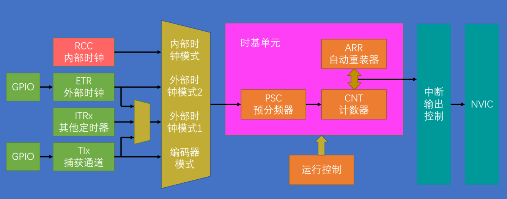

# TIM简介

**PPT**:

- TIM（Timer）定时器
- 定时器可以对输入的时钟进行计数，并在计数值达到设定值时触发中断
- 16位计数器、预分频器、自动重装寄存器组成的时基单元，在72MHz计数时钟下可以实现最大59.65的定时
- 不仅具备基本的定时中断功能，而且还包括内外时钟源选择、输入捕获、输出比较、编码器接口、主从触发模式等多种功能
- 根据复杂度和应用场景分为了高级定时器、通用定时器、基本定时器三种类型

**解读**：

首先TIM，它是英文Timer的缩写，意思是定时器。定时器的基本功能是对输入的时钟进行计数，并在计数值达到设定值时触发中断。所以定时器最基本的功能是定时触发中断。同时也可以看出来，定时器就是一个计数器，当这个计数器的输入是一个准确可靠的基准时钟时，那它对这个基准时钟进行计数的过程，实际上就是计时的过程。比如在STM32中，定时器的基准时钟一般都是主频72MHz，如果对72MHz计72个数，那就是1MHz也就是1us的时间；如果计72000个数，那就是1KHz也就是1ms的时间。

STM32的定时器拥有16位计数器、预分频器、自动重装寄存器的时基单元，在72MHz计数时钟下可以实现最大59.65s的定时。此处计数器就是用来执行计数定时的一个寄存器，每来一个时钟，计数器加1；预分频器可以对计数器的时钟进行分频，让计数更加灵活。计数重装寄存器就是计数的目标值，即需要计多少个时钟申请中断。这些寄存器构成了定时器最核心的部分，将这一块电路称之为时基单元。时基单元内的计数器、预分频器、自动重装寄存器都是16位的，2^16是65536，即如果预分频器设置最大，自动重装也设置最大，则定时器的最大定时时间就是59.65s。该结果由72M / 65536 / 65536得到中断频率，对中断频率取倒数即59.65s。STM32的定时器支持级联的模式，即一个定时器的输出作为另一个定时器的输入，此时最大定时时间为59.65s * 65536 * 65526（8千多年）。

STM32的定时器，不仅具备基本的定时中断功能，还包含内外时钟源选择、输入捕获、输出比较、编码器接口、主从触发模式等多种功能。由于定时器的基本结构非常通用，很多模块电路都能用到，STM32的定时器上扩展了非常多的功能，第一部分讲的即是定时中断功能和内外时钟源选择功能。第二部分讲输出比较，第三部分讲输入捕获和主从触发模式。第四部分讲编码器接口。

STM32的定时器，根据复杂度和应用场景分为高级定时器、通用定时器、基本定时器三种类型。其中高级定时器最为复杂，通用定时器中等复杂、最常用，基本定时器最简单。此课程主要讲通用定时器。

**PPT**:

定时器类型：

|    类型    |          编号          | 总线 |                             功能                             |
| :--------: | :--------------------: | :--: | :----------------------------------------------------------: |
| 高级定时器 |       TIM1、TIM8       | APB2 | 拥有通用定时器全部功能，并额外具有重复计数器、死区生成、互补输入、刹车输入等功能 |
| 通用定时器 | TIM1、TIM3、TIM4、TIM5 | APB1 | 拥有基本定时器全部功能，并额外具有内外时钟源选择、输入捕获、输出比较、编码器接口、主从触发模式等功能 |
| 基本定时器 |       TIM6、TIM7       | APB1 |             拥有定时中断、主从模式触发DAC的功能              |

- STM32F103C8T6定时器资源：TIM1，TIM2，TIM3，TIM4

**解读**：

这是三种定时器的一个介绍表。

第一列为类型，分为了高级定时器、通用定时器和基本定时器。

第二列编号，由于同一个芯片一般都有很多个定时器，所以TIM后面会跟一个数字。编号和定时器类型对应关系为：TIM1和TIM8是高级定时器，TIM2、3、4、5是通用定时器，TIM6和TIM7是基本定时器。除了TIM1到TIM8，在库函数中还出现了TIM9、10、11等，这些一般用不上，只需知道TIM1到8每一个定时器类型。

第三列，不同类型的定时器所连的总线是不一样的。高级定时器连接的是性能更高的APB2总线，通用定时器和基本定时器连接的是APB1总线。在RCC开启时钟时需要注意。

最后一列，功能。先看基本定时器，功能最少，只有基本的定时中断功能和一个主模式触发DAC的功能，所以基本定时器还可以和DAC联合使用。通用定时器比基本定时器复杂，它拥有基本定时器全部功能，即定时中断和触发DAC的功能，同时还额外具有内外时钟源选择、输入捕获、输出比较、编码器接口、主从触发模式等功能。高级定时器更加复杂，它拥有通用定时器的全部功能，同时还具有重复计数器、死去生成、互补输出、刹车输入等功能。这些功能主要是为了三相无刷电机设计的，

可以看出三种定时器是由高级到低级向下兼容的。

对于STM32F103C8T6这款芯片，它内部拥有的定时器资源是TIM1到4，即一个高级定时器和三个通用定时器，没有基本定时器。所以需要注意：不同的型号定时器的数量是不同的，在使用外设之前，需要查询手册是否有相应的外设。如果操作到不存在的外设，则不会起作用。

下面看三种定时器是如果工作的，以及这些结构能完成哪些任务。

**PPT**:

基本定时器：

**解读**：

下面解读图示结构是如何实现基本定时器的功能的。

首先图底部部分，有三个最重要的寄存器：预分频器、计数器和自动重装寄存器。它们构成了最基本的计数计时电路，所以这一块电路就叫做时基单元。预分频器之前，连接的是基准计数时钟的输入（图中的控制器），由于基本定时器只能选择内部时钟，所以可以直接认为，预分频器直接连到了输入端的内部时钟CK_INT（即图中所示），内部时钟的来源是RCC_TIMxCLK，这里的频率值一般都是系统的主频72MHz，所以通向时基单元的计数基准频率就是72MHz。

再看时基单元，首先是预分频器，它可以对72MHz的计数时钟进行预分频。如果这个寄存器写0，则是不分频或者说是1分频，此时输出频率=输入频率=72MHz；如果预分频器写1，则为2分频，输出频率=输入频率/2=36MHz；如果写2，就是3分频，输出=输入/3，依次类推。因此，预分频器的值和实际的分频系数差了1，即实际分频系数=预分频系数的值+1。这个预分频器是16位，所以最大值可以写65535，也就是65536分频。这就是预分频器，即对输入的基准频率提前进行一个分频的操作。

然后是计数器，计数器可以对预分频后的计数时钟进行计数，计数时钟每来一个上升沿，计数器的值就加1。这个计数器也是16位的，所以里面的值可以从0一直加到65535，如果继续加，计数器就会回到0重新开始。所以计数器的值在计时过程中会不断的自增运行，当自增运行到目标值时产生中断，那就完成了定时的任务。所以还需要一个存储目标值的寄存器，即自动重装寄存器。

自动重装寄存器也是16位，存储的是写入的计数目标。在运行过程中，计数值不断自增，自动重装值是固定的目标，当计数值等于自动重装值时，也就是计时时间到了，那它就会产生一个中断信号，并且清零寄存器。计数器自动开始下一次的计数计时。图中的向上的折线箭头表示此处会产生中断信号。像这种计数值等于自动重装值产生的中断，一般称之为”更新中断“，这个更新中断之后就会通往NVIC，我们再配置好NVIC的定时器通道，那定时器的更新中断就能够得到CPU的响应了。向下的箭头代表的是会产生一个事件，一般称之为”更新事件“，更新事件不会触发中断，但可以触发内部其他电路的工作。

以上即为定时器定时中断的全部流程。从基准时钟，到预防分频器，再到计数器，计数器计数自增，同时不断地与自动重装寄存器进行比较，值相等时即计时时间到，此时会产生一个更新中断和更新事件，CPU响应更新中断，就完成了我们地定时中断任务。

再简单介绍一下主模式触发DAC的功能。STM32定时器的一大特色就是主从触发模式，它能让内部的硬件在不受程序的控制下实现自动运行。如果能掌握好主从触发模式，在某些场景将会极大地减轻CPU的负担。看一下主模式触发DAC的作用：在我们使用DAC时，可能会用DAC输出一段波形，那就需要每隔一段时间触发一次DAC，让它输出下一个电压点。如果用正常的思路来实现，就是先设置一个定时器产生中断，每隔一段时间在中断程序中调用代码手动触发一次DAC转换，然后DAC输出。这样也是没问题的，但是这样会使主程序处于频繁被中断的状态，这会影响主程序的运行和其他中断的响应。所以定时器就设计了一个主模式，使用这个主模式可以把定时器的更新事件映射到这个触发TRGO(Trigger Out)的位置（如图所示），然后TRGO直接接到DAC的触发转换引脚上，这样就不需要通过中断来触发DAC转换了。仅需要把更新事件通过主模式映射到TRGO，然后TRGO就会直接触发DAC了。整个过程不需要软件的参与，实现了硬件的自动化，这就是主模式的作用。当然除了主模式外，还有很多硬件自动化的设计。

接下来看通用定时器：

**PPT**:

通用定时器：

**解读**：

通用定时器，结构复杂很多。首先中间最核心的部分还是时基单元，这部分结构和基本定时器相同，由预分频器、计数器、自动重装寄存器构成，每部分的工作流程和基本定时器也是一样的：预分频器对时钟进行预分频，计数器自增计数，当计数值计到自动重装值时，计数值清零同时产生更新中断和更新事件。不过对于通用定时器而言，计数器的计数模式不止向上计数这一种。向上计数的模式是指计数器从0开始，向上自增，计到重装值，清零同时申请中断，然后开始下一轮一次循环。除了向上计数的模式外，通用定时器和高级定时器还支持向下计数模式和中央对齐模式。向下计数模式是从重装值开始向下自减，减到0之后回到重装值同时申请中断，然后继续下一轮依次循环。中央对齐的计数模式是从0开始，先向上自增，计到重装值申请中断，再向下自减，减到0再申请中断，然后继续下一轮依次循环。总结即：基本定时器仅支持向上计数这一种模式，通用定时器和高级定时器支持向上计数、向下计数、中央对齐三种模式。虽然模式较多，但最常用的还是向上计数模式。

再看一下上面这部分结构：

这一部分就是内外时钟源选择和主从触发模式的结构。先看内外时钟源选择，对于基本定时器而言，定时只能选择内部时钟，也就是系统的72MHz。到了通用定时器，时钟源不仅可以选择内部的72MHz时钟，还可以选择如下几种外部时钟：第一个外部时钟就是来自TIMx_ETR引脚上的外部时钟。ETR(External)引脚的位置，可以参考引脚定义表：

可以看到***TIM2_CH1_ETR***, 意思是TIM2的CH1和ETR都是复用在了该引脚，即PA0引脚。CH2、CH3、CH4和其他定时器的一些引脚，也可以在表中找到。

所以我们可以在这个TIM2的ETR引脚，也就是PA0上接一个外部方波时钟，然后配置一下内部的极性选择、边沿检测和预分频电路（如图标注），再配置一下输入滤波电路（可以对外部时钟进行一定的整型，因为是外部引脚的时钟，所以难免会有毛刺，此电路就可以对输入的波形进行滤波）。最后，滤波后的信号兵分两路，上面一路ETRF进入触发控制器，紧跟着就可以选择作为时基单元的时钟了。如果期望在ETR外部引脚提供时钟，或者想对ETR时钟进行计数，把这个定时器当作计数器使用的话，就可以配置这一路的电路。在STM32中，这一路也叫做”外部时钟模式2“。

除了外部ETR引脚可以提供时钟外，下面的TRGI（Trugger In)也可以提供时钟。

TRGI从名字上看，主要用作触发输入来使用。触发输入可以触发定时器的从模式，也可以作为外部时钟来使用。此处重点介绍触发输入作为外部时钟来使用的情况。可以简单地将TRGI当作外部时钟的输入来看。当TRGI当作外部时钟来使用的时候，这一路就叫做”外部时钟模式1“。观察通过TRGI这一路的外部时钟都有哪些：

（1）往左看第一个就是ETR引脚的信号，也就是说ETR引脚及剋通过上面的ETRF路线当作时钟，又可以通过下面到达TRGI的这一路当作时钟。两种情况对于输入而言是等价的，只不过下面的这一路输入会占用触发输入的通道而已。

（2）第二个就是ITR信号，这一部分的时钟信号是来自其他定时器。从TRGO（图右上标注）可以看出，主模式的输出TRGO可以通向其他定时器（此时TRGO接到其他定时器的ITR引脚）。ITR0到ITR3分别来自其他4个定时器的TRGO输出。具体的连接方式，手册介绍如下：

可以看到，TIM2的ITR0接在了TIM1的TRGO上，ITR1接在了TIM8，ITR2接在了TIM3，ITR3接在了TIM4。其他定时器可参照此表，这就是ITR和定时器的连接关系。通过这一路我们就可以实现定时器级联的功能，比如：我们可以先初始化TIM3，然后使用主模式把它的更新事件映射到TRGO上，接着再初始化TIM2，选择上图中的ITR2，对应的就是TIM3的TRGO，然后再选择时钟为外部时钟模式1，这样TIM3的更新事件就可以驱动TIM2的时基单元，也就实现了定时器的级联。

（3）继续看图，TRGI前面还可以选择TI1F_ED，此处连接的是输入捕获单元的CH1引脚，也就是从CH1引脚获得时钟，这里后缀加一个ED(Edge)就是边沿的意思，意外通过这一路输入的时钟，上升沿和下降沿均有效。

（4）最后，这个时钟还可以通过TI1FP1和TI2FP2(如图标注)获得，其中TI1FP1连接到了CH1引脚的时钟，TI2FP2连接到了CH2引脚的时钟。

**总结**：外部时钟模式1的输入可以是ETR引脚、其他定时器、CH1引脚的边沿、CH1引脚和CH2引脚。一般情况下，外部时钟通过ETR引脚就可以了。图中设置这么复杂的输入，不仅仅是为了扩大时钟输入的范围，更多的还是为了某些特殊应用场景而设计的。

对于时钟输入而言，最常用的还是内部的72MHz的时钟。如果要使用外部时钟，首选ETR引脚外部时钟模式2的输入，这一路最简单最直接。

最后看下图：

图中，编码器接口（如图标注）：这是定时器的一个编码器接口，可以读取正交编码器的输出波形。TRGO是定时器的主模式输出，这一部分电路可以把内部的一些事件映射到这个TRGO引脚上，比如基本定时器中将更新事件映射到TRGO用于触发DAC，这里也一样可以把定时器内部的一些事件映射到TRGO用于触发其他定时器、DAC或者ADC，所以这个触发输出的范围比基本定时器更广一些。

**PPT**:

高级定时器：

高级定时器和通用定时器相比，结构图左上一大部分没有变化，主要改动为图右边的部分。在申请中断的地方，增加了一个重复次数计数器，有了这个计数器之后，就可以实现每隔几个计数周期，才发生一次更新事件和更新中断，这相当于对输出的信号又做了一次分频。对于高级定时器，之前计算的最大定时时间59秒多，此处需要再乘65536，又提升了很多定时时间。

其他部分就是高级定时器对输出比较模块的升级。DTG(Dead Time Generate)（如图标注）是死区生成电路，右边的输出引脚由原来的一个变为了两个互补的输出，可以输出一对互补的PWM波。这些电路是为了驱动三相无刷电机。三相无刷电机很常用，如四轴飞行器、电动车后轮、电钻等，都可能是三相无刷电机。因为三相无刷电机的驱动电路一般需要3个桥臂，每个桥臂2个大功率开关管来控制，总共需要6个大功率开关管来控制，所以这里的输出PWM引脚的前三路就变为了互补的输出，而第四路却没什么变化，因为三相电机只需要三路就可以了。为了防止互补输出的PWM驱动桥臂时在开关切换的瞬间，由于器件的不理想，造成短暂的直通现象，所以在PWM输出前加上了死区生成电路。在开关切换的瞬间产生一定时长的死区，让桥臂的上下管全都关断，防止直通现象。

最后一部分是刹车输入的功能。这一部分是为了给电机驱动提供安全保障。如果外部引脚BKIN(Break IN)产生了刹车信号或内部时钟失效产生了故障，那么控制电路就会自动切断电机的输出，防止意外的发生。

**PPT**

定时中断基本结构：

**解读**：

上图为定时中断基本结构图。下面着重介绍定时中断和内外时钟源选择所涉及的结构。

首先，最重要的还是中间部分的PSC（Prescaler)预分频器、CNT（Counter）计数器、ARR（AutoReloadRegister）自动重装寄存器这三个寄存器构成的时基单元。下面的运行控制（如图标注）是控制寄存器的一些位，比如启动停止、向上或向下计数等等，我们操作这些寄存器就能控制时基单元的运行。

左侧是为时基单元提供时钟的部分。可以选择RCC提供的内部时钟，也可以选择ETR引脚提供的外部时钟模式2。除此之外，还可以选择触发输入当作外部时钟，即外部时钟模式1，其对应的有ETR外部时钟、ITRx其他定时器、TIx输入捕获通道。这些就是定时器的所有可选的时钟源。最后还有一个编码器模式，一般是编码器独用的模式。普通的时钟用不到。

右侧部分：计时时间到，产生更新中断后的信号去向。如果是高级定时器，此处还会多一个重复计数器。中断信号会先在状态寄存器里设置一个中断标志位，这个标志位会通过中断输出控制（如图标注），到NVIC申请中断。存在中断输出控制的原因是：定时器模块有很多地方都要申请中断，比如通用定时器框图中所示，不仅更新要申请中断，触发信号也会申请中断，输入捕获和输出比较匹配时也会申请；所以这些中断都要经过中断输出控制，如果需要这个中断则允许，不需要则禁止。简单来说，这个中断输出控制就是一个中断输出的允许位，如果需要某个中断，要记得允许一下。

下面再看几个时序图，研究一下时基单元运行的一些细节问题。

**PPT**:

预分频器时序：

上图是当预分频器的参数从1变为2时计数器的时序图。第一行是CK_PSC，预分频器的输入时钟。下面的CNT_EN是计数器使能，高电平计数器正常运行，低电平计数器停止。再下面是CK_CNT计数器时钟，它既是预分频器的时钟输出，也是计数器的时钟输入。上图可以看到，开始时计数器未使能，计数器时钟不运行；使能后，前半段预分频器的系数为1，计数器的时钟等于预分频器前的时钟，后半段预分频器的系数变为2了，计数器的时钟也变为预分频器前时钟的一半。

在计数器时钟的驱动下，下面的计数器寄存器也跟随时钟的上升沿不断自增，在中间的位置FC之后，计数值变为0。此处可以推断出ARR自动重装值就是FC。当计数值计到和重装值相等并且下一个时钟来临时，计数值才清零，同时下面产生一个更新事件。

这就是一个计数周期的工作流程。

下面还有三行时序，描述的是预分频器的一种缓冲机制。预分频器实际上有2个，一个是预分频控制寄存器（如图标注）供我们读写使用，它并不直接决定分频系数；另一个是预分频缓冲器（如图标注）或称为影子寄存器，是真正起作用的寄存器。比如在某个时刻，我们将预分频寄存器由0改为1，如果在此时立刻改变时钟的分频系数，就会导致一个计数周期内前半部分和后半部分的频率不一样。虽然一般不会有什么问题，但STM32的定时器比较严谨，设计了一个预分频缓冲寄存器，当计数计到一半的时候改变了预分频值，这个变化并不会立刻生效，而是会等到本次计数周期结束时，产生了更新事件，预分频寄存器的值才会被传递到缓冲寄存器中去，才会生效。所以计时在计数中途改变了预分频值，计数频率仍然会保持为原来的频率，直到本轮计数完成，在下一轮计数时，改变后的分频值才会起作用。最后的预分频计数器（如图标注）解读如下：预分频器内部实际上也是靠计数来分频的，当预分频值为0时，计数器就一直为0，直接输出原频率，当预分频值为1时，计数器就0、1、0、1...这样计数，在回到0的时候输出一个脉冲，这样输出频率CK_CNT就是输入频率的二分频。预分频器的值和实际的分频系数之间差1，则有公式：计数器计数频率CK_CNT = CK_PSC / (PSC + 1) 

**PPT**:

计数器时序：

这是计时器时序图，内部时钟分频因子为2（即分频系数为2）。第一行是内部时钟72MHz；第二行是时钟使能高电平启动；第三行是计数器时钟，因为分频系数为2，所以频率是第一行CK_INT的一半。计数器在每个上升沿自增，当增到0036时发生溢出，再来一个上升沿时计数器清零，产生一个更新事件脉冲，并置一个更新中断标志位UIF（图最后一行），此标志位只要置1就会申请中断。中断响应后，需要在中断程序中手动清零。这就是计数器的工作流程。

计数器溢出频率CK_CNT_OV = CK_CNT / （ARR + 1）= CK_PSC / (PSC + 1) / (ARR + 1)，ARR为自动重装值。溢出时间为溢出频率倒数。

上面提到，预分频器为了防止计数中途更改数值造成错误设计了缓冲寄存器，同样计数器也是这样的设计，并且可以设置计数器是否使用缓冲寄存器。如下图为计数器无预装时序,，就是没有缓冲寄存器的情况：

可以看到第4行计数器寄存器正在自增，且此时自动重装值为FF（在最后一行），突然更改了自动加载寄存器（即自动重装寄存器），由FF改为了36，则计数值的目标值就由FF变成了36，所以第4行计数器寄存器计到36后就直接更新开始下一轮计数。也可以看出，F5改成36并立刻生效，如果生效时计数值已经超过36，虽然目标值36比计数值小，但计数值只能继续增加，直到FFFF,再回到0再加到36才会产生更新，就会造成一些小问题。

下图为有预装时序，就是有缓冲寄存器的情况。

通过设置ARPE位就可以选择是否使用预装功能。从图中看出，在计数的中途突然将计数目标由F5改为了36，但下面的影子寄存器才是真正起作用的，它还是F5，所以此时的计数目标还是计到F5产生更新事件并将更改的36传递到影子寄存器，在下一个计数周期这个更改的36才有效。所以可以看出，引入这个影子寄存器的目的实际上是为了同步，让值的变化和更新事件同时发生，防止在运行途中更改造成错误。

最后看一下时钟树：

**PPT**:

上图为RCC时钟树的结构图。这个时钟树就是STM32中用来产生和配置时钟，并且把配置好的时钟发送给各个外设的系统。时钟是所有外设运行的基础，所以时钟也是最先需要配置的东西。程序中主函数之前还会执行一个SystemInit函数，这个函数就是用来配置这个时钟树的。这个架构复杂、配置比较麻烦，但ST公司已经写好了配置这个时钟树的SystemInit函数。下面看一下这个时钟树：

左边是时钟的产生电路，右边是时钟的分配电路，中间的SYSCLK就是系统时钟72MHz。

在时钟产生电路，有4个震荡源，分别是内部的8MHz高速振荡器（左上标注为8MHz HSI RC)，外部的4-16MHz高速石英晶体振荡器（左中标注为4-16MHz HSE OSC），也就是晶振，一般都是接8MHz；外部的32.768KHz的低速晶振，这个一般是给RTC提供时钟；内部的40KHz低速RC振荡器，这个可以给看门狗提供时钟。上面的两个高速晶振是用来提供系统时钟的，AHB、APB2、APB1的时钟都是来源于这两个高速晶振。内部和外部都有一个8MHz的晶振都是可以用的，只不过外部的石英振荡器比内部的RC振荡器更加稳定，所以一般都用外部晶振，但是如果系统很简单而且不需要那么精确的时钟，也是可以使用内部的RC振荡器的，这样就可以省下外部晶振的电路。

在SystemInit函数中，ST配置时钟如下：首先会启动内部时钟，选择内部的8MHz为系统时钟（图中标注8MHz HSI RC)，暂时以8MHz的时钟运行，然后再启动外部时钟（图中标注4-16MHz HSE OSC)，进入PLL锁相环（图中标注PLL MUL）进行倍频，8MHz倍频9倍，得到72MHz，等到锁相环输出稳定后，选择锁相环输出为系统时钟，这样就把系统时钟由8MHz切换为了72MHz。

上面分析以后就可以解决实际应用中的一个问题，即如果外部晶振出问题了可能会导致一个现象：我们编写的程序的时钟慢了大概10倍，比如用定时器定一个1s的时间，结果过了10s才进行中断。问题就出在此处：如果外部晶振出问题了，系统时钟就无法切换到72MHz，那它就会以内部的8MHz运行，8M相比较72MHz，大概慢了10倍。

图中CSS(图中标注)，即Clock Security System，是时钟安全系统，也是负责切换时钟的，它可以检测外部时钟的运行状态，一旦外部时钟失效，它就会自动把外部时钟切换回内部时钟，保证系统时钟的运行，防止程序卡死造成事故。

再看右边时钟的分配电路：首先系统时钟72MHz进入AHB总线，AHB总线有个预分频器，在SystemInit里配置的分配系数为1，则AHB的时钟就是72MHz。然后进入APB1总线，这里配置的分配系数是2，所以APB1总线的时钟为72MHz/2=36MHz。大家可能会有疑问，通用定时器和基本定时器是接在APB1上的，而APB1的时钟是36MHz，按理说它们的时钟应该是36MHz，但所有的定时器的时钟都是72MHz，什么原因？原因就在上图中的支路：如果APB1预分频系数为=1，则频率不变，否则频率x2，这一路的右边可以发现是单独为定时器2~7开通的。因为APB1的预分频系数给的是2，所以此处频率要再x2，则通向定时器2到7的时钟就又回到了72MHz。因此有结论：无论是高级定时器、通用定时器，还是基本定时器，它们的内部基准时钟都是72MHz，这样就给使用带来方便，不用考虑不同定时器的时钟不一样的问题，不过前提是不乱改SystemInit里的默认配置。

再看下面APB2的时钟，这里的分频系数为1，所以APB2的时钟和AHB一样都是72MHz。此处为接在APB2上的高级定时器也单独开通了一路，写的也是：如果APB2预分频系数=1，则频率不变，否则频率x2。因为分频系数为1，所以定时器1和8的时钟就是72MHz。在这些时钟的输出部分都有一个与门进行输出控制，控制位写的是外部时钟使能，这就是我们在程序中写RCC_APB2/1PeriphClockCmd作用的地方。

