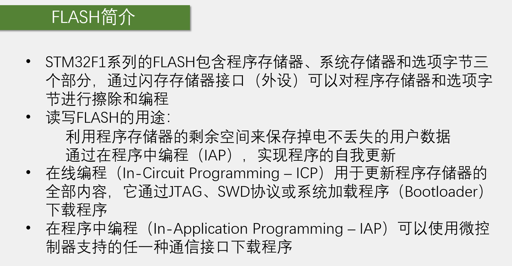

本节任务对Flash存储器进行读写。操作存储器需要用到闪存存储器接口。闪存存储器接口是一个外设，是闪存的管理员。毕竟闪存的操作很麻烦，涉及到擦除、编程、等待忙、解锁等等操作。所以需要将我们的指令和数据写入到这个外设的相应寄存器，外设就会自动去操作对应的存储空间。该外设可以对程序存储器和选型字节进行擦除和编程，不能对系统存储器进行擦除编程。因为系统存储器写入的是原厂的Bootloader程序，是不允许用户修改的。

第2点：利用程序存储器的剩余空间来保存掉电不丢失的用户数据。如c8t6芯片的程序存储器容量是64K，一般简单的程序可能只占前面很小一部分空间，剩下的大片空间就可以加以利用，如存储自定义的数据，这样非常方便，而且可以充分利用资源。但需要注意，选取存储区域时一定不能覆盖了原有的程序，否则程序被破坏就无法运行。一般存储少量的参数，选最后几页存储即可。

通过在程序中编程（IAP)，实现程序的自我更新。利用程序，来修改程序本身，实现程序的自我更新。

第3点：在线编程，意思是下载程序只需要留几个引脚就行，不用拆芯片，就叫在电路中编程。ICP的作用是用于更新程序存储器的全部内容，它通过JTAG、SWD协议或系统加载程序（Bootloader)下载程序。JTAG、SWD就是仿真器下载程序，如STLINK使用SWD下载程序，每次下载都是将整个程序完全更新掉。，Bootloader下载程序，也就是串口下载。串口下载也是更新整个程序。

第4点：在程序中编程IAP是更高级的下载方式。它可以使用微控制器支持的任一种通信接口下载程序。如何实现呢？我们首先需要自己写一个Bootloader程序，并且存放在程序更新时不会被覆盖的地方，比如放在程序存储器的末尾。我们控制程序跳转到这个自己写的Bootloader里来，在这里可以接受任意一种通信接口传过来的数据，比如串口、USB、蓝牙转串口、WIFI转串口等，传过来的数据就是待更新的程序。通过控制Flash读写，将收到的程序写入到前面程序正常运行的地方。写完之后，再控制程序跳转回正常运行的地方，或者直接复位，这样程序就完成了自我升级。这个功能其实和系统存储器这个Bootloader一样，但系统存储器的Bootloader写死了，只能用串口下载写到指定位置，启动方式也不方便，只能配置Boot引脚触发启动。自己写Bootloader就可以想怎么收怎么收，想写到哪就写到哪，想怎么启动就怎么启动，并且整个升级过程中，程序都可以自主完成，实现在程序中编程，更进一步可以实现远程升级，非常灵活方便。

