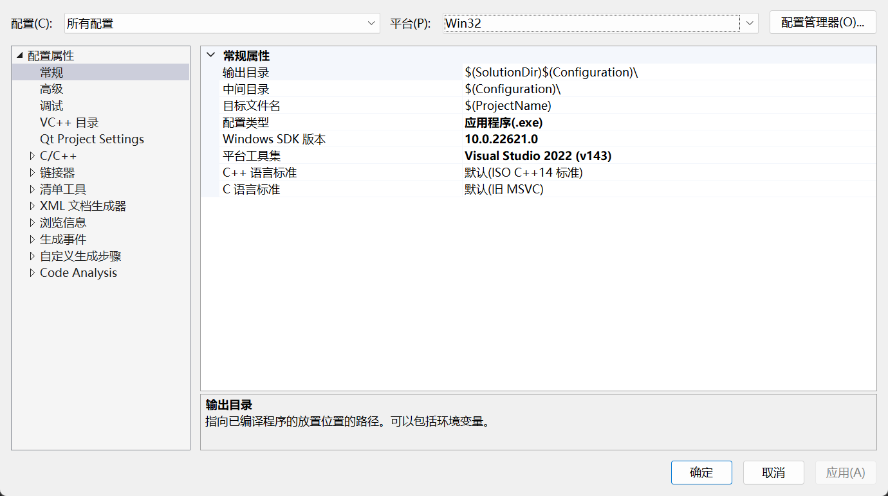

# VS配置属性

## 1 常规

**输出目录**

指向已编译程序的防止位置的路径。可以包括环境变量。

**中间目录**

指向生成中间文件（例如.obj文件）的位置的相对路径。可以包括环境变量。

**目标文件名**

指定此项目将生成的程序的文件名。

**配置类型**

指定要生成的程序类型（例如可执行文件、静态库、动态库等等）

## 宏总结

$(SolutionDir)  -- sln文件所在文件夹，末尾带“\”

$(Configuration) -- Debug模式下是Debug，Release模式下是Release

$(ProjectName) -- 项目名

$(MSBuildProjectDirectory) -- 项目源文件目录