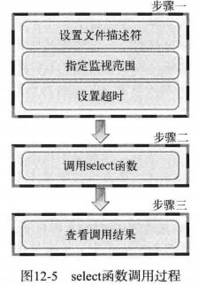
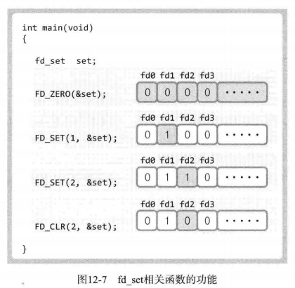

# 第12章 I/O复用

## 12.1 基于I/O复用的服务器端

**多进程服务器端的缺点和解决办法**

缺点：创建进程时，需要大量的运算和内存空间，代价大

解决办法：I/O复用


**复用**

解释1:在1个通信频道中传递多个数据（信号）的技术

解释2:为了提高物理设备的效率，用最少的物理要素传递最多数据时使用的技术


**复用技术在服务器端的应用**

无论提供多少个客户端，提供服务的进程只有1个


## 12.2 理解select函数并实现服务器端

运用select函数是最具代表性的实现复用服务器端的方法。

**select函数的功能**

select函数可以统一监视多个套接字，监视项包括：

（1）是否存在套接字接收数据？

（2）无需阻塞传输数据的套接字有哪些？

（3）哪些套接字发生了异常？

监视项即事件

**select函数调用顺序**




**Linux下fd_set数据变量**

Linux下fd_set是一个数组，第1个值为文件描述符为0的套接字的标志位，第2个值为文件描述符为1的套接字的标志位，依次类推.


**设置目标套接字标志位的函数**

设置标志位，或者称为注册文件描述符fd的信息

```c
//将fdset变量所有位初始化为0
FD_ZERO(fd_set *fdset);

//在参数fdset指向的变量中注册文件描述符fd的信息
FD_SET(int fd, fd_set* fdset);

//在参数fdset指向的变量中清除文件描述符fd的信息
FD_CLR(int fd, fd_set *fdset);

//若参数fdset指向的变量中包含文件描述符fd的信息，返回true
FD_ISSET(int fd, fd_set *fdset);
```




**select函数设置检查（监视）范围及超时**

```c
/**
*@param maxfd:监视对象文件描述符数量
*@param readset:将所有关注“是否存在待读取数据”的文件描述符注册到fd_set型变量，并传递其地址值
*@param writeset:将所有关注“是否可传输无阻塞数据“的文件描述符注册到fd_set型变量，并传递其地址值
*@param exceptset:将所有关注“是否发生异常“的文件描述符注册到fd_set型变量，并传递其地址值
*@param timeout:调用select函数后，为防止进入无限阻塞的状态，传递超时（time-out）信息。不设置超时可设置null
*@return 发送错误时返回-1，超时返回0。因发生关注的事件返回时，返回发生事件的文件描述符的数量
*/
int select(int maxfd, fd_set* readset, fd_set* writeset, fd_set* exceptset, const struct timeval *timeout);


struct timeval
{
    long tv_sec; //seconds
    long tv_usec; //microseconds
}
```


**select函数查看结果**

select函数执行后，select函数中传递的fd_set指针指向的数据中，标志位为1的文件描述符表示发生了对应的事件。被监视的文件描述符若没有发生事件，会将fd_set对应位置0


**select函数示例程序**

```c
#define BUF_SIZE 30

int main(intargc, char *argv[])
{
    fd_set reads, temps;
    int result, str_len;
    char buf[BUF_SIZE];
    struct timeval timeout;
    
    FD_ZERO(&reads);
    FR_SET(0, &reads); //0 is standard input(console)
    
    /*
    timeout.tv_sec = 5;
    timeout.tv_usec = 5000;
    */
    while(1){
        temps = reads;
        timeout.tv_sec = 5;
        timeout.tv_usec = 0;
        //执行select函数过程中，timeout会始终保存剩余监视时间，会变化，所以不使注释中设置时间的方法
        result = select(1, &temps, 0, 0, &timeout);
        if (result = -1) {
            //error
            break;
        } else if (result == 0) {
            //time out
        } else {
            if (FD_ISSET(0, &temps)) {
                str_len = read(0, bufm BUF_SZIE);
            }
            buf[str_len] = 0;
            printf("message form console: %s", buf);
        }
    }
    return 0;
}
```


## 12.3 基于Windows的实现

**与Linux区别点**

- select差别性

函数完全相同，区别是windows下select函数的第一个参数没有特殊意义，只是为了保持windows与UNIX系统的兼容性。

- windows下给struct timeval从新起了个名字

```c
typedef struc timeval {
    long tv_sec;
    long tv_usec;
} TIMEVAL;
```

- fd_set结构体不同

```c
typedef struct fd_set {
    u_int fd_count;
    SOCKET fd_array[FD_SETSIZE];
} fd_set;
```


**基于Windows实现I/O复用服务器端**

```c
#include <stdio.h>
#include <stdlib.h>
#include <string.h>
#include <winsock2.h>

#define BUF_SIZE 1024
void ErrorHandling(char *message);

int main(int argc, char *argv[])
{
    WSADATA wsaData;
    SOCKET hServSock, hClntSock;
    SOCKADDR_IN servAdr, clntAdr;
    TIMEVAL timeout;
    fd_set reads, cpyreads;
    
    int adrSz;
    int strLen, fdNum, i;
    char buf[BUF_SIZE];
    
    if (argc != 2) {
        printf("Usage: %s <port>\n", argv[0]);
        exit(1);
    }
    if (WSAStartup(MAKEWORD(2,2), &wsaData) != 0) {
        ErrorHandling("WSAStartup() error");
    }
    hServSock = socket(PF_INET, SOCK_STREAM, 0);
    memset(&servAdr, 0, sizeof(servAdr));
    servAdr.sin_family = AF_INET;
    servAdr.sin_addr.s_addr = htol(INADDR_ANY);
    servAdr.sin_port = htons(atoi(argv[1]));
    
    if (bind(hServSock, (SOCKADDR*)&servAdr, sizeof(servAdr)) == SOCKET_ERROR) {
        ErrorHandling("bind() error");
    }
    if (listen(hServSock, 5) == SOCKET_ERROR){
        ErrorHandling("listen() error")
    }
    
    FD_ZERO(&reads);
    FD_SET(hServSock, &reads);
    
    while(1) 
    {
        cpyReads = reads;
        timeout.tv_sec = 5;
        timeout.tv_usec = 5000;
        
        if ((fdNum=select(0, &cryReads, 0, 0, &timeout)) == SOCKET_ERROR) {
            break;
        }
        if (fdNum == 0) {
            continue;
        }
        for (i = 0; i < reads.fd_count; i++) {
            if (FD_ISSET(reads.fd_array[i], &cpyReads)) {
                if (reads.fd_array[i] == hServSock) {
                    adrSz = sizeof(clntAdr);
                    hClntSock = accept(hServSock, (SOCKADDR*)&clntAdr, &adrSz);
                    FD_SET(hClntSock, &reads);
                    printf("connected client:%d \n", hClntSock);
                } else {
                    strLen = recv(reads.fd_array[i], buf, BUF_SIZE - 1, 0);
                    if (strLen == 0) {
                        FD_CLR(reads.fd_array[i], &read);
                        closesocket(cpyReads.fd_array[i]);
                        printf("closed cliend: %d \n", cryReads.fd_array[i]);
                    } else {
                        send(reads.fd_array[i], buf, strlen, 0);
                    }
                }
            }
        }
    }
    closesocket(hServSock);
    WSACleanup();
    return 0;
}
```


