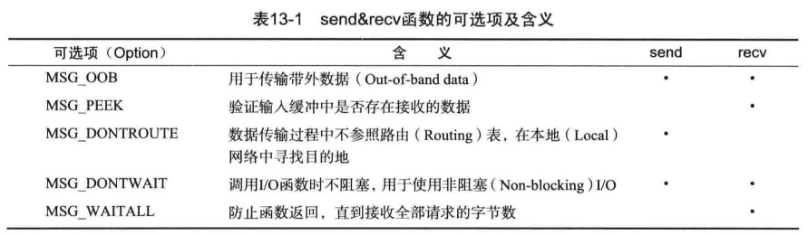

# 第13章 多种IO函数

## 13.1 send & recv函数

**基于Windows的I/O函数**

```c
/**
@param s 表示数据传输对象连接的套接字句柄
@param buf 保存待传输数据的缓冲地址值
@param len 要传输的字节数
@param flags 传输数据时用到的多种选项信息
@return 成功时返回传输字节数，失败时返回SOCKET_ERROR
*/
int send(SOCKET s, const char *buf, int len, int flags);

/**
@param s 表示数据接收对象连接的套接字句柄
@param buf 保存接收数据的缓冲地址值
@param len 能够接收的最大字节数
@param flags 接收数据时用到的多种选项信息
@return 成功时返回接收的字节数（收到EOF时为0），失败时返回SOCKET_ERROR
*/
int recv(SOCKET s, const char *buf, int len, int flags);
```

Linux也具有send和recv函数，与windows下几乎相同。


**I/O函数中的可选项flags**

收发数据时的可选项，可利用位或（|）运算同时传递多个信息。



不同的操作系统对这些可选项的支持不相同。


**MSG_OOB：发送紧急消息**

带外数据，即紧急消息。MAG_OOB选项用于发送带外数据。

MSG_OOB可选项用于**创建特殊发送方法和通道**以发送紧急消息。

Linux下，套接字的紧急消息处理，是通过系统的消息机制并注册回调函数，供在收到紧急消息时系统进行调用处理。使用设置MSG_OOB的recv读取紧急消息时，只能读取一个字节。例如发送端执行如下指令：

```c
send(sock, "890", sieof("890"), MSG_OOB);
/*
字节0被recv(...,MSG_OOB)接收；
字节8和9依然走不带MSG_OOB选项的recv接收
*/
```


windows下客户端：

```c
#include <stdio.h>
#include <stdlib.h>
#include <winsock2.h>

#define BUF_SIZE 30
void ErrorHandling(char* message) {
	fputs(message, stderr);
	fputc('\n', stderr);
	exit(1);
}

int main_client(int argc, char* argv[]) {
	WSADATA wsaData;
	SOCKET hSocket;
	SOCKADDR_IN sendAdr;
	if (argc != 3) {
		printf("Usage: &s <IP> <port>\n", argv[0]);
		exit(1);
	}
	if (WSAStartup(MAKEWORD(2, 2), &wsaData) != 0) {
		ErrorHandling("WSAStartup error");
	}

	hSocket = socket(PF_INET, SOCK_STREAM, 0);
	memset(&sendAdr, 0, sizeof(sendAdr));
	sendAdr.sin_family = AF_INET;
	sendAdr.sin_addr.s_addr = inet_addr(argv[1]);
	sendAdr.sin_port = htons(atoi(argv[2]));

	if (connect(hSocket, (SOCKADDR*)&sendAdr, sizeof(sendAdr) == SOCKET_ERROR)) {
		ErrorHandling("connect() error");
	}
	send(hSocket, "123", 3, 0);
	send(hSocket, "4", 1, MSG_OOB);
	send(hSocket, "567", 3, 0);
	send(hSocket, "890", 3, MSG_OOB);
	closesocket(hSocket);
	WSACleanup();
	return 0;
}
```

windows服务端

```c
#include <stdio.h>
#include <stdlib.h>
#include <winsock2.h>

#define BUF_SIZE 30
void ErrorHandling(char* message);

int main_server(int argc, char* argv[]) {
	WSADATA wsaData;
	SOCKET hAcptSock, hRecvSock;

	SOCKADDR_IN recvAdr;
	SOCKADDR_IN sendAdr;
	int sendAdrSize, strLen;
	char buf[BUF_SIZE];
	int result;

	fd_set read, except, readCopy, exceptCopt;
	struct timeval timeout;

	if (argc != 2) {
		printf("Usage: &s <IP> <port>\n", argv[0]);
		exit(1);
	}
	if (WSAStartup(MAKEWORD(2, 2), &wsaData) != 0) {
		ErrorHandling("WSAStartup error");
	}

	hAcptSock = socket(PF_INET, SOCK_STREAM, 0);
	memset(&recvAdr, 0, sizeof(recvAdr));
	recvAdr.sin_family = AF_INET;
	recvAdr.sin_addr.s_addr = inet_addr(INADDR_ANY);
	recvAdr.sin_port = htons(atoi(argv[1]));

	if (bind(hAcptSock, (SOCKADDR*)&recvAdr, sizeof(recvAdr)) == SOCKET_ERROR) {
		ErrorHandling("bind() error");
	}
	if (listen(hAcptSock, 5) == SOCKET_ERROR) {
		ErrorHandling("listen() error");
	}

	sendAdrSize = sizeof(sendAdr);
	hRecvSock = accept(hAcptSock, (SOCKADDR*)&sendAdr, &sendAdrSize);
	FD_ZERO(&read);
	FD_ZERO(&except);
	FD_SET(hRecvSock, &read);
	FD_SET(hAcptSock, &except);

	while (1)
	{
		readCopy = read;
		exceptCopt = except;
		timeout.tv_sec = 5;
		timeout.tv_usec = 0;

		result = select(0, &readCopy, 0, &exceptCopt, &timeout);

		if (result > 0) {
			if (FD_ISSET(hRecvSock, &exceptCopt)) {
				strLen = recv(hRecvSock, buf, BUF_SIZE - 0, 0);
				if (strLen = 0) {
					strLen = recv(hRecvSock, buf, BUF_SIZE - 1, MSG_OOB);
					buf[strLen] = 0;
					printf("Urgent message: %s \n", buf);
				}
				if (FD_ISSET(hRecvSock, &readCopy)) {
					strLen = recv(hRecvSock, buf, BUF_SIZE - 1, 0);
					if (strLen == 0) {
						break;
						closesocket(hRecvSock);
					}
					else {
						buf[strLen] = 0;
						puts(buf);
					}
				}
			}
		}
	}

	closesocket(hAcptSock);
	WSACleanup();
	return 0;
}
```


**MSG_PEEK和MSG_DONWAIT**

设置MSG_PEEK选项时，即使读取了输入缓冲的数据，也不会删除。

设置MSG_DONTWAIT选项时，函数不阻塞，直接返回

一般同时设置这两个选项，以**验证输入缓冲中是否存在接受的数据**


## 13.2 readv & writev函数

