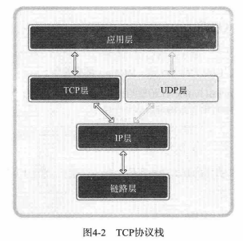

# 第4章 基于TCP的服务器端/客户端（1）

## 4.1 理解TCP和UDP

**TCP（Transmission COntrol Protocol，传输控制协议）**，意为“对数据传输过程的控制”。

**TCP/IP协议栈**


数据的收发分成了4个层次化的过程。TCP/IP协议栈是一种层次化方案。

TCP套接字收发数据借助下图所示TCP协议栈。



UDP套接字收发数据借助下图所示UDP协议栈。


各层可能通过操作系统等软件实现，也可能通过类似NIC的硬件设备实现。

数据通信中使用的协议栈分为7层。


**链路层**

链路层是物理链接领域标准化的结构，专门定义LAN，WAN，MAN等网络标准。若两台主机进行网络数据交换，需要进行物理连接，而链路层就复杂物理连接相关的标准。


**IP层**

IP层使用的协议就是IP，解决在复杂的网络中传输数据时**路径选择**的问题。IP本身是面向消息的、不可靠的协议，每次传输数据选择的路径并不一致。如果传输中发生路径错误，则选择其他路径；发生数据丢失或错误，则无法解决。IP协议无法应对数据错误。

**TCP/UDP层**

TCP和UDP层以IP层提供的路径信息为基础完成实际的数据传输，又称为**传输层**。TCP可以保证可靠的数据传输，但它发送数据以IP层为基础。

TCP的作用：如果数据交换过程中可以确认对方已收到数据，并重传丢失的数据，那么即使IP层不保证数据传输，这类通信也是可靠的。


TCP和UDP存在于IP层之上，决定主机之间的数据传输方式。TCP 协议向不可靠的IP协议赋予了可靠性。

**应用层**

IP层、TCP/UDP层等内容是套接字通信过程中自动处理的。选择数据传输路径、数据确认过程都被隐藏在套接字内部，是程序员从这些细节中解放出来。

编写软件过程中，需要根据程序特点决定服务器端和客户端之间的数据传输规则，这边是应用层协议。


## 4.2 实现基于TCP的服务端/客户端

**TCP服务器端的默认函数调用顺序**


**listen进入等待连接请求状态**

listen函数如下：

```c
/**
@param sock 希望进入等待连接请求状态的套接字，传递的套接字成为服务器端套接字（监听套接字）
@param backlog 连接请求队列的长度，表示允许进入队列的连接请求最大数量
@return 成功时返回0，失败时返回-1
*/
int listen(int sock, int backlog);
```

listen函数使对应的套接字进入监听客户端连接请求的状态，该状态下，来自于客户端的连接请求将被放入套接字内的连接请求队列。（简单说，使对应套接字进入监听状态，开始维护请求队列）。

listen表明，服务器端的监听套接字，相当于门卫一样管理着连接请求等候室（队列），并不负责数据的传输。


**accept受理客户端连接请求**

受理请求意味着进入可接收数据的状态。

```c
/**
@param sock 服务器端的监听套接字
@param addr 用于保存发起连接请求的客户端地址信息的结构体地址
@param addrlen 第2个参数addr结构体长度
@return 成功时返回创建的用于传输数据的套接字，失败时返回SOCK_INVALID
*/
SOCKET accept(SOCKET sock, struct sockaddr *addr, socklen_t *addrlen);
```

调用accept函数时**若请求队列为空，则accept函数不会返回**，直到出现客户端连接为止。


**TCP客户端的默认函数调用顺序**


**connect请求连接**

```c
/**
@param sock客户端套接字
@param servaddr 保存有目标服务器端地址信息的结构体变量地址
@param addrlen 第2个结构体参数servaddr的地址变量长度
@return 成功时返回0，失败时返回-1
*/
int connect(SOCKET sock, struct sockaddr *servaddr, socklen_t addrlen);
```

connect只有服务器端接收了连接请求或发生断网等异常情况而中断连接请求时，才会返回。

客户端的IP地址和端口在调用connect函数时由系统自动分配，无需调用bind函数进行分配。

**基于TCP的服务器端/客户端函数调用关系**


总体流程：服务器端创建套接字后连续bind和listen进入等待状态，客户端再通过调用connect函数发起连接请求。需要注意客户端只能等到服务端调用listen函数后才能调用connect函数。双方完成连接后，即可相互传输数据。

关于传输数据：recv函数会从缓冲buf内读取数据，读到了数据或另一端close套接字后才会返回。而且recv并不保证读取到所有数据。也就是说，传输数据时，一端调用recv时，要保证另一端发送了或将来肯定会发送数据，不然会一直阻塞。


## 4.3 实现迭代服务器端/客户端

这是一个回声实验。服务器端与客户端成功连接后，客户端首先给服务器端发送了数据，服务器端recv到数据后，再回传给客户端。客户端接收到后对数据进行控制台输出。这个实验能运行的原因是：客户端发送了数据，服务端接收数据并回传，客户端即可接收数据。相当于客户端发送数据保证了自己能够接收到数据，所以客户端recv不会一直阻塞。

目前存在的问题：我们希望的效果是客户端发送一个字符串，服务端就返回这个字符串；但实际情况下，可能客户端连续发送了两个字符串，服务端一次性返回这两个字符串，没有做到一一对应的关系

## 4.4 基于Windows的实现


