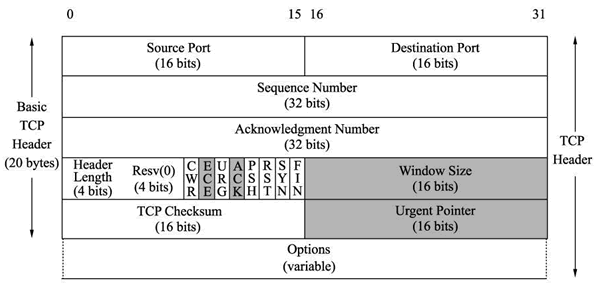
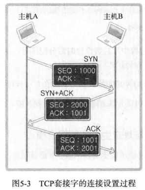
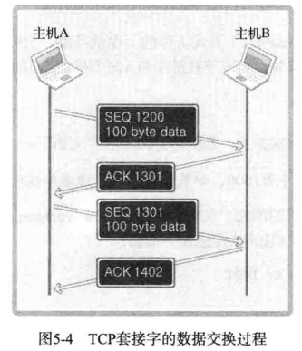
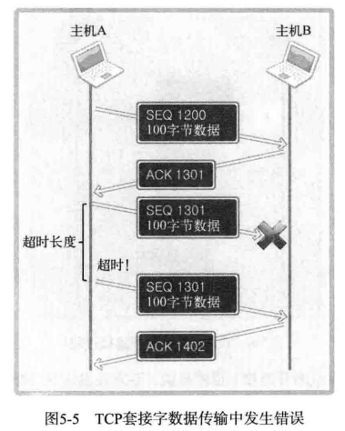
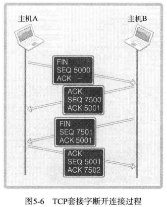
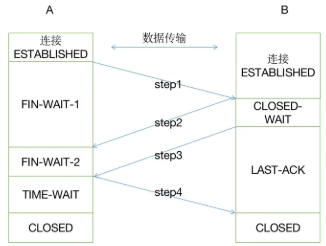

# 第5章 基于TCP的服务器端及客户端（2）

## 5.1 TCP数据无边界问题的处理

**数据无边界**

read函数或recv函数，无法区分数据是否完整（对于接受到的数据，无法有效区分数据的首字节与尾字节，即无法确定数据的边界）

假设客户端不断send数据至服务器端，服务端通过read或recv接收数据。服务端每次读取到的数据长度不定，针对某一次send的数据，在客户端也无法区分数据的首字节和尾字节在哪里，谓之**数据无边界**。

**数据无边界问题的处理方式**

应用层协议有效解决了数据无边界问题。应用层协议针对每次传递的数据进行了约定。不管是服务器端还是客户端，接收数据时，根据协议接收指定长度的数据，再根据协议解析数据即可。

## 5.2 TCP原理

**TCP套接字中的I/O缓冲**

- I/O缓冲在每个TCP套接字中单独存在
- I/O缓冲在创建套接字时自动生成
- 及时关闭套接字也会继续传递输出缓冲中遗留的数据
- 关闭套接字将丢失输入缓冲中的数据

**发送的数据超过接收端输入缓冲大小怎么办？**

TCP中有滑动窗口协议，接收端会告知发送端自身可以接收的数据量大小。

**write函数返回时间点**

执行write或send函数，只是将数据写入输出缓冲中，写完就返回。read或recv也只是从输入缓冲中读取数据。发送端输出缓冲的数据传输到接收端输入缓冲的过程，由套接字自动管理。

**TCP报文格式**

TCP报文是TCP层传输的数据单元，也称报文段。每个字段如下：

**TCP内部工作原理1：连接（三次握手）**

TCP连接第一次握手：客户端发送报文，设置SYN为1，ACK为0，以及seq序列号，请求连接。

TCP连接第二次握手：服务器发送报文，设置SYN为1，ACK为1，以及seq序列号和ack num，表示同意连接，并告知客户端下一次发送的数据seq。

TCP连接第三次握手：客户端发送报文，设置SYN为0，ACK为1，以及ack num。告知服务端下一次发送的数据seq。

**为什么是三次握手不是两次？**

TCP在进行数据传输的过程中，对数据都按字节进行了编号。为了可靠的数据传输，发送端要根据接收端的反馈来决定自身发送哪些编号了的数据。接收端的反馈（ack num）告诉发送端，下一次发送数据的编号。

三次握手的目的就是客户端与服务端约定各自数据发送的seq初始值。三次握手的第二次握手，是服务器端告诉客户端下一次发送的数据的编号，第三次握手是客户端告诉服务器端，服务器端下一次发送的数据的编号。这就是为什么必须三次握手而不是两次握手的原因。

**TCP内部工作原理2：数据交换**

**TCP内部工作原理3：断开连接**

断开连接过程，经历4次挥手。

断开连接过程：主机A发送FIN报文，告知主机B，自身希望断开；主机B返回ACK报文对主机A的断开请求进行了确认（不确认的话，A不知道自己的断连的请求对方有没有收到，会一直发送FIN报文段）。B在处理完所有该发送的数据后，向A发送FIN报文段，告知A自身已经可以断开连接了。（此时B已经知道A想断连，自身也已处于可以断连的状态，为什么不在发送FIN报文后直接断开呢？因为A只有收到了B的FIN报文才能进入TIME-WAIT状态后再关闭，所以B要确保A收到了自身的FIN报文，B有一个LAST-ACK状态）。在收到A的ACK确认报文后，B就可以断开了。

TIME-WAIT状态的设计，是确保B收到了A的ACK报文，B只有收到了该ACK才会断开。如果B没有收到A的ACK报文，在TIME-WAIT状态的时间段内，A会再次收到B的FIN报文。此时为了让B能够断开，A会再次发送ACK报文。