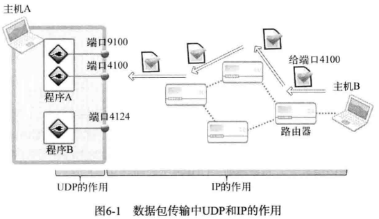

# 第6章 基于UDP的服务器端及客户端

## 6.1 理解UDP

**UDP套接字的特点**

UDP类似信件，无法确认对方是否收到，传输过程中也可能发生丢失情况。UDP提供的是不可靠的数据传输服务。

TCP在可靠性上更好，UDP在结构上以及性能上更优。

TCP在不可靠的IP层进行流控制，而UDP缺少这种流控制机制。**流控制**是区分UDP和TCP的最重要的标志。


**UDP内部工作原理**



UDP最重要的作用就是根据端口号将传到主机的数据包交付给最终的UDP套接字。


**UDP的高效使用**

在实时视频场景中，实时性比可靠性更重要。即使丢失了一部分数据，也只会导致画面轻微抖动或出现一点杂音。


**TCP比UDP慢的原因**

- 收发数据前后进行的连接设置及清除过程
- 收发数据过程中为保证可靠性而添加的流控制


## 6.2 实现基于UDP的服务器端/客户端

**UDP中的服务器端和客户端没有连接**

UDP服务器端/客户端不像TCP那样在连接状态下交换数据，不必调用TCP连接过程中调用的listen函数和accept函数。UDP中只有创建套接字的过程和数据交换过程。


**UDP服务器端和客户端均只需1个套接字**

TCP中套接字之间是一对一的关系（客户端与服务器端套接字一一对应）。

UDP套接字可以向任意主机传输数据。


**基于UDP的数据I/O函数**

创建好TCP套接字后，传输数据时无需再添加地址信息。但UDP套接字不会保持连接状态，因此每次传输数据都要添加目标地址信息。

```c
/**
@param sock 用于传输数据的UDP套接字
@param buff 保存待传输数据的缓冲地址值
@param nbytes 待传输的数据长度，以字节为单位
@param flags 可选项参数，若没有则传递0
@param to 存有目标地址信息的sockaddr结构体变量的地址
@param addrlen 传递给参数to的地址值结构体变量长度
@return 成功时返回传输的字节数，失败时返回-1
*/
size_t sendto(int sock, void *buff, size_t nbytes, int flags, struct sockaddr *to, socklen_t addrlen);


/**
@param sock 用于接收数据的UDP套接字
@param buff 保存接收数据的缓冲地址值
@param nbytes 可接收的最大字节数
@param flags 可选项参数，若没有则传入0
@param from 存有发送端地址信息的sockaddr结构体变量的地址值
@param addrlen保存参数from的结构体变量长度的变量地址值
@return 成功时返回接收的字节数，失败时返回-1
*/
size_t recvfrom(int sock, void *buff, size_t nbytes, int flags, struct sockaddr *from, socklen_t *addrlen);
```

windows下：

```c
/**
@param sock 用于传输数据的UDP套接字
@param buff 保存待传输数据的缓冲地址值
@param nbytes 待传输的数据长度，以字节为单位
@param flags 可选项参数，若没有则传递0
@param to 存有目标地址信息的sockaddr结构体变量的地址
@param addrlen 传递给参数to的地址值结构体变量长度
@return 成功时返回传输的字节数，失败时返回SOCKET_ERROR
*/
int sendto(SOCKET sock, const char *buff, int nbytes, int flags, struct sockaddr *to, socklen_t addrlen);


/**
@param sock 用于接收数据的UDP套接字
@param buff 保存接收数据的缓冲地址值
@param nbytes 可接收的最大字节数
@param flags 可选项参数，若没有则传入0
@param from 存有发送端地址信息的sockaddr结构体变量的地址值
@param addrlen保存参数from的结构体变量长度的变量地址值
@return 成功时返回接收的字节数，失败时返回-1
*/
int recvfrom(SOCKET sock, char *buff, int nbytes, int flags, struct sockaddr *from, int *addrlen);
```


**示例程序**

服务器端

```c
#include <stdio.h>
#include <stdlib.h>
#include <string.h>
#include <winsock2.h>
#define BUF_SIZE 30
void ErrorHandling(char *message);

int main(int argc, char *argv[])
{
    WSADATA wsaData;
    SOCKET sevSock;
    char message[BUF_SIZE];
    int strLen;
    int clntAdrSz;
    
    SOCKADDR_IN servAdr, clntAdr;
    if (argc != 2) {
        printf("Usage: %s <port>\n", argv[0]);
        exit(1);
    }
    if (WSAStartup(MAKEWORD(2,2), &wsaData) != 0) {
        ErrorHandling("WSAStartup() error");
    }
    servSock = socket(PF_INET, SOCK_DGRAM, 0);
    if (servSock == INVALID_SOCKET) {
        ErrorHandling("UDP socket creation error");
    }
    
    memset(&servAdr, 0, sizeof(servAdr));
    servAdr.sin_family = AF_INET;
    servAdr.sin_addr.s_addr = htonl(INADDR_ANY);
    servAdr.sin_port = htons(atoi(argv[1]));
    
    if (bind(servSock, (SOCKADDR*)&servAdr,sizeof(servAdr)) == SOCKET_ERROR){
        ErrorHandling("bind() error");
    }
    
    while(1)
    {
        clntAdrsz = sizeof(clntAdr);
        strLen = recvfrom(servSock, message, BUF_SIZE, 0, (SOCKADDR*)&clenAdr, sizeof(clntAdrSz));
        sendto(servSock, message, strLen, 0, (SOCKADDR*)&clntAdr, sizeof(clntAdr));
    }
    closesocket(servSock);
    WSACleanup();
    return 0;
}

void ErrorHandling(char *mesage)
{
    fputs(message, stderr);
    fputc('\n', stderr);
    exit(1);
}
```

客户端：基于已连接的UDP套接字

```c
#include <stdio.h>
#include <stdlib.h>
#include <string.h>
#include <winsock2.h>
#define BUF_SIZE 30
void ErrorHandling(char *message);

int main(int argc, char *argv[])
{
    WSADATA wsaData;
    SOCKET sock;
    char message[BUF_SIZE];
    int strLen;
    
    SOCLADDR_IN servAdr;
    if (argc != 3) {
        printf("Usage : %s <IP> <PORT>\n",argv[0]);
        exit(1);
    }
    if (WSAStartup(MAKEWORD(2,2), &wsaData) != 0) {
        ErrorHandling("WSAStartup() error");
    }
    
    sock = socket(PF_INET, SOCK_DGRAM, 0);
    if (sock == INVALID_SOCKET) {
        ErrorHandling("socket() error");
    }
    
    memset(&servAdr, 0, sizeof(servAdr));
    servAdr.sin_family = AF_INET;
    servAdr.sin_addr.s_addr = inet_addr(argv[1]);
    servAdr.sin_port = htons(atoi(argv[2]));
    connect(sock, (SOCKADDR*)&servAdr, sizeof(servAdr));
    
    while(1)
    {
        fputs("Insert message(q to quit): ", stdout);
        fgets(message, sizeof(message), stdin);
        if (!strcmp(message, "q\n") || strcmp(message, "Q\n")){
            break;
        }
        send(sock, message, strlen(message), 0);
        strLen = recv(sock, message, sizeof(message) - 1, 0);
        message[strLen] = 0;
        printf("Message from server: %s",message);
    }
    closesocket(sock);
    WSACleanup();
    return 0;
}
```


客户端：基于未连接的UDP套接字

```c
#include <stdio.h>
#include <stdlib.h>
#include <string.h>
#include <winsock2.h>
#define BUF_SIZE 30
void ErrorHandling(char *message);

int main(int argc, char *argv[])
{
    WSADATA wsaData;
    SOCKET sock;
    char message[BUF_SIZE];
    int strLen;
    
    SOCLADDR_IN servAdr;
    //注意：
    SOCKADDR_IN addr_from;
    //
    if (argc != 3) {
        printf("Usage : %s <IP> <PORT>\n",argv[0]);
        exit(1);
    }
    if (WSAStartup(MAKEWORD(2,2), &wsaData) != 0) {
        ErrorHandling("WSAStartup() error");
    }
    
    sock = socket(PF_INET, SOCK_DGRAM, 0);
    if (sock == INVALID_SOCKET) {
        ErrorHandling("socket() error");
    }
    
    memset(&servAdr, 0, sizeof(servAdr));
    servAdr.sin_family = AF_INET;
    servAdr.sin_addr.s_addr = inet_addr(argv[1]);
    servAdr.sin_port = htons(atoi(argv[2]));
    //connect(sock, (SOCKADDR*)&servAdr, sizeof(servAdr));
    
    while(1)
    {
        fputs("Insert message(q to quit): ", stdout);
        fgets(message, sizeof(message), stdin);
        if (!strcmp(message, "q\n") || strcmp(message, "Q\n")){
            break;
        }
        //send(sock, message, strlen(message), 0);
        sento(sock, message, strlen(message), 0, (struct sockaddr*)&servAdr, sizeof(servAdr));
        //strLen = recv(sock, message, sizeof(message) - 1, 0);
        strLen = recvfrom(sock, message, BUF_SIZE, 0, (struct sockaddr*)&addr_from, &addr_from);
        message[strLen] = 0;
        printf("Message from server: %s",message);
    }
    closesocket(sock);
    WSACleanup();
    return 0;
}
```


**UDP套接字的地址分配**

所有套接字都应分配IP地址和端口号。

- **服务器端**：bind函数分配地址
- **客户端**：调用sendto函数时若尚未分配地址信息，则分配地址信息，并保留分配的地址一直到程序结束。


## 6.3 UDP的数据传输特性和调用connect函数

**存在数据边界的UDP套接字**

UDP是具有数据边界的协议，因此输入函数的调用次数应和输出函数的调用次数完全一次，这样才能保证接收全部已发送的数据。1个数据包（或称数据报）就是一个完整数据。

**已连接（connected）UDP套接字与未连接（unconnected）UDP套接字**

sendto函数传输数据的过程：

（1）第1阶段：向UDP套接字注册目标地址IP和端口号

（2）第2阶段：传输数据

（3）第3阶段：删除UDP套接字中注册的目标地址信息

每次调用sendto函数都会重复上述过程，每次都会变更目标地址，因此可以重复利用同一UDP套接字向不同的目标传输数据。**未注册目标地址信息的套接字称为未连接的套接字**。

要与同一主机进行长时间通信时，将UDP套接字变成已连接的套接字会提高效率（节约1/3的时间）

**创建已连接UDP套接字**

创建已连接UDP套接字，调用connect函数即可。

```c
sock socket(PF_INET, sock_DGRAM, 0);
memset(&adr, 0, sizeof(adr));
adr.sin_family = AF_INET;
adr.sin_addr.s_addr = ...;
adr.sin_port = ...;
connect(sock, (struct sockaddr *)&adr, sizeof(adr));
```

调用connect并不意味着与对方UDP套接字连接，只是向套接字注册地址信息。

因为已经指定了收发对象，所以不仅可以使用sendto、recvfrom函数，还可以使用write\read函数。


## 6.4 基于Windows的实现

