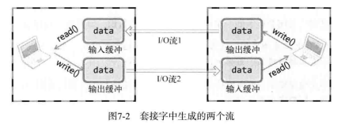

# 第7章 优雅地断开套接字连接

## 7.1 基于TCP的半关闭

**单方面断开连接带来的问题**

close或closesocket函数是单方面断开连接的，意味着完全断开连接。**完全断开**指无法发送数据且无法接收数据。

两台主机通信过程中，其中一台主机单方面完全断开连接，则无法再接收主机B传输的数据（close后已经无法调用接收数据相关的函数）。


**套接字和流（Stream）**

两台主机通过套接字建立连接收进入可交换数据的状态，称为**“流形成的状态”**。

双向通信，需要2个流。

套接字连接后，每个主机都会拥有单独是输入流和输出流。不同的两个主机之间输入流与输出流对应。



**半关闭状态**

建立连接后，关闭两个流中的一个后，称为半关闭状态。


**用于半关闭的函数**

```c
//Linux
/**
@param sock 需要断开的套接字
@param howto 断开方式信息 SHUT_RD:断开输入流 SHUT_WR:断开输出流 SHUT_RDWR:同时断开I/O流
@return 成功时返回0，失败时返回-1
*/
int shutdown(int sock, int howto);

//Windows
/**
@param sock 需要断开的套接字
@param howto 断开方式信息 SD_RECEIVE:断开输入流 SD_SEND:断开输出流 SD_BOTH:同时断开I/O流
@return 成功时返回0，失败时返回SOCKET_ERROR
*/
int shutdown(SOCKET sock, int howto);
```


**为何需要半关闭**

问题1：是不是留出足够长的时间，保证完成数据交换，就没必要半关闭？

答1：理论上是，但收数据的一端需要接收数据到何时无法知道，也无法无休止地调用read函数，这可能导致程序堵塞（因为read函数未返回）

问题2：是否可以约定代表数据结束的字符？

答2：不可以，这意味着数据中间不能有与约定字符相同的内容。为解决该问题，发送端最后向接收端传递EOF表示数据传输结束。

问题3：何时传递EOF?

答3：输出流关闭时，接收方调用read或recv会返回EOF。close会关闭输出流，发送EOF，但存在前述单方面断开连接的问题；shutdown函数可以只关闭发送端的输出流（半关闭），在发送EOF的同时保留了输入流，可以接收对方数据。


## 7.2 基于Windows的实现

**服务器端**

```c
//...
while(1){
    readCnt = fread((void*)buf, 1, BUF_SIZE, fp);
    if (readCnt < BUF_SIZE) {
        send(hClntSock, (char*)&buf, readCnt, 0);
        break;
    }
    send(hClntSock, (char*)&buf, readCnt, 0);
}
shutdown(hClntSock, SD_SEND);
recv(hCLnSock, (char*)buf, BUF_SIZE, 0);
//...
closesocket(hClntSock);
closesocket(hservSock);
//...
```

**客户端**

```c
while(readCnt=recv(hSocket, buf, BUF_SIZE, 0) != 0) {
    //...
}
send(hSocket, "Thank you", 10, 0);
closesocket(hSocket);
//...
```

