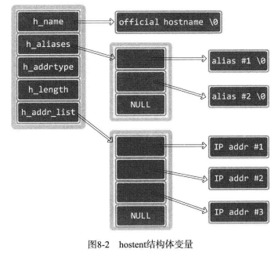

# 第8章 域名及网络地址

## 8.1 域名系统DNS

DNS（Domain Name System，域名系统），是对IP地址和域名进行相互转换的系统，其核心是DNS服务器。

**什么是域名**

提供网络服务的服务器端也是通过IP地址区分，但IP地址非常难记。因此使用域名替代IP地址。相当于别名。

服务器的IP地址变换是非常频繁的，不可能每次更换IP地址就要更新客户端程序。但域名可以做到很长时间不变，所以只需要更换域名代表的IP地址即可，客户端程序不需要改变。

客户端使用域名与服务器端进行连接时，首先会访问DNS服务器获取对应的IP地址，再进行连接。


## 8.2 IP地址和域名之间的转换

以下是通过程序向DNS服务器发出解析请求的方法。

**利用域名获取IP地址**

```c
//Linux、Windows相同
/**
@param hostname 域名字符串
@return 成功时返回hosten结构体地址，失败时返回NULL指针
*/
struct hostent *gethostbyname(const char *hostname);
```


**利用IP地址获取域名**

```c
//Linux、Windows相同
/**
@param addr 含有IP地址信息的in_addr结构体指针
@param len 向第一个参数传递的地址信息的字节数，IPv4为4，IPv6为16
@param family 传递地址族信息，IPv4为AF_INET，IPv6为AF_INET6
@return 成功时返回hosten结构体地址，失败时返回NULL指针
*/
struct hostent *gethostbyaddr(const char *addr, int len, int family);
```


**hostent结构体**

```c
struct hostent
{
    char *h_name;  //official name
    char **h_aliases;  //alias list
    int h_addrtype;  //host address type
    int h_length;  //address length
    char **h_addr_list;  //address list
}
```

- h_name:官方域名，代表某一主页。某些著名公司的域名并未用官方域名注册
- h_aliases:同一IP可以绑定多个域名。除官方域名外其他域名信息通过h_aliases
- h_addrtype:地址族信息，若是IPv4，则该变量存有AF_INET
- h_length:保存IP地址的长度。若是IPv4地址，则保持4；IPv6地址则保持16.
- h_addr_list:最重要成员，此变量以整数形式保持域名对应的IP地址。用户较多的网站有可能分配多个IP给同一域名，利用多个服务器进行负载均衡。

**注意二级数组尾部的NULL**




## 8.3 基于Windows的实现

```c
struct hostent *host;
host = gethostbyname("www.naver.com");

for (int i = 0; host->aliases[i]; i++) {
    printf("Aliases %d:%s \n", i+1, host->aliases[i]);
}
printf("Address type:%s \n", (host->h_addrtype==AF_INET)?"AF_INET" : "AF_INET6");
for (int i = 0; host->h_addr_list[i];i++) {
    printf("IP addr %d:%s\n", i+1, inet_ntoa(*(struct in_addr*)host->h_addr_list[i]));
}
```

```c
struct hostent *host;
SOCKADDR_IN addr;
memset(&addr, 0, sizeof(addr));
addr.sin_addr.s_addr=inet_addr("74.125.19.106");
host=gethostbyaddr((char*)&addr.sin_addr, 4, AF_INET);

for (int i = 0; host->aliases[i]; i++) {
    printf("Aliases %d:%s \n", i+1, host->aliases[i]);
}
printf("Address type:%s \n", (host->h_addrtype==AF_INET)?"AF_INET" : "AF_INET6");
for (int i = 0; host->h_addr_list[i];i++) {
    printf("IP addr %d:%s\n", i+1, inet_ntoa(*(struct in_addr*)host->h_addr_list[i]));
}
```

