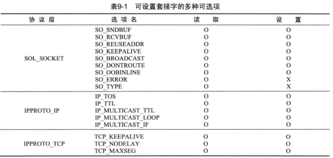
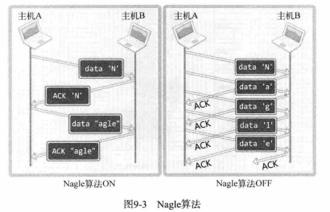

# 第9章 套接字的多种可选项

## 9.1 套接字可选项和I/O缓冲大小

**套接字可选项**



从表格可看出套接字选项是分层的。SOL_SOCKET层是套接字相关的通用可选项，IPPROTO_IP层可选项是IP协议相关事项，IPPROTO_TCP层可选项是TCP协议相关的事项。


**可选项相关函数getsockopt & setsockopt**

```c
/**
*@param sock:用于被查看选项的套接字
*@param level：要查看的可选项的协议层
*@param optname:要查看的可选项名
*@param optval:保存查看结果的缓冲地址值
*@param optlen:向第4个参数optval传递的缓冲大小。调用函数后，该变量中保存通过第4个参数返回的选项信息的字节数
*@return 成功时返回0，失败时返回-1
*/
int getsockopt(int sock, int level, int optname, void *optval, socklen_t *optlen);

/**
*@param sock:用于被查看选项的套接字
*@param level：要更改的可选项的协议层
*@param optname:要更改的可选项名
*@param optval:保存要更改的选项信息的缓冲地址值
*@param optlen:向第4个参数optval传递的可选信息的字节数
*@return 成功时返回0，失败时返回-1
*/
int setsockopt(int sock, int level, int optname, const void* optval, socklen_t optlen);
```

```c
//get
int tcp_sock = socket(PF_INET, SOCK_STREAM, 0);
int sock_type;
int state = getsockopt(tcp_sock, SOL_SOCKET, SO_TYPE, (void*)&sock_type, sizeof(sock_type));
```


**SO_SNDBUF & SO_RCVBUF**

这两个选项既可以读取当前I/O缓冲大小，也可以进行更改。

```c
int sock = socket(PF_INET, SOCK_STREAM, 0);
int send_buf_size, recv_buf_size, state;
socklen_t len;

len = sizeof(send_buf_size);
state = getsockopt(sock, SOL_SOCKET, SO_SNDBUF, (void*)&send_buf_size, &len);
if (state) {/*error*/}

len = sizeof(recv_buf_size);
state = getsockopt(sock, SOL_SOCKET, SO_RCVBUF, (void*)&recv_buf_size, &len);
if (state) {/*error*/}
```

```c
int send_buf_size = 1024 * 3, recv_buf_size = 1024 * 3;
int state;
socklen_t len;
int sock;

sock = socket(PF_INET, SOCK_STREAM, 0);
state = setsockopt(sock, SOL_SOCKET, SO_RECVBUF, (void *)&recv_buf_size, sizeof(recv_buf_size));
if (state){/*error*/}

state = setsockopt(sock, SOL_SOCKET, SO_SNDBUF, (void *)&send_buf_size, sizeof(send_buf_size));
if (state){/*error*/}
```

缓冲区的大小设置需谨慎处理，不一定完全按照我们的设置进行（比如设置0还生效是不合理的）


## 9.2 SO_REUSEADDR

**TIME_WAIT状态**

率先调用close函数发送FIN消息的套接字在最后一次给对方回复ACK消息后会进入一段时间的TIME_WAIT状态。close函数会立即返回（代表着服务端或客户端程序结束），但实际处在TIME_WAIT状态的套接字并未消失，端口依然处于占用状态。如果是服务器端，由于服务器端的地址以及端口固定，此时重启服务器端，执行bind函数会因为端口占用而地址分配失败。客户端一般不存在该问题的原因是，客户端程序每次运行，端口一般是随机分配的。

TIME_WAIT状态很重要，但如果服务器端发生故障紧急停止，本就需要尽快重启服务器端以提供服务，但因处在TIME_WAIT状态而必须等几分钟。更严重的情况是，TIME_WAIT状态下，如果客户端始终收不到ACK消息导致服务器端反复收到FIN消息，TIME_WAIT状态时间会一直持续下去，服务器端就始终无法重启。

**解决办法**是修改套接字的可选项SO_REUSEADDR的值为1，可将TIME_WAIT状态下的套接字端口号重新分配给新的套接字。

```c
int option = 1;
int optlen = sizeof(option);
setsockopt(sock, SOL_SOCKET, SO_REUSEADDR, (void*)&option, optlen);
```


## 9.3 TCP_NODELAY

**Nagle算法**

TCP套接字中的Nagle算法，用于防止因数据包过多而发生网络过载。



Nagle算法下，只有收到前一数据的ACK消息时，才发送下一数据。

Nagle算法下，某一次数据发送完，等待ACK消息的过程中，输出缓冲持续填充数据，收到ACK消息后，从缓冲中取数据再发送出去，再等待ACK，依次循环。

Nagle算法关闭的情况下，按序传递到输出缓冲的数据，发送过程与ACK接收与否无关，数据到达输出缓冲后，立即被发送出去。例如“传输大文件数据”，文件数据传入缓冲本身就很快，即使不用Nagle算法，也会在装满输出缓冲时传输数据包。这样不仅不会增加数据包的数量，反而会在无需等待ACK的前提下连续传输，因此大大提高传输速度。

（关于Nagle关闭的个人想法：首先套接字将输出缓冲的数据发送出去，不可能做到输出缓冲每增加一个字节就将这个字节传递出去。实际可以简单理解为，套接字每隔一个很短的时间，就可以发送缓冲区数据，这个很短的时间内，可以传入很多字节的数据，甚至可以填满缓冲区。在每隔一个很短的时间并且缓冲区有数据，不管ACK消息收到与否，都会直接将数据传输出去。）


**传输大数据应禁用Nagle算法**

有必要时应禁用Nagle算法，如传输大文件数据。

```c
int opt_val = 1;
setsockopt(sock, IPPROTO_TCP, TCP_NODELAY, (void*)&opt_val, sizeof(val));
```


**遗留问题：禁用Nagle算法的传输可靠性如何保证？**