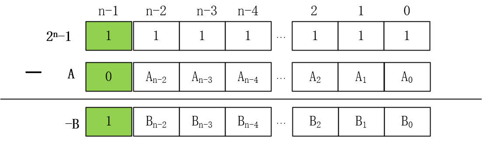

**量、数量**：事物的可计量性质（即可度量特征），如长度、重量、时间、温度等。

**数值**：量的符号化表示。即，数字是事物的可度量特征的符号化表示。

**数制**：数值的表示规则。不同规则下用来表示数值的数字符号个数不同，如二进制、八进制、十进制、十六进制。

**基数**：数制中表示数值的数字符号个数，如2、8、10、16.

**权**：一个数值中，每个数码表示的值取决于数码本身以及对应位值，位值即”权“。权是基数的某次幂。

**符号数**：二进制最高位表示数的符号。0表示正，1表示负数。

**机器数**：一个数（包括符号位）在机器中的二进制表示形式。

**真值**：机器数表示的值称为真值。同一机器数能够代表不同的真值。

**原码**

一种数值的二进制编码规则。*最高位为符号位，其余数字位表示数的绝对值。*

*特点：*简单直观，与真值转换方便，但不便于在计算机中进行加减运算（计算要进行符号判断，不同情况采用不同方法）。

**反码**

也是一种数值的二进制编码规则。负数的反码，在原码的基础上，符号位不变，数值位按位取反。

**补码**

也是一种数值的二进制编码规则。负数的补码，在反码基础上，末位加1。

**补码的推导过程**

首先明确：

- 机器字长n的二进制序列，index从右到左，从0到到n-1
- 二进制序列某一位代表的值为2^index^
- 全为1的二进制序列值等于2^index_max+1^

***事先需要制定几个规则***：

1. 机器字长n的二进制序列，最高位表示*符号位（0为正，1为负），*剩余位表示*数值位*。
2. 编码规则需满足：采用该编码规则的两个数求和，符号位与数值位一样可正常参与计算，得到的结果依旧满足该编码规则（对计算机硬件设计很重要）。
3. 0的编码唯一且序列所有位全为0，正数的数值位就是普通的无符号二进制数。

补码是满足这3个条件的，那么为什么补码满足呢？以下根据这三个规则推出补码的编码规则。

以算式***A-B***为例，将减法转变加法，则相当于计算***A+(-B)***。假设***A***和***B***都大于0，则根据上面第3条规则，我们很容易知道***A***的编码，关键是如何求***-B***的编码。

这里我们令***A=B***，则***A+(-B)=000...00***。

所以***000...00-A***即为***-B***。*规则2的符号位与数值位均可参与计算，具体是说加法时逢2进1，最高进位舍弃，这等价于减法时0减1时可借位，最高位也能从不存在的更高位借1*。***A***不为0意味着***000...00***必然向更高借1，则相当于***2^n^+0-A***，即***（-B）= 2^n^-A***。则**[B]~补~=2^n^-A=2^n^-|B|**

所以**[B]~补~-1=(2^n^-1)-A**，如下图：

各位对应相减，结果就是***-B***的各位与***A***的各位相反。所以**[B]~补~-1**就是***A***按位取反的结果。这里将这个按位取反称作**反码**，所以**[B]~补~=[B]~反~+1**

***为什么补码的补码是原码？***

如果已知***-B***，求***A***，将上图中的***A***和***-B***互换一下位置即可，那么***A-1***就是***-B***按位取反的结果，所以**[B]~补~**的补码就是***A***

***相关计算***

- 三码之间，按照转换规则转换时，都保留符号位，只对数值位进行转换
- 反码和补码各自对应一个**对二进制序列**进行转换的规则
- 补码的补码，就是对一个二进制序列应用补码规则进行转换得到新的序列，只不过被转换的二进制序列是一个真值的补码而已

**举例**

- 正数

  三码相同

- 负数

  真值-10 ->原码0b1000,1010 ->取反得反码0b1111,0101 -->反码加1得补码0b1111,0110 -->求补规则，即取反加1，得原码0b1000,1010

