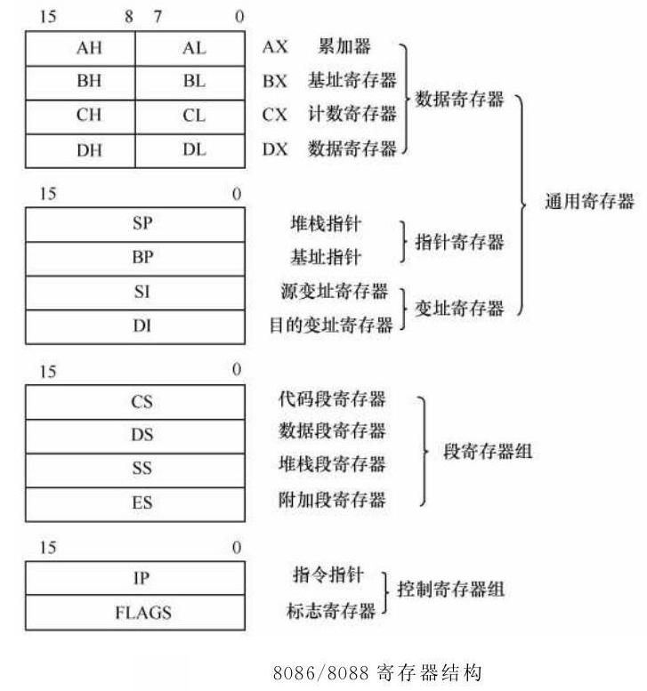

- 立即寻址  ***MOV AX,1234H***
- 寄存器寻址  ***MOV AX,BX***
- 直接寻址  ***MOV AX,[1064H]***
- 寄存器间接寻址  ***MOV AX,[BX]*** (only 4 :  [BX] [BP] [SI] [DI] )  基址或变址
- 寄存器相对寻址   ***MOV AX,[BX+10H]***基址或变址 + 位移量
- 基址变址寻址 基址+变址  ***MOV AX,[BX+SI]***
- 基址变址相对寻址 基址+变址 + 位移量  ***MOV AX,[BX+SI+10H]***