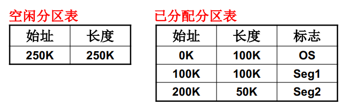
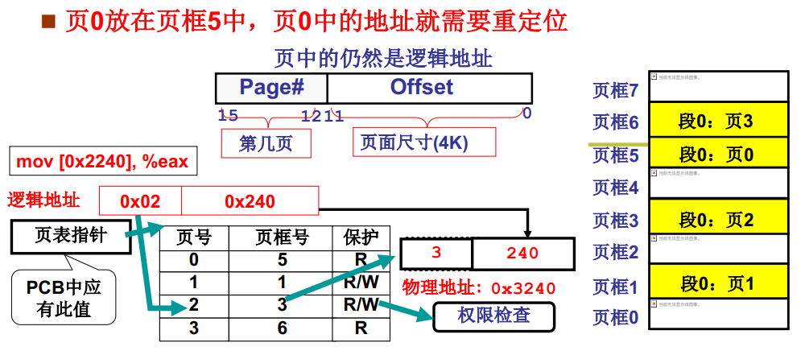

**内存如何分割？（按段如何分区？）**

程序被分成多个段（数据段、代码段、栈段等），所以存在如何分割内存分配到各段的问题。

- 固定分区

  等分内存，但显然段有大有小，需求不一定

- 可变分区

  通过空闲分区表和已分配分区表记录内存的使用情况

  

  如果为一个段申请内存，在空闲分区表中，如果内存中存在多个满足大小的空闲区域，如何选择？

  - 首先适配  从分区表中按顺序选择第一个满足要求的空闲内存区域
  - 最佳适配  选择满足大小的空闲内存区域段中空间最小的区域
  - 最差适配  选择满足大小的空闲内存区域段中空间最大的区域

**内存按段分区导致的内存效率问题**

很明显，内存释放后，存在很多内存碎片，会出现这些内存碎片总的大小可以满足一个段的空间分配，但所有的碎片都不满足要求。

如果使用*内存紧缩*（即将空闲分区合并，需要移动段）。需要花费大量时间，这是不能容忍的。

**将段以及物理内存空间打散，分成更小的页，解决分区问题**

所谓分页，是将程序的各个段分成更小的单位*页*，每页大小为4K，并为每一页分配一个编号。程序内的指令逻辑地址能够很容易计算其对应的页号，如上面的0x2240，该地址除以4K（右移3），得到地址所在页号为2。

物理内存同样以4K分割成页，每一页分配一个编号，叫页框号。为一个程序的段分配内存时，只需要将程序段内的页存储在内存的一个个页框内，并将段的每一页的页号和给其分配的内存页框号记录在表中，通过页号，查找到对应的页框号，通过页框号就能找到物理内存地址。如上面的页2存储在了内存的页框3的位置，在页框3中偏移0x240，即0x3240，就是真正的逻辑地址。

程序的段包含的页，在程序段中是顺序编号的，但在物理内存中，就不再需要顺序存储了。*一句话概括，程序的段被分成更小的页，非连续地存储在内存中，通过表记录每页的物理位置。*

分页解决了空间浪费以及内存紧缩存在的问题。