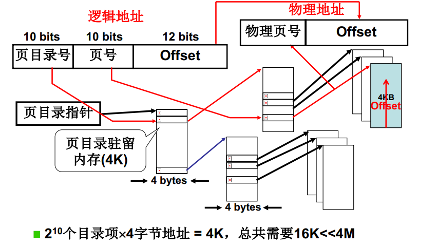

**问题**

为了提高内存空间利用率，页应该小，但是页小了页表就大了。

页面尺寸通常为4k，地址32位，则有2^20^个页面，存放着页表项在内存中，需要2^20^ * 4字节 = 4M内存。每个进程都需要4M内存，进程越多，需要内存越多。但32位地址总空间就4G!

**尝试1** 只存放用到的页

实际上大部分逻辑地址根本不会用到。只存放用到的页面临的问题是页表中的页号不连续，就需要比较查找，即使是折半查找，每次平均需要查找20次（log~2~2^20^)。这些页表存在内存上，20次也是不可接收的。

因此页表既要连续还得占用内存少。

**尝试2** 多级页表，即页目录表 + 页表

32位逻辑地址，分成10位页目录号，10位页号，12位偏移地址。

对于一个进程来说，页表目录占用内存2^10^ * 4字节 = 4K，而该进程实际用到的页表目录项很少，比如用到3个页表目录项，则这3个页表目录项各自对应4K的页表，其余的页表目录项没有对应的页表，不需要存储。所以总共使用了4K + 3 * 4K = 16K，远远小于4M内存。

下图示例中，进程的页表项使用了低地址和高地址，也就是说，使用的页表项可以是不连续的。

**多级页表提高了空间效率，时间上如何？**

每增加一级页目录，就需要多访问一次内存。上述多级页表需要访问2次内存。多级页表增加了访存的次数，尤其是64位系统。

**快表进一步优化多级页表的访问效率**

TLB是一组相联快读存储，是寄存器。TLB（即快表），会记录最近访问的内存。如果后续的指令访问的内存可以通过快表查询到（称为*命中*），则不需要访问页目录，可直接通过TLB获取物理地址，提高访问速度。

实际情况中，TLB条目数可以在64-1024之间，虽然很小，但TLB依旧能起作用的原因是程序的地址访问存在局限性，即*空间局限性（Locality in Space)*。程序多体现为循环、顺序结构，引用内存的地址多是邻近的。

要想真正实现“近似访存1次”，TLB的命中率就应该很高。