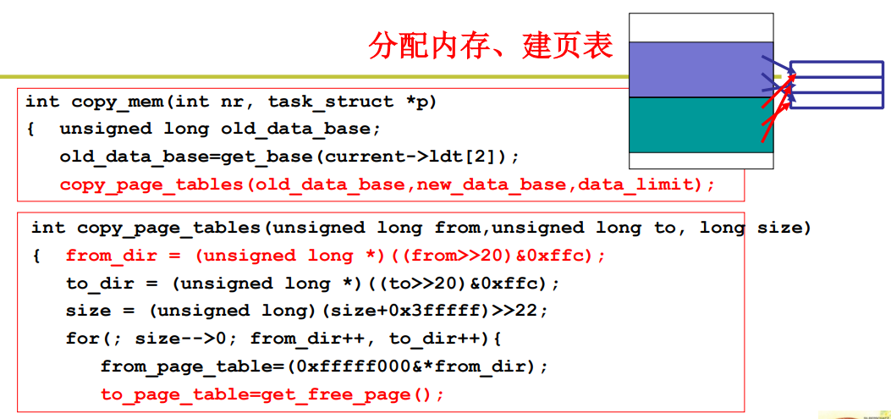
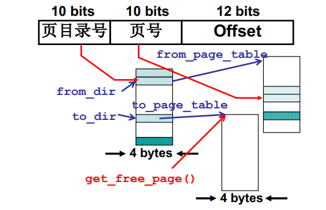
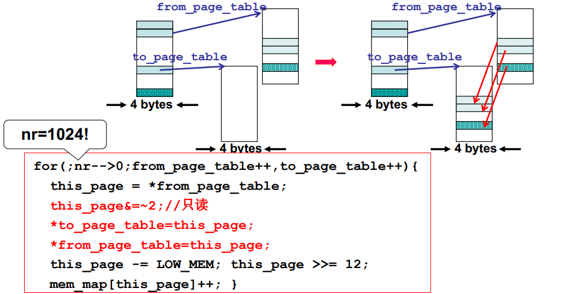
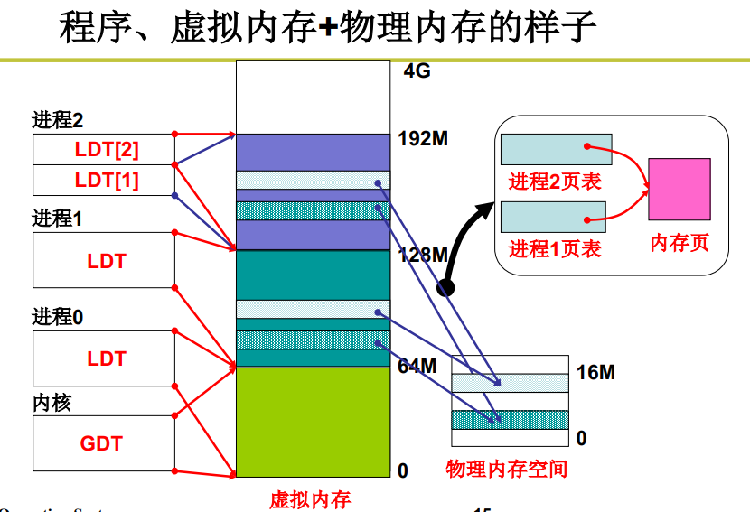
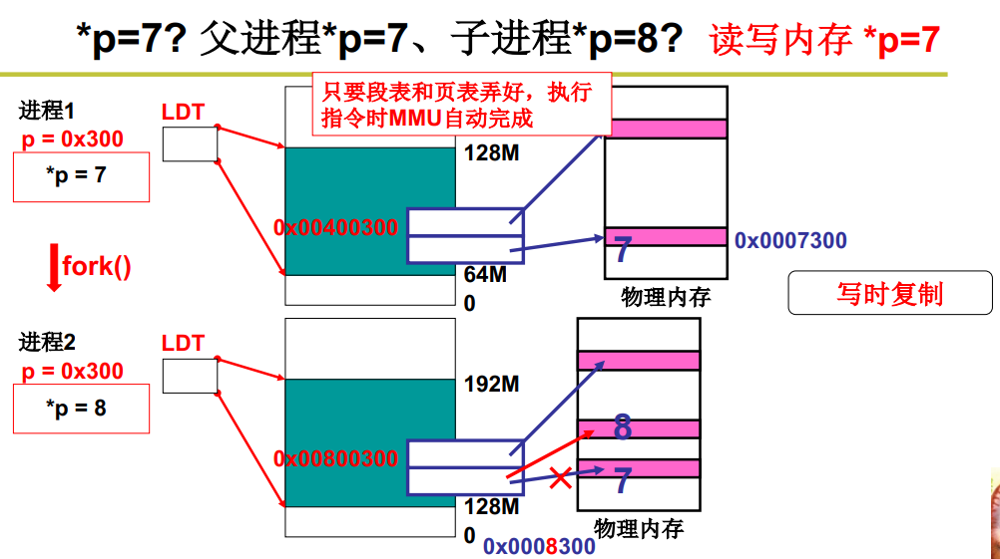

**程序员希望用段，物理内存希望用页，如何处理？**

使用虚拟内存，进行段页结合

**段页同时存在：段面向用户、页面向硬件**

逻辑地址依旧是段地址+偏移地址（CS:IP）。在虚拟的地址空间内为程序的各个段分配完整的空间，记录在段表内。同时建立页表，完成虚拟地址对物理内存的映射。

**程序载入内存**

1. 从虚拟地址空间分配一段内存（称虚存）给程序段，建立段表

nr是进程序号，p是PCB，ldt[1]和ldt[2]分别段页代码段、数据段。所以这一段代码完成的是*分配虚存、建段表*。

这个地方做了简化，每个进程分配了64M的虚拟地址空间，*互不重叠*，这样可以使所有的虚拟地址共用一套页表，每一个虚拟地址对应该页表中的不同页。

2.为虚拟地址分配内存、建页表（将虚拟地址与物理内存进行映射）

*为子进程申请页表空间，并从父进程页表拷贝至子进程页表*。

拷贝时，父子进程页表相同，指向同一块内存，所以子进程设置“只读”。

**程序、虚拟内存、物理内存的样子**

**问题：父子进程页表指向同一物理内存，子进程写操作如何？**

写时复制、读时共享。

**总结：什么是虚拟内存？**

虚拟内存是一种计算机内存管理方法。对于应用程序来说，程序各段（数据段、代码段、栈等）拥有连续的地址空间，即虚拟地址空间。而物理内存需要分割成比段更小的页进行数据存储。虚拟地址空间通过段表以及页表完成对物理内存的映射。