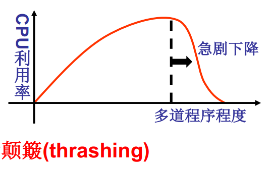

**颠簸现象（Thrashing)**

在操作系统中，颠簸现象（Thrashing）是指系统因为频繁的页面调度而陷入一种无效忙碌状态，导致系统性能下降。当系统内存不足以容纳所有需要运行的进程时，操作系统会将某些进程的页面（即进程的内存区域）从内存中换出到磁盘上，以释放内存空间供其他进程使用。但是，如果系统内存不足，导致不断地进行页面交换，这就会使得系统花费大量的时间和资源来处理页面调度，而不能执行实际的工作。这种情况下，系统的响应时间会变得非常缓慢，甚至停滞不前，这就是颠簸现象。

为了避免颠簸现象的发生，操作系统通常会采用一些策略来优化页面调度，例如增加物理内存、使用更高效的页面置换算法、减少并发进程数量等等。

