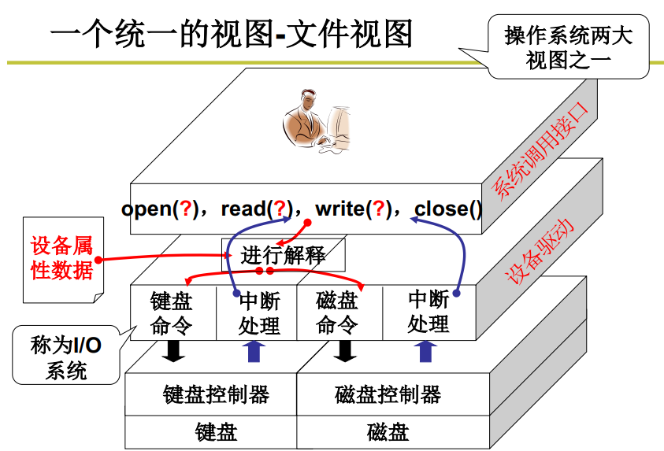
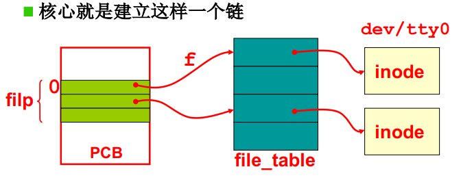
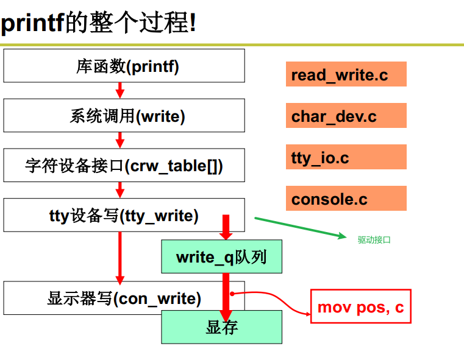

**怎么使用外设？**

每个外设都有对应的控制器，控制器内包含寄存器。CPU控制外设，就是通过向外设控制器内的寄存器写内容（指令），控制器就会根据寄存器的内容来实际地操控硬件。

使用外设，就是向控制器发指令。外设执行完指令会触发中断，然后CPU再处理中断。

*CPU向控制器中的寄存器读写数据，控制器完成真正的工作，并向CPU发中断信号*。


**问题**：向设备控制器的寄存器写会很麻烦，需要查寄存器地址、内容的格式与语义，非常麻烦。

**解决办法**：操作系统要给用户提供一个简单的视图 -- *文件视图（即不论什么样的外设，都统一接口）*，这样方便

驱动程序三件事：

- 形成文件视图
- 发出Out指令
- 进行中断处理


**一段操作外设的程序printf()**

```c++
int fd = open("/dev/xxx"); //打开一个外设
for (int i = 0; i < 10; ++i) {
    write(fd, i, sizeof(int));
}
close(fd);
```

- 不论什么设备，都是open、read、write、close

  操作系统为用户提供统一的接口!

- 不同的设备对应不同的设备文件（/dev/xxx)

  根据设备文件找到寄存器的地址、内容格式等等！




1. *printf("Host Name:%s", name);*

   printf库展开的部分:先创建缓存buf，将格式化输出都写到哪里，然后再*write(1, buf, ...)*

2. *write(1, buf, ...)*

   ```c++
   //在Linux/fs/read_write.c中
   int sys_write(unsigned int fd, char *buf, int count)
   {
       struct file *file;
       file = current->filp[fd]; //fd是索引，current是当前进程PCB
       inode = file->f_inode; //包含显示器信息
       /*...*/
   }
   ```

   fd = 1决定了是往显示器上写。inode包含了显示器信息。所以是通过fd = 1找到了文件file，再通过file找到了inode，得到了“要往哪里写”的信息。

3. *fd=1的flip从哪里来*

   flip在current内，current是从fork而来，所以flip是从父进程拷贝而来。而最开始打开的，是shell进程，shell是父进程

   ```c++
   void main(void)
   {
       if (!fock()) {init();}
   }
   
   void init()
   {
       open("dev/tty0", O_RDWR, 0);
       dup(0);
       dup(0);
       execve("/bin/sh",argv, envp);
   }
   ```

   所以最开始shell通过open打开了dev/tty0。

   ```c++
   int sys_open(const char *filename, int flag)
   {
       i = open_namei(filename, flag, &inode); //找到inode
       current->filp[fd] = f; //第一个空闲的fd
       f->f_mode = inode->i_mode;
       f->f_inode = inode;
       f->f_count = 1;
       return fd;
   }
   ```

   inode保存了设备的信息。

   

   从上面的图可以看出，通过fd能够最终找到对应文件的inode.

4. *继续sys_write*

   ```c++
   //在Linux/fs/read_write.c中
   int sys_write(unsigned int fd, char *buf, int count)
   {
       struct file *file;
       file = current->filp[fd]; //fd是索引，current是当前进程PCB
       inode = file->f_inode; //包含显示器信息
       /*...*/
       if (S_ISCHR(inode->i_mode)) 
           return rw_char(WRITE, inode->i_zone[0]/*设备号，是字符设备*/, buf, cnt);
   }
   
   //linux/fs/char_dev.c中
   int rw_char(int rw, int dev, char *buf, int cnt)
   {
       crw_ptr call_addr = crw_table[MAJOR(dev)];
       call_addr(rw, dev, buf, cnt); //查表得到处理函数
       /*...*/
   }
   
   //下面是保存函数指针的数组crw_table
   static crw_ptr crw_table[] = {..., rw_ttyx,};
   
   static int rw_ttyx(int rw, unsigned minor, char *buf, int count)
   {
       return ((rw == READ) ? tty_read(minor, buf) : tty_write(minor, buf));
   }
   ```

5. *转到tty_write,实现输出的核心函数*

   ```c++
   int tty_write(unsigned channel, char *buf, int nr)
   {
       struct tty_stuct *tty;
       tty = channel + tty_table;
       sleep_if_full(&tty->write_q); //输出就是放入队列，即缓冲区。
       //...
       char *c, *b = buf;
       while(nr > 0 && !FULL(tty->write_q))
       {
           c = get_fs_byte(b); //从用户缓存区读
           if (c == '\r'){
               PUTCH(13, tty->write_q)
               continue;
           }
           if (O_LCUC(tty)) c = toupper(c);
           b++;
           nr--;
           PUTCH(c, tty->write_q);
       } //输出完事或写队列满
       tty->write(tty); //真正开始输出屏幕
   }
   ```

6. *tty->write*

   tty结构体的write成员在结构体初始化时被赋值为con_write

7. *con_write*汇编真正写显示器

   ```c++
   void con_write(struct tty_struct *tty)
   {
       GETCH(tty->write_q, c);
       //内嵌汇编，实现真正写显示器
       if (c > 31 && c < 127) {
           __asm__("movb _attr, %%ah\n\t"
                  "movw %%ax,%1\n\t"::"a"(c),
                  "m"(*（short*）pos):"ax");
           pos +=2;
       }
   }
   ```

   

