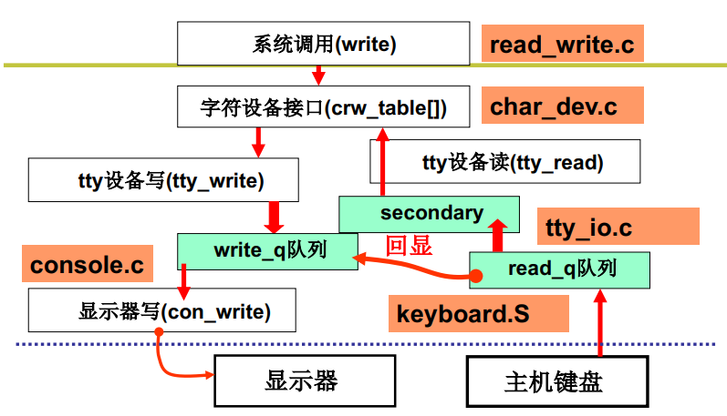

**键盘的使用**

敲击键盘，产生中断


**键盘中断**

```c++
void con_init() 
{
    set_trap_gate(0x21, &keyboard_interrupt); //设置21号中断的处理函数
}

//在kernel/chr_drv/keyboard.S中
.global _keyboard_interrupt
_keyboard_interrupt:
	inb $0x60, %al //从端口0x60读扫描码
    call key_table(,%eax, 4) //调用key_table+eax * 4
    ...push $0 call _do_tty+interrupt
```

