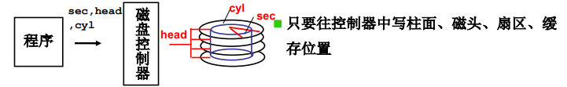
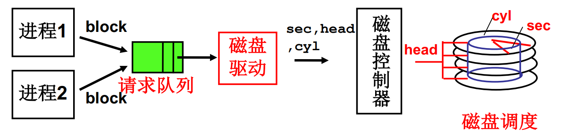
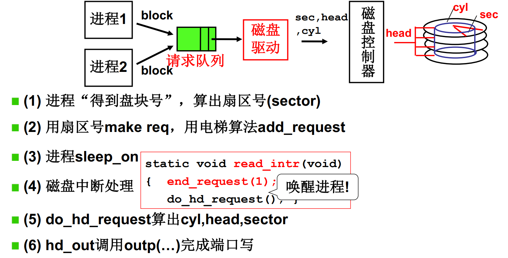

**磁盘的使用**

- CPU向磁盘控制器中的寄存器读写数据
- 磁盘控制器完成真正的工作，并向CPU发送中断信号


**磁盘的I/O过程**

- 首先将磁头移动到指定的磁道上
- 磁盘转动，磁信号转换为电信号（读）
- 磁盘转动，电信号转变为磁信号（写）

可简述为：*控制器 -- > 寻道 -- > 旋转 -- > 传输！*


**最直接的使用磁盘：磁盘的读写控制**

只要往控制器中写柱面（C）、磁头（H）、扇区（S）、缓存位置的值。



```C
void do_hd_request(void)
{
    ...
    hd_out(dev, nsect, head, cy1, WIN_WRITE, ...);
    port_write(HD_DARA, CURRENT->buffer, 256);
}

void hd_out(drive, nsect, sec, head, cy1, cmd...)
{
    port = HD_DATA;
    out_p(nsect, ++port);
    outb_p(sect, ++port);
    outb_p(cy1, ++port);
    outb_port(cy1 >> 8, ++port);
    outb_port(oxA0 | (drive << 4) | head, ++port);
    outb_p(cmd, ++port);
}
```


**第一层抽象：通过盘块号读写磁盘**

磁盘驱动负责从block计算出cy1,head,sec(CHS)


磁盘访问时间 = 写入控制器时间 + 寻道时间 + 旋转时间 + 传输时间

抽象过程中考虑block相邻的盘块可以快速读出，所以相邻盘块安排在一个磁道上。

CHS得到的扇区号 = C x (Heads x Sectors) + H x Sectors + S

*扇区大小固定，但操作系统可以每次读/写连续的几个扇区（盘块）*。


**第二层抽象：多个进程通过队列使用磁盘**

通过合理调度，使磁盘工作效率提升。




**生磁盘（raw disk）的使用整理**

