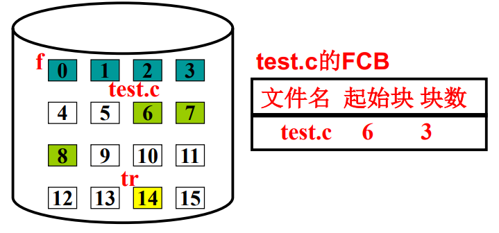
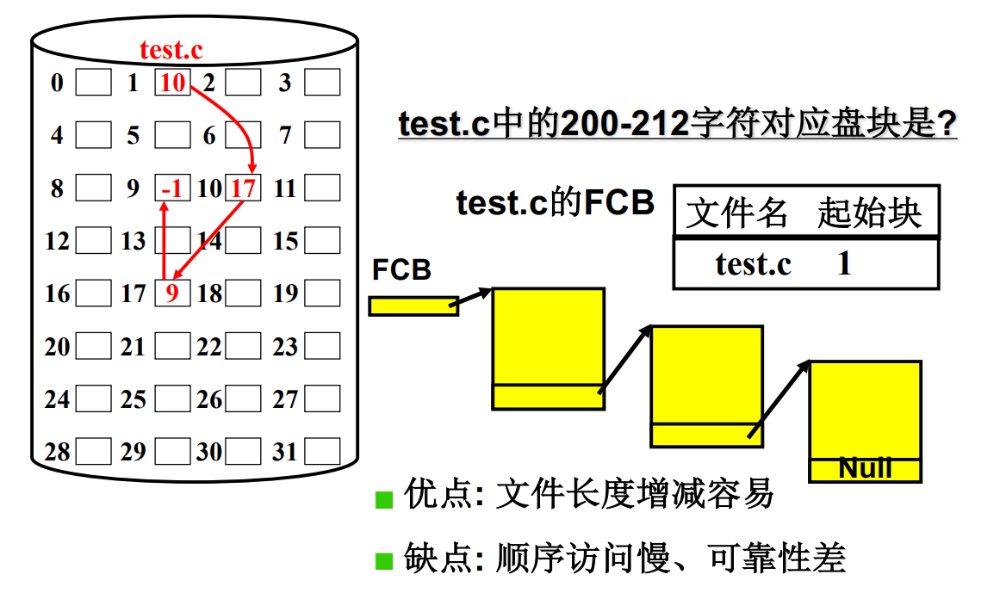
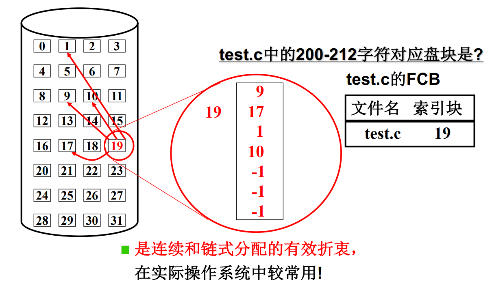
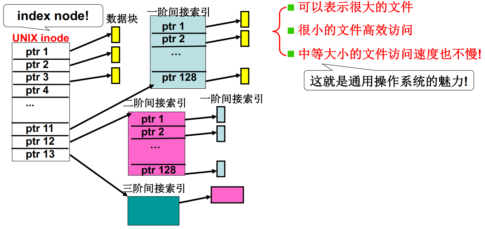

**引入文件，对磁盘使用的第三层抽象**

解决用户需要知道盘块号的问题，需要在盘块上引入更高一层次的抽象概念 -- *文件*

用户眼中文件是字符序列（字符流），磁盘上的文件是盘块集合。

所以，计算机上，文件是*字符流到盘块集合的映射关系*。

如何根据字符流计算得到盘块号？

**映射FCB**

连续结构实现文件如下：

在已知盘块的基础上，存储文件名、文件在磁盘上的起始盘块以及文件占用的总的盘块数。这就完成映射！

链式结构实现文件如下：

索引结构实现文件如下：

FCB在索引块内记录了该文件的块信息，如上图文件的第一个块是9，第二个块是17，依次类推。

实际系统是多级索引：

