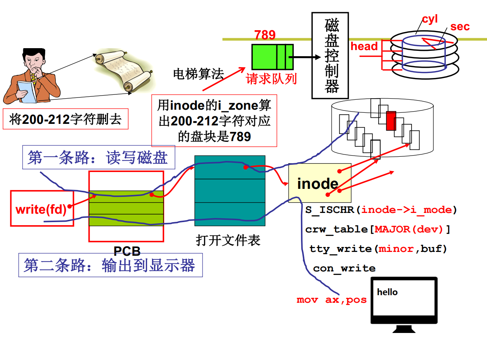

**通过文件使用磁盘**

```c
//fs/read_write.c
int sys_write(int fd, const char* buf, int count)
{
    struct file *file = current->filp[fd];
    struct m_inode *inode = file->inode;
    if (S_ISREG(inode->i_mode))
    {
        return file_write(inode, file, buf, count);
    }
}
```


***file_write(inode, file, buf, count)***

1. 首先需要知道对文件的改写位置，由参数file提供
2. 要找到改写的盘块号，由参数inode提供
3. 用盘块号、buf等形成request放入调度算法的队列中（即电梯算法，提高多个读写磁盘的效率）


***file_write的实现***

```c
int file_write(struct m_inode *inode, struct file *filp, char *buf, int count)
{
    off_t pos;
    //用file知道文件流读写的字符区间，从哪到哪（也就是文件内偏移量）
    if (filp->f_flags & O_APPEND) {
        pos = inode->i_size;
    } else {
        pos = file->f_pos;
    }
    while (i < count) {
        blockk = create_block(inode, pos / BLOCK_SIZE);
        bh = bread(inode->i_dev, block); //读写调度
        int c = pos % BLOCK_SIZE;
        char *p = c + bh->b_data;
        bh->b_dirt = 1;
        c = BLOCK_SIZE - c;
        pos += c;
        ...;
        while (c-- > 0) {
            *(p++) = get_fs_byte(buf++);
            brelse(bh);
        }
        filp->f_pos = pos;
    }
}
```


***create_block算盘快，文件抽象的核心***


***完整的文件视图***




inode内包含文件类型，如果是字符类型文件，则需要读写磁盘，走上图中的第一条线路；否则走第二条路。这样完成了统一。