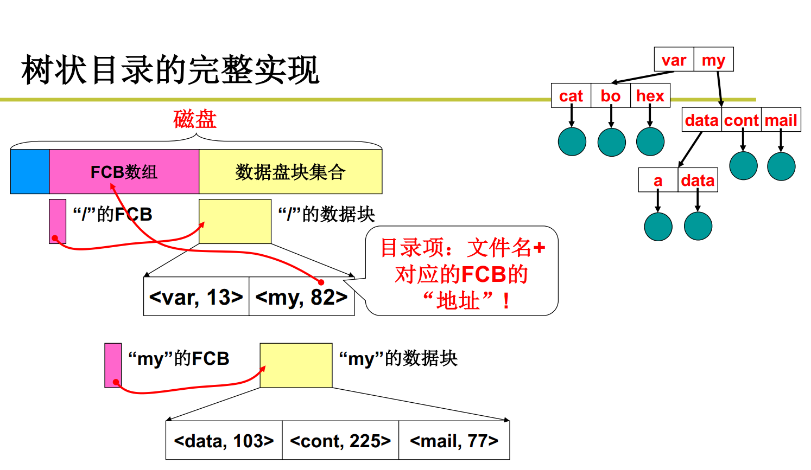
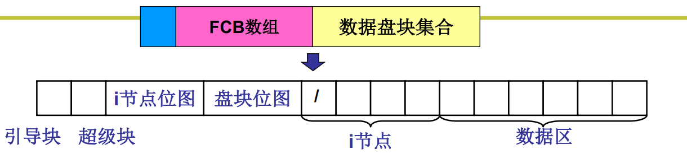
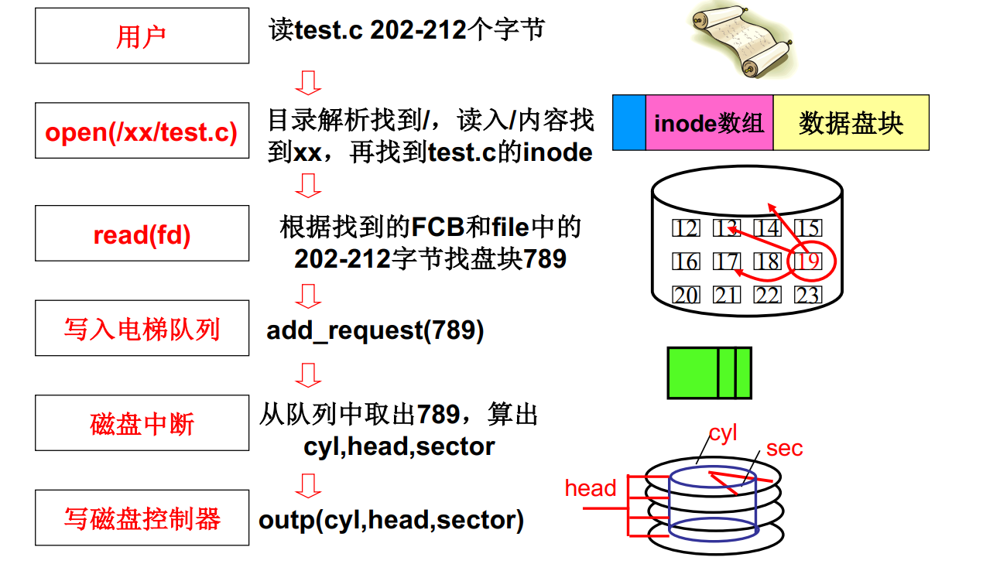

***树状目录的实现***

以找视图中的mail文件夹为例：

首先根据FCB数据找到根目录/的数据块，该数据块记录了根目录下存在var和my文件夹以及各自对应的index，再根据文件夹my的index在FCB数组中找到文件夹my的数据块。文件夹my的数据块里记录了mail文件夹以及对应的index，根据mail的index在FCB中找到mail的数据块，里面就记录了其包含的文件的信息，就可以定位该文件下的位置了。

***使文件系统自举还需要的额外信息***

- inode位图：哪些inode空闲，哪些被占用
- 盘块位图：哪些盘块是空闲的。硬盘大小不同的这个位图大小也不同
- 超级块：记录两个位图有多大等信息

***磁盘的全部映射***

