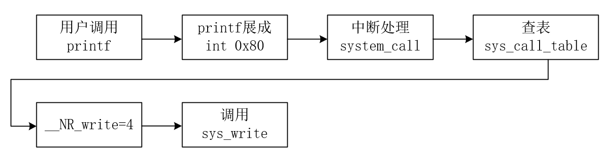

**为什么要系统调用**

OS立起来之后，OS位于内存的0地址处，内存中，应用程序在OS的上面。应用程序是不允许直接访问操作OS所在的内存，所以系统调用提供了进入内核的手段。


**内核（用户）态，内核（用户）段**

CS:IP是当前指令，用CS的低2位表示CS的状态:0表示内核态，3表示用户态。

当CS处于内核态时，CS 可以访问任何数据，CS 处于用户态时，不能访问内核数据。这是一种硬件设计。（要求DPL  >= CPL）。

内存中保存OS的段是内核段，保存用户程序的段是用户段。这两个段统称为目标段（DPL表示目标段的级别，CPL表示当前的内存区级别）。


**DPL >= CPL**

CPL是当前的指令级别，DPL是目标内存区的级别。CPL由当前的CS决定。如果当前CS指向内存用户段，则CPL是3，只能访问DPL >= 3的内存段，即用户段；如果当前CS指向内核段，则CPL是0，能够访问DPL >= 0的内存段，即内核段和用户段。

DPL描述的某一段内存的级别，这个级别在GDT表中维护；CPL指的是当前的指令级别（CS的末两位）。指令级别（CPL)决定了指令所能够访问的指定级别（DPL)的内存段。


**硬件提供了唯一可以主动进入内核的方法 -- int中断**（int 0x80）

int指令将CS中的CPL改成0，”进入内核“，这是用户程序发起调用内核代码的唯一方式。


**系统调用的核心**

- 用户程序中包含一段包含int指令的代码（库函数完成）
- 操作系统写中断处理，获取想调程序的编号
- 操作系统根据编号执行相应代码


**系统调用的实现**

- 应用程序调用printf(...)，printf(...)调用C函数库的printf(...)，C函数库的printf(...)调用C函数库的write（...）,C函数库的write(...)调用内核中的系统调用write(...)
- C库函数的write(...)就是一段包含int 0x80中断的代码

*C库函数write*

```c
//linux/lib/write.c文件
#include <unistd.h>
_syscall3(int, write, int, fd, const char *buf, off_t, count)

//linux/include/unistd.h
#define _syscall3(type, name, atype, a, btype, ctype, c) \
type name(atype a, btype b, ctype c) \
{
   long __res;
	__asm__ volatile("int 0x80" : "=a"(__res) : ""(__NR_#name), //内嵌汇编
    "b"((long)(a)), "c"((long)(b)), "d"((long)(c)));
	if (__res >= 0) return (type)__res;
	errno=-__res;
	return -1;
}
//这段程序的核心就是将系统调用号赋值给eax，然后调用int 0x80指令,即进入内核
```

__NR_write是系统调用号，放在eax中（eax就是系统调用号）

```c
//linux/include/unistd.h
#define __NR_write 4 //一堆连续正整数（数组下标，函数表索引）
```


**int 0x80中断处理**

```c
//设置0x80的中断处理
void sched_init(void) {
    set_system_gate(0x80, &system_call);
}
//linux/include/asm/system.h
#define set_system_gate(n, addr) \
_set_gate(&idt[n], 15, 3, addr); //idt是中断向量表基址
#define _set_gate(gate_addr, type, dpl, addr) \
__asm__("movw %%dx, %%ax\n\t", "movw %0, %%dx\n\t" \
"mov1 %%eax, %1\n\t" "movl %%edx, %2":\
:"i"((short)(0x8000+(dpl<<13)+type<<8))),"o"(*(( \
char*)(gate_addr))), "o"(*(4+(char*)(gate_addr))), \
"d"((char*)(addr), "a"(0x00080000))
)
```

**中断处理程序system_call**

```c
call _sys_call_table(, %eax, 4) //a(,%eax,4) = a+4*8eax
```

_sys_call_table+4*%eax就是相应系统调用处理函数的入口


